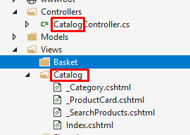

# ASP.NET Core Road to Microservices Part 01: Building the Views

### Introduction


Lorem ipsum dolor sit amet, consectetur adipiscing elit, sed do eiusmod tempor incididunt ut labore et dolore magna aliqua. Ut enim ad minim veniam, quis nostrud exercitation ullamco laboris nisi ut aliquip ex ea commodo consequat. Duis aute irure dolor in reprehenderit in voluptate velit esse cillum dolore eu fugiat nulla pariatur. Excepteur sint occaecat cupidatat non proident, sunt in culpa qui officia deserunt mollit anim id est laborum. 

### Creating the Project


```csharp
public class Program
{
    public static void Main(string[] args)
    {
        CreateWebHostBuilder(args).Build().Run();
    }

    public static IWebHostBuilder CreateWebHostBuilder(string[] args) =>
        WebHost.CreateDefaultBuilder(args)
            .UseStartup<Startup>();
}
```

```csharp
public class Startup
{
	public Startup(IConfiguration configuration)
	{
		Configuration = configuration;
	}

	public IConfiguration Configuration { get; }

	// This method gets called by the runtime. Use this method to add services to the container.
	public void ConfigureServices(IServiceCollection services)
	{
		services.Configure<CookiePolicyOptions>(options =>
		{
			// This lambda determines whether user consent for non-essential cookies is needed for a given request.
			options.CheckConsentNeeded = context => true;
			options.MinimumSameSitePolicy = SameSiteMode.None;
		});


		services.AddMvc().SetCompatibilityVersion(CompatibilityVersion.Version_2_2);
	}

	// This method gets called by the runtime. Use this method to configure the HTTP request pipeline.
	public void Configure(IApplicationBuilder app, IHostingEnvironment env)
	{
		if (env.IsDevelopment())
		{
			app.UseDeveloperExceptionPage();
		}
		else
		{
			app.UseExceptionHandler("/Home/Error");
			// The default HSTS value is 30 days. You may want to change this for production scenarios, see https://aka.ms/aspnetcore-hsts.
			app.UseHsts();
		}

		app.UseHttpsRedirection();
		app.UseStaticFiles();
		app.UseCookiePolicy();

		app.UseMvc(routes =>
		{
			routes.MapRoute(
				name: "default",
				template: "{controller=Home}/{action=Index}/{id?}");
		});
	}
}
```

Lorem ipsum dolor sit amet, consectetur adipiscing elit, sed do eiusmod tempor incididunt ut labore et dolore magna aliqua. Ut enim ad minim veniam, quis nostrud exercitation ullamco laboris nisi ut aliquip ex ea commodo consequat. Duis aute irure dolor in reprehenderit in voluptate velit esse cillum dolore eu fugiat nulla pariatur. Excepteur sint occaecat cupidatat non proident, sunt in culpa qui officia deserunt mollit anim id est laborum. 

### Index page


```xml
@{
    ViewData["Title"] = "Home Page";
}

@for (int category = 0; category < 6; category++)
{
    <h3>Category Name</h3>

    <div id="carouselExampleIndicators-@category" class="carousel slide" data-ride="carousel">
        <ol class="carousel-indicators">
            <li data-target="#carouselExampleIndicators-@category" data-slide-to="0" class="active"></li>
            <li data-target="#carouselExampleIndicators-@category" data-slide-to="1"></li>
            <li data-target="#carouselExampleIndicators-@category" data-slide-to="2"></li>
        </ol>
        <div class="carousel-inner">
            <div class="carousel-item active">
                <div class="container">
                    <div class="row">
                        @for (int i = 0; i < 4; i++)
                        {
                        <div class="col-sm-3">
                            <div class="card">
                                <div class="card-body">
                                    
                                </div>
                                <div class="card-footer">
                                    <p class="card-text">Product Name</p>
                                    <h5 class="card-title text-center">$ 39.90</h5>
                                    <div class="text-center">
                                        <a href="#" class="btn btn-success">
                                            Add to basket
                                        </a>
                                    </div>
                                </div>
                            </div>
                        </div>
                        }
                    </div>
                </div>
            </div>
            <div class="carousel-item">
                <div class="container">
                    <div class="row">
                        @for (int i = 0; i < 1; i++)
                        {
                        <div class="col-sm-3">
                            <div class="card">
                                <div class="card-body">
                                    
                                </div>
                                <div class="card-footer">
                                    <p class="card-text">Product Name</p>
                                    <h5 class="card-title text-center">$ 39.90</h5>
                                    <div class="text-center">
                                        <a href="#" class="btn btn-success">
                                            Add to basket
                                        </a>
                                    </div>
                                </div>
                            </div>
                        </div>
                        }
                    </div>
                </div>
            </div>
        </div>
        <a class="carousel-control-prev" href="#carouselExampleIndicators-@category" role="button" data-slide="prev">
            <span class="carousel-control-prev-icon" aria-hidden="true"></span>
            <span class="sr-only">Previous</span>
        </a>
        <a class="carousel-control-next" href="#carouselExampleIndicators-@category" role="button" data-slide="next">
            <span class="carousel-control-next-icon" aria-hidden="true"></span>
            <span class="sr-only">Next</span>
        </a>
    </div>
}
```

Lorem ipsum dolor sit amet, consectetur adipiscing elit, sed do eiusmod tempor incididunt ut labore et dolore magna aliqua. Ut enim ad minim veniam, quis nostrud exercitation ullamco laboris nisi ut aliquip ex ea commodo consequat. Duis aute irure dolor in reprehenderit in voluptate velit esse cillum dolore eu fugiat nulla pariatur. Excepteur sint occaecat cupidatat non proident, sunt in culpa qui officia deserunt mollit anim id est laborum. 

### Styling


```html
<link href="~/lib/font-awesome/css/font-awesome.css" rel="stylesheet" />
<link rel="stylesheet" href="~/css/site.css" />
```

```html
<a href="#" class="btn btn-success">
    <span class="fa fa-shopping-cart"></span>
    Add to basket
</a>
```


Lorem ipsum dolor sit amet, consectetur adipiscing elit, sed do eiusmod tempor incididunt ut labore et dolore magna aliqua. Ut enim ad minim veniam, quis nostrud exercitation ullamco laboris nisi ut aliquip ex ea commodo consequat. Duis aute irure dolor in reprehenderit in voluptate velit esse cillum dolore eu fugiat nulla pariatur. Excepteur sint occaecat cupidatat non proident, sunt in culpa qui officia deserunt mollit anim id est laborum. 

### Branding

```html
<div class="container">
    &copy; 2019 - The Grocery Store - <a asp-area="" asp-controller="Home" asp-action="Privacy">Privacy</a>
</div>
```

```css
a.navbar-brand {
    white-space: normal;
    text-align: center;
    word-break: break-all;
    background: url('../images/logo.png');
    width: 215px;
    height: 55px;
}
```


Lorem ipsum dolor sit amet, consectetur adipiscing elit, sed do eiusmod tempor incididunt ut labore et dolore magna aliqua. Ut enim ad minim veniam, quis nostrud exercitation ullamco laboris nisi ut aliquip ex ea commodo consequat. Duis aute irure dolor in reprehenderit in voluptate velit esse cillum dolore eu fugiat nulla pariatur. Excepteur sint occaecat cupidatat non proident, sunt in culpa qui officia deserunt mollit anim id est laborum. 

### Partial views


Index.cshtml

```html
@{
    ViewData["Title"] = "Home Page";
}

@for (int category = 0; category < 6; category++)
{
    <h3>Category Name</h3>

    <div id="carouselExampleIndicators-@category" class="carousel slide" data-ride="carousel">
        <ol class="carousel-indicators">
            <li data-target="#carouselExampleIndicators-@category" data-slide-to="0" class="active"></li>
            <li data-target="#carouselExampleIndicators-@category" data-slide-to="1"></li>
            <li data-target="#carouselExampleIndicators-@category" data-slide-to="2"></li>
        </ol>
        <div class="carousel-inner">
            <div class="carousel-item active">
                <div class="container">
                    <div class="row">
                        @for (int i = 0; i < 4; i++)
                        {
                            <div class="col-sm-3">
                                <div class="card">
                                    <div class="card-body">
                                        
                                    </div>
                                    <div class="card-footer">
                                        <p class="card-text">Product Name</p>
                                        <h5 class="card-title text-center">$ 39.90</h5>
                                        <a href="#" class="btn btn-success">
                                            <span class="fa fa-shopping-cart"></span>
                                            Add to basket
                                        </a>
                                    </div>
                                </div>
                            </div>
                        }
                    </div>
                </div>
            </div>
            <div class="carousel-item">
                <div class="container">
                    <div class="row">
                        @for (int i = 0; i < 1; i++)
                        {
                            <div class="col-sm-3">
                                <div class="card">
                                    <div class="card-body">
                                        
                                    </div>
                                    <div class="card-footer">
                                        <p class="card-text">Product Name</p>
                                        <h5 class="card-title">$ 39.90</h5>
                                        <a href="#" class="btn btn-success">
                                            <span class="fa fa-shopping-cart"></span>
                                            Add to basket
                                        </a>
                                    </div>
                                </div>
                            </div>
                        }
                    </div>
                </div>
            </div>
        </div>
        <a class="carousel-control-prev" href="#carouselExampleIndicators-@category" role="button" data-slide="prev">
            <span class="carousel-control-prev-icon" aria-hidden="true"></span>
            <span class="sr-only">Previous</span>
        </a>
        <a class="carousel-control-next" href="#carouselExampleIndicators-@category" role="button" data-slide="next">
            <span class="carousel-control-next-icon" aria-hidden="true"></span>
            <span class="sr-only">Next</span>
        </a>
    </div>
    var products = Enumerable.Range(0, 30);
}

<partial name="_Category" for="@products" />
```

_Category.cshtml
```html
@model IEnumerable<int>;

@{
    var products = Model;
    const int productsPerCategory = 5;
    const int PageSize = 4;
}

@for (int category = 0; category < (products.Count() / productsPerCategory); category++)
{
    <h3>Category @(category + 1)</h3>

    <div id="carouselExampleIndicators-@category" class="carousel slide" data-ride="carousel">
        <div class="carousel-inner">
            @{
                int pageCount = (int)Math.Ceiling((double)productsPerCategory / PageSize);
                var productsInCategory =
                    products
                    .Skip(category * productsPerCategory)
                    .Take(productsPerCategory);

                for (int pageIndex = 0; pageIndex < pageCount; pageIndex++)
                {
                <div class="carousel-item @(pageIndex == 0 ? "active" : "")">
                    <div class="container">
                        <div class="row">
                            @{
                                var productsInPage =
                                    productsInCategory
                                    .Skip(pageIndex * PageSize)
                                    .Take(PageSize);

                                foreach (var productIndex in productsInPage)
                                {
                                    <partial name="_ProductCard" for="@productIndex"/>
                                }
                            }
                        </div>
                    </div>
                </div>
                }
            }
        </div>
        <a class="carousel-control-prev" href="#carouselExampleIndicators-@category" role="button" data-slide="prev">
            <span class="carousel-control-prev-icon" aria-hidden="true"></span>
            <span class="sr-only">Previous</span>
        </a>
        <a class="carousel-control-next" href="#carouselExampleIndicators-@category" role="button" data-slide="next">
            <span class="carousel-control-next-icon" aria-hidden="true"></span>
            <span class="sr-only">Next</span>
        </a>
    </div>
}
```

_ProductCart.cshtml


```html
@model int;

@{ 
    var productIndex = Model;
}

<div class="col-sm-3">
    <div class="card">
        <div class="card-body">
            
        </div>
        <div class="card-footer">
            <p class="card-text">Product Name</p>
            <h5 class="card-title text-center">$ 39.90</h5>
            <a href="#" class="btn btn-success">
                <span class="fa fa-shopping-cart"></span>
                Add to basket
            </a>
            </div>
        </div>
    </div>
</div>
```

Lorem ipsum dolor sit amet, consectetur adipiscing elit, sed do eiusmod tempor incididunt ut labore et dolore magna aliqua. Ut enim ad minim veniam, quis nostrud exercitation ullamco laboris nisi ut aliquip ex ea commodo consequat. Duis aute irure dolor in reprehenderit in voluptate velit esse cillum dolore eu fugiat nulla pariatur. Excepteur sint occaecat cupidatat non proident, sunt in culpa qui officia deserunt mollit anim id est laborum. 

### Search Products Partial View


_Index.cshtml
```html
@ {
    var products = Enumerable.Range(0, 30);
}

<partial name="_SearchProducts"/>

<partial name="_Category" for="@products" />
```

_Category.cshtml

```cshtml
@{
    const int PageSize = 4;
}

<div class="container">
    @for (int category = 0; category < (products.Count() / productsPerCategory); category++)
    {
        <h3>Category @(category + 1)</h3>
		
		        <div id="carouselExampleIndicators-@category" class="carousel slide" data-ride="carousel">
            <div class="carousel-inner">
                @{
                    int pageCount = (int)Math.Ceiling((double)productsPerCategory / PageSize);
                    var productsInCategory =
                        products
                        .Skip(category * productsPerCategory)
                        .Take(productsPerCategory);
						
                    for (int pageIndex = 0; pageIndex < pageCount; pageIndex++)
                    {
                        <div class="carousel-item @(pageIndex == 0 ? "active" : "")">
                            <div class="container">
                                <div class="row">
                                    @{
                                        var productsInPage =
                                            productsInCategory
                                            .Skip(pageIndex * PageSize)
                                            .Take(PageSize);

										foreach (var productIndex in productsInPage)
                                        {
                                            <partial name="_ProductCard" for="@productIndex" />
                                        }
                                    }
                                </div>
                            </div>
						</div>	
                    }
                }
            </div>
            <a class="carousel-control-prev" href="#carouselExampleIndicators-@category" role="button" data-slide="prev">
                <span class="carousel-control-prev-icon" aria-hidden="true"></span>
                <span class="sr-only">Previous</span>
            </a>
            <a class="carousel-control-next" href="#carouselExampleIndicators-@category" role="button" data-slide="next">
                <span class="carousel-control-next-icon" aria-hidden="true"></span>
                <span class="sr-only">Next</span>
            </a>
    }
</div>			

```
_SearchProducts.cshtml
```html
<div class="container">
    <h2>Search products</h2>
    <div id="custom-search-input">
        <div class="input-group col-md-12">
            <form>
                <div class="container">
                    <div class="row">
                        <div>
                            <input type="text" name="search"
                                   class="form-control input-lg"
                                   placeholder="category or product" />
                        </div>
                        <div>
                            <div class="input-group-btn text-center">
                                <a href="#" class="btn btn-success">
                                    <span class="fa fa-search"></span>
                                </a>
                            </div>
                        </div>
                    </div>
                </div>
            </form>
        </div>
    </div>
</div>
```

Lorem ipsum dolor sit amet, consectetur adipiscing elit, sed do eiusmod tempor incididunt ut labore et dolore magna aliqua. Ut enim ad minim veniam, quis nostrud exercitation ullamco laboris nisi ut aliquip ex ea commodo consequat. Duis aute irure dolor in reprehenderit in voluptate velit esse cillum dolore eu fugiat nulla pariatur. Excepteur sint occaecat cupidatat non proident, sunt in culpa qui officia deserunt mollit anim id est laborum. 

### Basket view



BaseController.cs

```csharp
public abstract class BaseController : Controller
{
    [ResponseCache(Duration = 0, Location = ResponseCacheLocation.None, NoStore = true)]
    public IActionResult Error()
    {
        return View(new ErrorViewModel { RequestId = Activity.Current?.Id ?? HttpContext.TraceIdentifier });
    }
}
```

```csharp
public class CatalogController : BaseController
{
    public IActionResult Index()
    {
        return View();
    }
}

public class BasketController : BaseController
{
    public IActionResult Index()
    {
        return View();
    }
}
```

Startup.cs

```csharp
 template: "{controller=Catalog}/{action=Index}/{id?}");
```

Index.cshtml

```html
@{
    ViewData["Title"] = "My Basket";

    var items = new[]
    {
        new { Id = 1, ProductId = 1, Name = "Broccoli", UnitPrice = 59.90, Quantity = 2 },
        new { Id = 2, ProductId = 5, Name = "Green Grapes", UnitPrice = 59.90, Quantity = 3 },
        new { Id = 3, ProductId = 9, Name = "Tomato", UnitPrice = 59.90, Quantity = 4 }
    };
}

<div class="row">
    <div class="col-sm-12">
        <div class="pull-right">
            <a class="btn btn-success" href="/">
                Add More Products
            </a>
            <a class="btn btn-success" href="/registration">
                Fill in Registration
            </a>
        </div>
    </div>
</div>

<h3>My Basket</h3>

<div class="card">
    <div class="card-header">
        <div class="row">
            <div class="col-sm-6">
                Item
            </div>
            <div class="col-sm-2 text-center">
                Unit Price
            </div>
            <div class="col-sm-2 text-center">
                Quantity
            </div>
            <div class="col-sm-2">
                <span class="pull-right">
                    Subtotal
                </span>
            </div>
        </div>
    </div>
    <div class="card-body">
        @foreach (var item in items)
        {
        <div class="row row-center">
            <div class="col-sm-2">
                
            </div>
            <input type="hidden" name="productId" value="012" />
            <div class="col-sm-4">@item.Name</div>
            <div class="col-sm-2 text-center">@item.UnitPrice.ToString("C")</div>
            <div class="col-sm-2 text-center">
                <div class="input-group">
                    <button type="button" class="btn btn-light">
                        <span class="fa fa-minus"></span>
                    </button>
                    <input type="text" value="@item.Quantity"
                            class="form-control text-center quantity" />
                    <button type="button" class="btn btn-light">
                        <span class="fa fa-plus"></span>
                    </button>
                </div>
            </div>
            <div class="col-sm-2">
                <div class="pull-right">
                    <span class="pull-right" subtotal>
                        @((item.Quantity * item.UnitPrice).ToString("C"))
                    </span>
                </div>
            </div>
        </div>
        <br />
        }
    </div>
    <div class="card-footer">
        <div class="row">
            <div class="col-sm-10">
                <span numero-items>
                    Total: @items.Length
                    item@(items.Length > 1 ? "s" : "")
                </span>
            </div>
            <div class="col-sm-2">
                Total: <span class="pull-right" total>
                    @(items.Sum(item => item.Quantity * item.UnitPrice).ToString("C"))
                </span>
            </div>
        </div>
    </div>
</div>

<br />

<div class="row">
    <div class="col-sm-12">
        <div class="pull-right">
            <a class="btn btn-success" href="/">
                Add More Products
            </a>
            <a class="btn btn-success" href="/registration">
                Fill in Registration
            </a>
        </div>
    </div>
</div>
```

site.css

```css
.row-center {
    display: flex;
    align-items: center;
}
```


Lorem ipsum dolor sit amet, consectetur adipiscing elit, sed do eiusmod tempor incididunt ut labore et dolore magna aliqua. Ut enim ad minim veniam, quis nostrud exercitation ullamco laboris nisi ut aliquip ex ea commodo consequat. Duis aute irure dolor in reprehenderit in voluptate velit esse cillum dolore eu fugiat nulla pariatur. Excepteur sint occaecat cupidatat non proident, sunt in culpa qui officia deserunt mollit anim id est laborum. 

### Basket partial views


Lorem ipsum dolor sit amet, consectetur adipiscing elit, sed do eiusmod tempor incididunt ut labore et dolore magna aliqua. Ut enim ad minim veniam, quis nostrud exercitation ullamco laboris nisi ut aliquip ex ea commodo consequat. Duis aute irure dolor in reprehenderit in voluptate velit esse cillum dolore eu fugiat nulla pariatur. Excepteur sint occaecat cupidatat non proident, sunt in culpa qui officia deserunt mollit anim id est laborum. 

### Registration View


Lorem ipsum dolor sit amet, consectetur adipiscing elit, sed do eiusmod tempor incididunt ut labore et dolore magna aliqua. Ut enim ad minim veniam, quis nostrud exercitation ullamco laboris nisi ut aliquip ex ea commodo consequat. Duis aute irure dolor in reprehenderit in voluptate velit esse cillum dolore eu fugiat nulla pariatur. Excepteur sint occaecat cupidatat non proident, sunt in culpa qui officia deserunt mollit anim id est laborum. 

### Checkout View


Lorem ipsum dolor sit amet, consectetur adipiscing elit, sed do eiusmod tempor incididunt ut labore et dolore magna aliqua. Ut enim ad minim veniam, quis nostrud exercitation ullamco laboris nisi ut aliquip ex ea commodo consequat. Duis aute irure dolor in reprehenderit in voluptate velit esse cillum dolore eu fugiat nulla pariatur. Excepteur sint occaecat cupidatat non proident, sunt in culpa qui officia deserunt mollit anim id est laborum. 

### Notifications View


Lorem ipsum dolor sit amet, consectetur adipiscing elit, sed do eiusmod tempor incididunt ut labore et dolore magna aliqua. Ut enim ad minim veniam, quis nostrud exercitation ullamco laboris nisi ut aliquip ex ea commodo consequat. Duis aute irure dolor in reprehenderit in voluptate velit esse cillum dolore eu fugiat nulla pariatur. Excepteur sint occaecat cupidatat non proident, sunt in culpa qui officia deserunt mollit anim id est laborum. 

### Json product load


Lorem ipsum dolor sit amet, consectetur adipiscing elit, sed do eiusmod tempor incididunt ut labore et dolore magna aliqua. Ut enim ad minim veniam, quis nostrud exercitation ullamco laboris nisi ut aliquip ex ea commodo consequat. Duis aute irure dolor in reprehenderit in voluptate velit esse cillum dolore eu fugiat nulla pariatur. Excepteur sint occaecat cupidatat non proident, sunt in culpa qui officia deserunt mollit anim id est laborum. 

### Links


Lorem ipsum dolor sit amet, consectetur adipiscing elit, sed do eiusmod tempor incididunt ut labore et dolore magna aliqua. Ut enim ad minim veniam, quis nostrud exercitation ullamco laboris nisi ut aliquip ex ea commodo consequat. Duis aute irure dolor in reprehenderit in voluptate velit esse cillum dolore eu fugiat nulla pariatur. Excepteur sint occaecat cupidatat non proident, sunt in culpa qui officia deserunt mollit anim id est laborum. 

