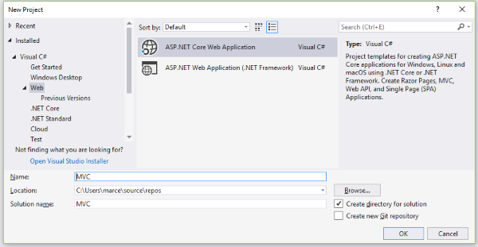

# ASP.NET Core Road to Microservices Part 01: Building the Views

### Introduction


Lorem ipsum dolor sit amet, consectetur adipiscing elit, sed do eiusmod tempor incididunt ut labore et dolore magna aliqua. Ut enim ad minim veniam, quis nostrud exercitation ullamco laboris nisi ut aliquip ex ea commodo consequat. Duis aute irure dolor in reprehenderit in voluptate velit esse cillum dolore eu fugiat nulla pariatur. Excepteur sint occaecat cupidatat non proident, sunt in culpa qui officia deserunt mollit anim id est laborum. 

### Creating the Project




```csharp
public class Program
{
    public static void Main(string[] args)
    {
        CreateWebHostBuilder(args).Build().Run();
    }

    public static IWebHostBuilder CreateWebHostBuilder(string[] args) =>
        WebHost.CreateDefaultBuilder(args)
            .UseStartup<Startup>();
}
```

```csharp
public class Startup
{
	public Startup(IConfiguration configuration)
	{
		Configuration = configuration;
	}

	public IConfiguration Configuration { get; }

	// This method gets called by the runtime. Use this method to add services to the container.
	public void ConfigureServices(IServiceCollection services)
	{
		services.Configure<CookiePolicyOptions>(options =>
		{
			// This lambda determines whether user consent for non-essential cookies is needed for a given request.
			options.CheckConsentNeeded = context => true;
			options.MinimumSameSitePolicy = SameSiteMode.None;
		});


		services.AddMvc().SetCompatibilityVersion(CompatibilityVersion.Version_2_2);
	}

	// This method gets called by the runtime. Use this method to configure the HTTP request pipeline.
	public void Configure(IApplicationBuilder app, IHostingEnvironment env)
	{
		if (env.IsDevelopment())
		{
			app.UseDeveloperExceptionPage();
		}
		else
		{
			app.UseExceptionHandler("/Home/Error");
			// The default HSTS value is 30 days. You may want to change this for production scenarios, see https://aka.ms/aspnetcore-hsts.
			app.UseHsts();
		}

		app.UseHttpsRedirection();
		app.UseStaticFiles();
		app.UseCookiePolicy();

		app.UseMvc(routes =>
		{
			routes.MapRoute(
				name: "default",
				template: "{controller=Home}/{action=Index}/{id?}");
		});
	}
}
```

Lorem ipsum dolor sit amet, consectetur adipiscing elit, sed do eiusmod tempor incididunt ut labore et dolore magna aliqua. Ut enim ad minim veniam, quis nostrud exercitation ullamco laboris nisi ut aliquip ex ea commodo consequat. Duis aute irure dolor in reprehenderit in voluptate velit esse cillum dolore eu fugiat nulla pariatur. Excepteur sint occaecat cupidatat non proident, sunt in culpa qui officia deserunt mollit anim id est laborum. 

### Index page


```xml
@{
    ViewData["Title"] = "Home Page";
}

@for (int category = 0; category < 6; category++)
{
    <h3>Category Name</h3>

    <div id="carouselExampleIndicators-@category" class="carousel slide" data-ride="carousel">
        <ol class="carousel-indicators">
            <li data-target="#carouselExampleIndicators-@category" data-slide-to="0" class="active"></li>
            <li data-target="#carouselExampleIndicators-@category" data-slide-to="1"></li>
            <li data-target="#carouselExampleIndicators-@category" data-slide-to="2"></li>
        </ol>
        <div class="carousel-inner">
            <div class="carousel-item active">
                <div class="container">
                    <div class="row">
                        @for (int i = 0; i < 4; i++)
                        {
                        <div class="col-sm-3">
                            <div class="card">
                                <div class="card-body">
                                    
                                </div>
                                <div class="card-footer">
                                    <p class="card-text">Product Name</p>
                                    <h5 class="card-title">$ 39.90</h5>
                                    <div class="text-center">
                                        <a href="#" class="btn btn-success btn-addtobasket">
                                            Add to basket
                                        </a>
                                    </div>
                                </div>
                            </div>
                        </div>
                        }
                    </div>
                </div>
            </div>
            <div class="carousel-item">
                <div class="container">
                    <div class="row">
                        @for (int i = 0; i < 1; i++)
                        {
                        <div class="col-sm-3">
                            <div class="card">
                                <div class="card-body">
                                    
                                </div>
                                <div class="card-footer">
                                    <p class="card-text">Product Name</p>
                                    <h5 class="card-title">$ 39.90</h5>
                                    <div class="text-center">
                                        <a href="#" class="btn btn-success btn-addtobasket">
                                            Add to basket
                                        </a>
                                    </div>
                                </div>
                            </div>
                        </div>
                        }
                    </div>
                </div>
            </div>
        </div>
        <a class="carousel-control-prev" href="#carouselExampleIndicators-@category" role="button" data-slide="prev">
            <span class="carousel-control-prev-icon" aria-hidden="true"></span>
            <span class="sr-only">Previous</span>
        </a>
        <a class="carousel-control-next" href="#carouselExampleIndicators-@category" role="button" data-slide="next">
            <span class="carousel-control-next-icon" aria-hidden="true"></span>
            <span class="sr-only">Next</span>
        </a>
    </div>
}
```

Lorem ipsum dolor sit amet, consectetur adipiscing elit, sed do eiusmod tempor incididunt ut labore et dolore magna aliqua. Ut enim ad minim veniam, quis nostrud exercitation ullamco laboris nisi ut aliquip ex ea commodo consequat. Duis aute irure dolor in reprehenderit in voluptate velit esse cillum dolore eu fugiat nulla pariatur. Excepteur sint occaecat cupidatat non proident, sunt in culpa qui officia deserunt mollit anim id est laborum. 

### Styling


Lorem ipsum dolor sit amet, consectetur adipiscing elit, sed do eiusmod tempor incididunt ut labore et dolore magna aliqua. Ut enim ad minim veniam, quis nostrud exercitation ullamco laboris nisi ut aliquip ex ea commodo consequat. Duis aute irure dolor in reprehenderit in voluptate velit esse cillum dolore eu fugiat nulla pariatur. Excepteur sint occaecat cupidatat non proident, sunt in culpa qui officia deserunt mollit anim id est laborum. 

### Branding


Lorem ipsum dolor sit amet, consectetur adipiscing elit, sed do eiusmod tempor incididunt ut labore et dolore magna aliqua. Ut enim ad minim veniam, quis nostrud exercitation ullamco laboris nisi ut aliquip ex ea commodo consequat. Duis aute irure dolor in reprehenderit in voluptate velit esse cillum dolore eu fugiat nulla pariatur. Excepteur sint occaecat cupidatat non proident, sunt in culpa qui officia deserunt mollit anim id est laborum. 

### Partial views


Lorem ipsum dolor sit amet, consectetur adipiscing elit, sed do eiusmod tempor incididunt ut labore et dolore magna aliqua. Ut enim ad minim veniam, quis nostrud exercitation ullamco laboris nisi ut aliquip ex ea commodo consequat. Duis aute irure dolor in reprehenderit in voluptate velit esse cillum dolore eu fugiat nulla pariatur. Excepteur sint occaecat cupidatat non proident, sunt in culpa qui officia deserunt mollit anim id est laborum. 

### Search Products Partial View


Lorem ipsum dolor sit amet, consectetur adipiscing elit, sed do eiusmod tempor incididunt ut labore et dolore magna aliqua. Ut enim ad minim veniam, quis nostrud exercitation ullamco laboris nisi ut aliquip ex ea commodo consequat. Duis aute irure dolor in reprehenderit in voluptate velit esse cillum dolore eu fugiat nulla pariatur. Excepteur sint occaecat cupidatat non proident, sunt in culpa qui officia deserunt mollit anim id est laborum. 

### Basket view


Lorem ipsum dolor sit amet, consectetur adipiscing elit, sed do eiusmod tempor incididunt ut labore et dolore magna aliqua. Ut enim ad minim veniam, quis nostrud exercitation ullamco laboris nisi ut aliquip ex ea commodo consequat. Duis aute irure dolor in reprehenderit in voluptate velit esse cillum dolore eu fugiat nulla pariatur. Excepteur sint occaecat cupidatat non proident, sunt in culpa qui officia deserunt mollit anim id est laborum. 

### Basket partial views


Lorem ipsum dolor sit amet, consectetur adipiscing elit, sed do eiusmod tempor incididunt ut labore et dolore magna aliqua. Ut enim ad minim veniam, quis nostrud exercitation ullamco laboris nisi ut aliquip ex ea commodo consequat. Duis aute irure dolor in reprehenderit in voluptate velit esse cillum dolore eu fugiat nulla pariatur. Excepteur sint occaecat cupidatat non proident, sunt in culpa qui officia deserunt mollit anim id est laborum. 

### Registration View


Lorem ipsum dolor sit amet, consectetur adipiscing elit, sed do eiusmod tempor incididunt ut labore et dolore magna aliqua. Ut enim ad minim veniam, quis nostrud exercitation ullamco laboris nisi ut aliquip ex ea commodo consequat. Duis aute irure dolor in reprehenderit in voluptate velit esse cillum dolore eu fugiat nulla pariatur. Excepteur sint occaecat cupidatat non proident, sunt in culpa qui officia deserunt mollit anim id est laborum. 

### Checkout View


Lorem ipsum dolor sit amet, consectetur adipiscing elit, sed do eiusmod tempor incididunt ut labore et dolore magna aliqua. Ut enim ad minim veniam, quis nostrud exercitation ullamco laboris nisi ut aliquip ex ea commodo consequat. Duis aute irure dolor in reprehenderit in voluptate velit esse cillum dolore eu fugiat nulla pariatur. Excepteur sint occaecat cupidatat non proident, sunt in culpa qui officia deserunt mollit anim id est laborum. 

### Notifications View


Lorem ipsum dolor sit amet, consectetur adipiscing elit, sed do eiusmod tempor incididunt ut labore et dolore magna aliqua. Ut enim ad minim veniam, quis nostrud exercitation ullamco laboris nisi ut aliquip ex ea commodo consequat. Duis aute irure dolor in reprehenderit in voluptate velit esse cillum dolore eu fugiat nulla pariatur. Excepteur sint occaecat cupidatat non proident, sunt in culpa qui officia deserunt mollit anim id est laborum. 

### Json product load


Lorem ipsum dolor sit amet, consectetur adipiscing elit, sed do eiusmod tempor incididunt ut labore et dolore magna aliqua. Ut enim ad minim veniam, quis nostrud exercitation ullamco laboris nisi ut aliquip ex ea commodo consequat. Duis aute irure dolor in reprehenderit in voluptate velit esse cillum dolore eu fugiat nulla pariatur. Excepteur sint occaecat cupidatat non proident, sunt in culpa qui officia deserunt mollit anim id est laborum. 

### Links


Lorem ipsum dolor sit amet, consectetur adipiscing elit, sed do eiusmod tempor incididunt ut labore et dolore magna aliqua. Ut enim ad minim veniam, quis nostrud exercitation ullamco laboris nisi ut aliquip ex ea commodo consequat. Duis aute irure dolor in reprehenderit in voluptate velit esse cillum dolore eu fugiat nulla pariatur. Excepteur sint occaecat cupidatat non proident, sunt in culpa qui officia deserunt mollit anim id est laborum. 

