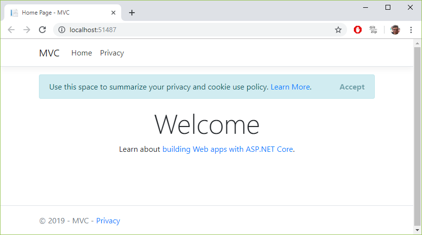

# ASP.NET Core Road to Microservices Part 01: Building the Views

### Introduction

In this article I will show how to create a basic e-commerce application flow using ASP.NET Core, with the help of Visual Studio.

This article is the first of a series of articles demonstrating various practices, patterns, technologies and frameworks 
that can be implemented in an ASP.NET Core e-commerce application, while we gradually approach the final goal of building a microservices
solution.

That said, if you feel a little disappointed for not finding any real microservices in this article, that's because there are
so many subjects I want to cover, that it would not be possible to talk about all of them (or discuss them more than scratching the surface) 
in just one article. Also, I would not present microservices right away, because I want to work in an "evolutionary" 
stepwise approach, refactoring and advancing the codebase as we go down the road. So please be patient, and enjoy the ride.
 
Since this is only the first article of a whole series, I would like to enumerate the envisioned for the next parts:

* Part 1  : Building the Views
* Part 2  : View Components
* Part 3  : Unit Testing with XUnit
* Part 4  : SQLite
* Part 5  : Dapper
* Part 6  : SignalR
* Part 7  : Unit Testing Web API
* Part 8  : Unit Testing Web MVC App
* Part 9  : Monitoring Health Checks       
* Part 10 : Redis Databases
* Part 11 : IdentityServer4
* Part 12 : Ordering Web API
* Part 13 : Basket Web API
* Part 14 : Catalog Web API
* Part 15 : Resilient HTTP Clients with Polly
* Part 16 : Documenting Web APIs with Swagger
* Part 17 : Docker containers
* Part 18 : Docker configurations
* Part 19 : Central Logging with Kibana

As we can see, there are many subjects to cover. Although the parts are numbered, that's just for counting purposes. In fact,
the actual order can change as we advance.

### Creating the Project

The project will be created using Visual Studio Community (this can be done via Visual Studio Code or even command-line tools),
selecting the MVC project template.

The MVC stands for Model-View-Controller, which is today a ubiquitous software architectural pattern for building user interfaces
while applying separation of concerns principles.

The Model part refers to the data carrying objects, responsible for holding the information displayed in the apparent user interface,
as well as to validate, gather and transport user typed information to the application back end. 

The View part is responsible for rendering/displaying user interface components. Usually these are referred to in lay terms as "web pages",
but in fact the web page is technically a complete set of HTML files (including header, body and footer), images, icons, CSS stylesheets,
JavaScript code and so on. A single view might render all the webpage, but usually each view is only responsible for the inner page contents.

The Controllers are the components responsible for dealing with the incoming requests made to a set of views, deciding which
data needs to be provided for the views, and requesting and preparing such data and invoking the views accordingly.
Controllers will also deal with data violations, redirecting the application to error pages when needed.

So let's get started by creating a new ASP.NET Core MVC project using Visual Studio.

First, we click new project from Visual Studio menu, selecting the "Web Application" option.


This will open up the wizard window, where we must choose the "Model-View-Controller" option. Be sure to unselect the
"SSL" option, because for the sake of simplicity, we are not using secure HTTP (HTTPS), at least not now.


As soon as the project is loaded from the selected MVC template, we can run (by pressing F5) and now we can see the
application's home page opening in our favorite web browser.



The above image shows a quite simple web application. The new project already gives us the files needed for a basic MVC architecture.

Now, which files are we talking about? Lets examine the solution tree in Visual Studio:


Notice in the above image how we have project folders for all of MVC parts: Model, View and Controller.

But how does our ASP.NET Core MVC application starts? As with every .NET application, the executable has
an "entry point", which must be a Main() method included in a Program class.

In an ASP.NET Core application, the Main() method must set up and launch a "web host", that is, the host for our
web application. 

```csharp
public class Program
{
    public static void Main(string[] args)
    {
        CreateWebHostBuilder(args).Build().Run();
    }

    public static IWebHostBuilder CreateWebHostBuilder(string[] args) =>
        WebHost.CreateDefaultBuilder(args)
            .UseStartup<Startup>();
}
```

As we can see here, the method `WebHost.CreateDefaultBuilder()` is invoked so that the webhost can be created, but since
it needs to be configured, we also have to call the `UseStartup()` to pass the Startup class name, which is responsible
for the webhost configuration. Let's see how this class works and how it's going to be used in our application.

The Startup has a simple structure. It contains only two methods:

* ConfigureServices()
* Configure()

In this context, a "service" is any component that can be added to provide our application with a specific functionality, 
e.g: MVC, logging, database, authentication, cookies, session, etc.

Such components are also called "middlewares" that can be part of a "pipeline". Each middleware decides if the request is to be passed to the next 
component in the pipeline, and may include algorithm to be executed before or after the following component in the pipeline.

Typically, a service called "MyService" would be referenced twice in our Startup class:

* First, in a AddMyService() method in the ConfigureServices() method. Here,
the AddMyService() method would be provided with appropriate configuration so that the service can function properly;
* Then, in a UseMyService() in the Configure() method.

*** QUAL A ANATOMIA DE UMA CLASSE STARTUP?

NOTE OS DOIS MÉTODOS DA STARTUP, CONFIGURE E CONFIGURESERVICES

```csharp
public class Startup
{
	public Startup(IConfiguration configuration)
	{
		Configuration = configuration;
	}

	public IConfiguration Configuration { get; }

	// This method gets called by the runtime. Use this method to add services to the container.
	public void ConfigureServices(IServiceCollection services)
	{
		services.Configure<CookiePolicyOptions>(options =>
		{
			// This lambda determines whether user consent for non-essential cookies is needed for a given request.
			options.CheckConsentNeeded = context => true;
			options.MinimumSameSitePolicy = SameSiteMode.None;
		});


		services.AddMvc().SetCompatibilityVersion(CompatibilityVersion.Version_2_2);
	}

	// This method gets called by the runtime. Use this method to configure the HTTP request pipeline.
	public void Configure(IApplicationBuilder app, IHostingEnvironment env)
	{
		if (env.IsDevelopment())
		{
			app.UseDeveloperExceptionPage();
		}
		else
		{
			app.UseExceptionHandler("/Home/Error");
			// The default HSTS value is 30 days. You may want to change this for production scenarios, see https://aka.ms/aspnetcore-hsts.
			app.UseHsts();
		}

		app.UseHttpsRedirection();
		app.UseStaticFiles();
		app.UseCookiePolicy();

		app.UseMvc(routes =>
		{
			routes.MapRoute(
				name: "default",
				template: "{controller=Home}/{action=Index}/{id?}");
		});
	}
}
```

Lorem ipsum dolor sit amet, consectetur adipiscing elit, sed do eiusmod tempor incididunt ut labore et dolore magna aliqua. Ut enim ad minim veniam, quis nostrud exercitation ullamco laboris nisi ut aliquip ex ea commodo consequat. Duis aute irure dolor in reprehenderit in voluptate velit esse cillum dolore eu fugiat nulla pariatur. Excepteur sint occaecat cupidatat non proident, sunt in culpa qui officia deserunt mollit anim id est laborum. 

### Index page

VAMOS TRABALHAR COM UM CONJUNTO LIMITADO DE 30 PRODUTOS DA LOJA

*** USANDO IMAGENS NO CATÁLOGO


A VIEW DE CATÁLOGO INCLUI UM COMPONETNE PRINCIPAL QUE É O CARROSSEL

*** A VIEW DO CATÁLOGO

```xml
@{
    ViewData["Title"] = "Home Page";
}

@for (int category = 0; category < 6; category++)
{
    <h3>Category Name</h3>

    <div id="carouselExampleIndicators-@category" class="carousel slide" data-ride="carousel">
        <ol class="carousel-indicators">
            <li data-target="#carouselExampleIndicators-@category" data-slide-to="0" class="active"></li>
            <li data-target="#carouselExampleIndicators-@category" data-slide-to="1"></li>
            <li data-target="#carouselExampleIndicators-@category" data-slide-to="2"></li>
        </ol>
        <div class="carousel-inner">
            <div class="carousel-item active">
                <div class="container">
                    <div class="row">
                        @for (int i = 0; i < 4; i++)
                        {
                        <div class="col-sm-3">
                            <div class="card">
                                <div class="card-body">
                                    
                                </div>
                                <div class="card-footer">
                                    <p class="card-text">Product Name</p>
                                    <h5 class="card-title text-center">$ 39.90</h5>
                                    <div class="text-center">
                                        <a href="#" class="btn btn-success">
                                            Add to basket
                                        </a>
                                    </div>
                                </div>
                            </div>
                        </div>
                        }
                    </div>
                </div>
            </div>
            <div class="carousel-item">
                <div class="container">
                    <div class="row">
                        @for (int i = 0; i < 1; i++)
                        {
                        <div class="col-sm-3">
                            <div class="card">
                                <div class="card-body">
                                    
                                </div>
                                <div class="card-footer">
                                    <p class="card-text">Product Name</p>
                                    <h5 class="card-title text-center">$ 39.90</h5>
                                    <div class="text-center">
                                        <a href="#" class="btn btn-success">
                                            Add to basket
                                        </a>
                                    </div>
                                </div>
                            </div>
                        </div>
                        }
                    </div>
                </div>
            </div>
        </div>
        <a class="carousel-control-prev" href="#carouselExampleIndicators-@category" role="button" data-slide="prev">
            <span class="carousel-control-prev-icon" aria-hidden="true"></span>
            <span class="sr-only">Previous</span>
        </a>
        <a class="carousel-control-next" href="#carouselExampleIndicators-@category" role="button" data-slide="next">
            <span class="carousel-control-next-icon" aria-hidden="true"></span>
            <span class="sr-only">Next</span>
        </a>
    </div>
}
```


### Styling

VAMOS ESTILIZAR O CARROSSEL UTILIZANDO UM FONTE ESPECIAL PARA TRABALHAR COM ÍCONES

*** USANDO UMA FONTE PARA ÍCONES


PARA USAR ESSA FONTE É NECESSÁRIO REFERNECIAÁ-LA NO _LAYOUT.CSHTML

*** REFERENCIANDO A FONTE AWESOME

```html
<link href="~/lib/font-awesome/css/font-awesome.css" rel="stylesheet" />
<link rel="stylesheet" href="~/css/site.css" />
```

AGORA QUE ADICIONAMOS A REFERENCIA, VAMOS USAR UM ÍCONE DA FONTE, PARA O CARRINHO DE COMPRAS NO BOTÃO DO PRODUTO

*** ADICIONANDO O ÍCONE DE CARRINHO

```html
<a href="#" class="btn btn-success">
    <span class="fa fa-shopping-cart"></span>
    Add to basket
</a>
```

*** A NOVA VIEW DE CATÁLOGO

RODANDO A APLICAÇÃO, A VIEW DE CATÁLOGO AGORA TEM ESTA APARENCIA


Lorem ipsum dolor sit amet, consectetur adipiscing elit, sed do eiusmod tempor incididunt ut labore et dolore magna aliqua. Ut enim ad minim veniam, quis nostrud exercitation ullamco laboris nisi ut aliquip ex ea commodo consequat. Duis aute irure dolor in reprehenderit in voluptate velit esse cillum dolore eu fugiat nulla pariatur. Excepteur sint occaecat cupidatat non proident, sunt in culpa qui officia deserunt mollit anim id est laborum. 

### Branding

O TEMPLATE FORNECIDO PELO ASPNET CORE FORNECE MEIOS PARA ADIOCIONAR SUA MARCA. VAMOS VER COMO FAZER ISSO

VAMOS TROCAR O NOME DA LOJA NO RODAPÉ DA PÁGINA

*** TROCANDO O NOME DA LOJA

```html
<div class="container">
    &copy; 2019 - The Grocery Store - <a asp-area="" asp-controller="Home" asp-action="Privacy">Privacy</a>
</div>
```

AGORA VAMOS DEFINIR O LOGOTIPO NA BARRA

*** USANDO LOGO NO PLANO DE FUNDO DA BARRA DE NAVEGAÇÃO

```css
a.navbar-brand {
    white-space: normal;
    text-align: center;
    word-break: break-all;
    background: url('../images/logo.png');
    width: 215px;
    height: 55px;
}
```

*** O LOGOTIPO


Lorem ipsum dolor sit amet, consectetur adipiscing elit, sed do eiusmod tempor incididunt ut labore et dolore magna aliqua. Ut enim ad minim veniam, quis nostrud exercitation ullamco laboris nisi ut aliquip ex ea commodo consequat. Duis aute irure dolor in reprehenderit in voluptate velit esse cillum dolore eu fugiat nulla pariatur. Excepteur sint occaecat cupidatat non proident, sunt in culpa qui officia deserunt mollit anim id est laborum. 

### Partial views

*** O QUE SÃO PARTIAL Views

*** POR QUE USAR PARTIAL VIEWS

*** A VIEW INDEX.CSHTML REFATORADA

Index.cshtml

```html
@{
    ViewData["Title"] = "Catalog";
    var products = Enumerable.Range(0, 30);
}

<partial name="_Categories" for="@products" />
```

*** A PARTIAL VIEW DE CATEGORIAS

_Categories.cshtml
```html
@model IEnumerable<int>;

@{
    var products = Model;
    const int productsPerCategory = 5;
    const int PageSize = 4;
}

@for (int category = 0; category < (products.Count() / productsPerCategory); category++)
{
    <h3>Category @(category + 1)</h3>

    <div id="carouselExampleIndicators-@category" class="carousel slide" data-ride="carousel">
        <div class="carousel-inner">
            @{
                int pageCount = (int)Math.Ceiling((double)productsPerCategory / PageSize);
                var productsInCategory =
                    products
                    .Skip(category * productsPerCategory)
                    .Take(productsPerCategory);

                for (int pageIndex = 0; pageIndex < pageCount; pageIndex++)
                {
                <div class="carousel-item @(pageIndex == 0 ? "active" : "")">
                    <div class="container">
                        <div class="row">
                            @{
                                var productsInPage =
                                    productsInCategory
                                    .Skip(pageIndex * PageSize)
                                    .Take(PageSize);

                                foreach (var productIndex in productsInPage)
                                {
                                    <partial name="_ProductCard" for="@productIndex"/>
                                }
                            }
                        </div>
                    </div>
                </div>
                }
            }
        </div>
        <a class="carousel-control-prev" href="#carouselExampleIndicators-@category" role="button" data-slide="prev">
            <span class="carousel-control-prev-icon" aria-hidden="true"></span>
            <span class="sr-only">Previous</span>
        </a>
        <a class="carousel-control-next" href="#carouselExampleIndicators-@category" role="button" data-slide="next">
            <span class="carousel-control-next-icon" aria-hidden="true"></span>
            <span class="sr-only">Next</span>
        </a>
    </div>
}
```

*** A PARTIAL VIEW DE CARD DE PRODUTO

_ProductCard.cshtml


```html
@model int;

@{ 
    var productIndex = Model;
}

<div class="col-sm-3">
    <div class="card">
        <div class="card-body">
            
        </div>
        <div class="card-footer">
            <p class="card-text">Product Name</p>
            <h5 class="card-title text-center">$ 39.90</h5>
            <a href="#" class="btn btn-success">
                <span class="fa fa-shopping-cart"></span>
                Add to basket
            </a>
            </div>
        </div>
    </div>
</div>
```

Lorem ipsum dolor sit amet, consectetur adipiscing elit, sed do eiusmod tempor incididunt ut labore et dolore magna aliqua. Ut enim ad minim veniam, quis nostrud exercitation ullamco laboris nisi ut aliquip ex ea commodo consequat. Duis aute irure dolor in reprehenderit in voluptate velit esse cillum dolore eu fugiat nulla pariatur. Excepteur sint occaecat cupidatat non proident, sunt in culpa qui officia deserunt mollit anim id est laborum. 

### Search Products Partial View

*** USANDO PARTIAL VIEW PARA BUSCA DE PRODUTOS

*** ADICIONANDO UMA PARTIAL VIEW PARA BUSCA DE PRODUTOS

_Index.cshtml
```html
@ {
    var products = Enumerable.Range(0, 30);
}

<partial name="_SearchProducts"/>

<partial name="_Categories" for="@products" />
```

*** A PARTIAL VIEW DE BUSCA DE PRODUTOS

_SearchProducts.cshtml
```html
<div class="container">
    <h2>Search products</h2>
    <div id="custom-search-input">
        <div class="input-group col-md-12">
            <form>
                <div class="container">
                    <div class="row">
                        <div>
                            <input type="text" name="search"
                                   class="form-control input-lg"
                                   placeholder="category or product" />
                        </div>
                        <div>
                            <div class="input-group-btn text-center">
                                <a href="#" class="btn btn-success">
                                    <span class="fa fa-search"></span>
                                </a>
                            </div>
                        </div>
                    </div>
                </div>
            </form>
        </div>
    </div>
</div>
```

Lorem ipsum dolor sit amet, consectetur adipiscing elit, sed do eiusmod tempor incididunt ut labore et dolore magna aliqua. Ut enim ad minim veniam, quis nostrud exercitation ullamco laboris nisi ut aliquip ex ea commodo consequat. Duis aute irure dolor in reprehenderit in voluptate velit esse cillum dolore eu fugiat nulla pariatur. Excepteur sint occaecat cupidatat non proident, sunt in culpa qui officia deserunt mollit anim id est laborum. 

### Basket view

*** CRIANDO UMA SUPERCLASSE PARA OS CONTROLLERS


BaseController.cs

```csharp
public abstract class BaseController : Controller
{
    [ResponseCache(Duration = 0, Location = ResponseCacheLocation.None, NoStore = true)]
    public IActionResult Error()
    {
        return View(new ErrorViewModel { RequestId = Activity.Current?.Id ?? HttpContext.TraceIdentifier });
    }
}
```

*** HERDANDO DA SUPERCLASSE

```csharp
public class CatalogController : BaseController
{
    public IActionResult Index()
    {
        return View();
    }
}

public class BasketController : BaseController
{
    public IActionResult Index()
    {
        return View();
    }
}
```

*** MODIFICANDO A ROTA PADRÃO

Startup.cs

```csharp
 template: "{controller=Catalog}/{action=Index}/{id?}");
```

*** CRIANDO A VIEW PARA O CARRINHO

Index.cshtml

```html
@{
    ViewData["Title"] = "My Basket";

    var items = new[]
    {
        new { Id = 1, ProductId = 1, Name = "Broccoli", UnitPrice = 59.90, Quantity = 2 },
        new { Id = 2, ProductId = 5, Name = "Green Grapes", UnitPrice = 59.90, Quantity = 3 },
        new { Id = 3, ProductId = 9, Name = "Tomato", UnitPrice = 59.90, Quantity = 4 }
    };
}

<div class="row">
    <div class="col-sm-12">
        <div class="pull-right">
            <a class="btn btn-success" href="/">
                Add More Products
            </a>
            <a class="btn btn-success" href="/registration">
                Fill in Registration
            </a>
        </div>
    </div>
</div>

<h3>My Basket</h3>

<div class="card">
    <div class="card-header">
        <div class="row">
            <div class="col-sm-6">
                Item
            </div>
            <div class="col-sm-2 text-center">
                Unit Price
            </div>
            <div class="col-sm-2 text-center">
                Quantity
            </div>
            <div class="col-sm-2">
                <span class="pull-right">
                    Subtotal
                </span>
            </div>
        </div>
    </div>
    <div class="card-body">
        @foreach (var item in items)
        {
        <div class="row row-center">
            <div class="col-sm-2">
                
            </div>
            <input type="hidden" name="productId" value="012" />
            <div class="col-sm-4">@item.Name</div>
            <div class="col-sm-2 text-center">@item.UnitPrice.ToString("C")</div>
            <div class="col-sm-2 text-center">
                <div class="input-group">
                    <button type="button" class="btn btn-light">
                        <span class="fa fa-minus"></span>
                    </button>
                    <input type="text" value="@item.Quantity"
                            class="form-control text-center quantity" />
                    <button type="button" class="btn btn-light">
                        <span class="fa fa-plus"></span>
                    </button>
                </div>
            </div>
            <div class="col-sm-2">
                <div class="pull-right">
                    <span class="pull-right" subtotal>
                        @((item.Quantity * item.UnitPrice).ToString("C"))
                    </span>
                </div>
            </div>
        </div>
        <br />
        }
    </div>
    <div class="card-footer">
        <div class="row">
            <div class="col-sm-10">
                <span numero-items>
                    Total: @items.Length
                    item@(items.Length > 1 ? "s" : "")
                </span>
            </div>
            <div class="col-sm-2">
                Total: <span class="pull-right" total>
                    @(items.Sum(item => item.Quantity * item.UnitPrice).ToString("C"))
                </span>
            </div>
        </div>
    </div>
</div>

<br />

<div class="row">
    <div class="col-sm-12">
        <div class="pull-right">
            <a class="btn btn-success" href="/">
                Add More Products
            </a>
            <a class="btn btn-success" href="/registration">
                Fill in Registration
            </a>
        </div>
    </div>
</div>
```

*** ALINHANDO OS ÍTENS

site.css

```css
.row-center {
    display: flex;
    align-items: center;
}
```


Lorem ipsum dolor sit amet, consectetur adipiscing elit, sed do eiusmod tempor incididunt ut labore et dolore magna aliqua. Ut enim ad minim veniam, quis nostrud exercitation ullamco laboris nisi ut aliquip ex ea commodo consequat. Duis aute irure dolor in reprehenderit in voluptate velit esse cillum dolore eu fugiat nulla pariatur. Excepteur sint occaecat cupidatat non proident, sunt in culpa qui officia deserunt mollit anim id est laborum. 

### Basket partial views

*** MOVENDO VIEW DE CARRINHO PARA VIEWS PARCIAIS

*** CRIANDO CLASSE PARA ITEM DO CARRINHO

BasketController.cs

```csharp
public class BasketItem
{
    public int Id { get; set; }
    public int ProductId { get; set; }
    public string Name { get; set; }
    public decimal UnitPrice { get; set; }
    public int Quantity { get; set; }
}
```

*** VIEW PARCIAL PARA CONTROLES DO CARRINHO

_BasketControls.cshtml

```html
<div class="row">
    <div class="col-sm-12">
        <div class="pull-right">
            <a class="btn btn-success" href="/">
                Add More Products
            </a>
            <a class="btn btn-success" href="/">
                Fill in Registration
            </a>
        </div>
    </div>
</div>
```

*** VIEW DE CARRINHO REFATORADA

Index.cshtml

```html
@using MVC.Controllers
@{
    ViewData["Title"] = "My Basket";
    List<BasketItem> items = new List<BasketItem>
    {
        new BasketItem { Id = 1, ProductId = 1, Name = "Broccoli", UnitPrice = 59.90m, Quantity = 2 },
        new BasketItem { Id = 2, ProductId = 5, Name = "Green Grapes", UnitPrice = 59.90m, Quantity = 3 },
        new BasketItem { Id = 3, ProductId = 9, Name = "Tomato", UnitPrice = 59.90m, Quantity = 4 }
    };
}

<partial name="_BasketControls" />

<h3>My Basket</h3>

<partial name="_BasketList" for="@items" />
<br />
<partial name="_BasketControls" />
```

_BasketList.cshtml

*** LISTA DO CARRINHO PARTIAL VIEW

```html
@using MVC.Controllers
@model List<BasketItem>;

@{
    var items = Model;
}

<div class="card">
    <div class="card-header">
        <div class="row">
            <div class="col-sm-6">
                Item
            </div>
            <div class="col-sm-2 text-center">
                Unit Price
            </div>
            <div class="col-sm-2 text-center">
                Quantity
            </div>
            <div class="col-sm-2">
                <span class="pull-right">
                    Subtotal
                </span>
            </div>
        </div>
    </div>
    <div class="card-body">
        @foreach (var item in items)
        {
            <partial name="_BasketItem" for="@item" />
        }
    </div>
    <div class="card-footer">
        <div class="row">
            <div class="col-sm-10">
                <span numero-items>
                    Total: @items.Count
                    item@(items.Count > 1 ? "s" : "")
                </span>
            </div>
            <div class="col-sm-2">
                Total: <span class="pull-right" total>
                    @(items.Sum(item => item.Quantity* item.UnitPrice).ToString("C"))
                </span>
            </div>
        </div>
    </div>
</div>
```


_BasketItem.cshtml

```html
@using MVC.Controllers

@model BasketItem

@{
    var item = Model;
}

<div class="row row-center product-line" item-id="@item.Id.ToString("000")">
    <div class="col-sm-2">
        
    </div>
    <input type="hidden" name="productId" value="012" />
    <div class="col-sm-4">@item.Name</div>
    <div class="col-sm-2 text-center">@item.UnitPrice.ToString("C")</div>
    <div class="col-sm-2 text-center">
        <div class="input-group">
            <button type="button" class="btn btn-light">
                <span class="fa fa-minus"></span>
            </button>
            <input type="text" value="@item.Quantity"
                   class="form-control text-center quantity" />
            <button type="button" class="btn btn-light">
                <span class="fa fa-plus"></span>
            </button>
        </div>
    </div>
    <div class="col-sm-2">
        <div class="pull-right">
            <span class="pull-right" subtotal>
                @((item.Quantity * item.UnitPrice).ToString("C"))
            </span>
        </div>
    </div>
</div>
<br />
```

Lorem ipsum dolor sit amet, consectetur adipiscing elit, sed do eiusmod tempor incididunt ut labore et dolore magna aliqua. Ut enim ad minim veniam, quis nostrud exercitation ullamco laboris nisi ut aliquip ex ea commodo consequat. Duis aute irure dolor in reprehenderit in voluptate velit esse cillum dolore eu fugiat nulla pariatur. Excepteur sint occaecat cupidatat non proident, sunt in culpa qui officia deserunt mollit anim id est laborum. 

### Registration View


RegistrationController.cs

*** O CONTROLLER DE REGISTRATION

```csharp
using Microsoft.AspNetCore.Mvc;

namespace MVC.Controllers
{
    public class RegistrationController : BaseController
    {
        public IActionResult Index()
        {
            return View();
        }
    }
}
```

*** A VIEW REGISTRATION

Index.cshtml

```html
<h3>Registration</h3>

<form method="post" action="/">
    <div class="card">
        <div class="card-body">
            <div class="row">
                <div class="col-sm-4">
                    <div class="form-group">
                        <label class="control-label">Customer Name</label>
                        <input type="text" class="form-control" />
                    </div>
                    <div class="form-group">
                        <label class="control-label">Email</label>
                        <input type="email" class="form-control" />
                    </div>
                    <div class="form-group">
                        <label class="control-label">Phone</label>
                        <input type="text" class="form-control" />
                    </div>
                </div>
                <div class="col-sm-4">
                    <div class="form-group">
                        <label class="control-label">Address</label>
                        <input type="text" class="form-control" />
                    </div>
                    <div class="form-group">
                        <label class="control-label">Additional Address</label>
                        <input type="text" class="form-control" />
                    </div>
                    <div class="form-group">
                        <label class="control-label">District</label>
                        <input type="text" class="form-control" />
                    </div>
                </div>
                <div class="col-sm-4">
                    <div class="form-group">
                        <label class="control-label">City</label>
                        <input type="text" class="form-control" />
                    </div>
                    <div class="form-group">
                        <label class="control-label">State</label>
                        <input type="text" class="form-control" />
                    </div>
                    <div class="form-group">
                        <label class="control-label">Zip Code</label>
                        <input type="text" class="form-control" />
                    </div>

                    <div class="form-group">
                        <a class="btn btn-success" href="/">
                            Keep buying
                        </a>
                    </div>
                    <div class="form-group">
                        <button type="submit"
                                class="btn btn-success button-notification">
                            Check out
                        </button>
                    </div>
                </div>
            </div>
        </div>
    </div>
</form>
```

Lorem ipsum dolor sit amet, consectetur adipiscing elit, sed do eiusmod tempor incididunt ut labore et dolore magna aliqua. Ut enim ad minim veniam, quis nostrud exercitation ullamco laboris nisi ut aliquip ex ea commodo consequat. Duis aute irure dolor in reprehenderit in voluptate velit esse cillum dolore eu fugiat nulla pariatur. Excepteur sint occaecat cupidatat non proident, sunt in culpa qui officia deserunt mollit anim id est laborum. 

*** CONTROLLER DE CHECKOUT

### Checkout View

CheckoutController.cs


```csharp
public class CheckoutController : BaseController
{
    public IActionResult Index()
    {
        return View();
    }
}
```

*** A VIEW DE CHECKOUT

Index.cshtml

```html
@model string

@{ 
    ViewData["Title"] = "Checkout";
    var email = "alice@smith.com";
}
<h3>Order Has Been Placed!</h3>

<div class="panel-info">
    <p>Your order has been placed.</p>
    <p>Soon you will receive an e-mail at <b>@email</b> including all order details.</p>
    <p><a href="/" class="btn btn-success">Back to product catalog</a></p>
</div>
```


aliqua. Ut enim ad minim veniam, quis nostrud exercitation ullamco laboris nisi ut aliquip ex ea commodo consequat. Duis aute irure dolor in reprehenderit in voluptate velit esse cillum dolore eu fugiat nulla pariatur. Excepteur sint occaecat cupidatat non proident, sunt in culpa qui officia deserunt mollit anim id est laborum. 

### Notifications View

*** CONTROLLER DE NOTIFICATION

NotificationsController.cs

```csharp
public class NotificationsController : BaseController
{
    public IActionResult Index()
    {
        return View();
    }
}
```

*** VIEW DE NOTIFICATION

Index.cshtml

```html
@{
    ViewData["Title"] = "Notifications";
}
<h3>User Notifications</h3>

<div class="row">
    <div class="col-sm-12">
        <div class="pull-right">
            <a class="btn btn-success" href="/">
                Back to Catalog
            </a>
        </div>
    </div>
</div>
<br />

<div class="card">
    <div class="card-header">
        <div class="row">
            <div class="col-sm-2 text-center">
                <!--NEW?-->
            </div>
            <div class="col-sm-8">
                Message
            </div>
            <div class="col-sm-2 text-center">
                Date / Time
            </div>
        </div>
    </div>
    <div class="card-body notifications">
        <div class="row">
            <div class="col-sm-2 text-center">
                <span class="fa fa-envelope-open"></span>
            </div>
            <div class="col-sm-8">
                New order placed successfully: 2
            </div>
            <div class="col-sm-2 text-center">
                <span>
                    13/04/2019
                </span>
                &nbsp;
                <span>
                    18:04
                </span>
            </div>
        </div>
    </div>
</div>
<br />
<div class="row">
    <div class="col-sm-12">
        <div class="pull-right">
            <a class="btn btn-success" href="/">
                Back to Catalog
            </a>
        </div>
    </div>
</div>
```


Lorem ipsum dolor sit amet, consectetur adipiscing elit, sed do eiusmod tempor incididunt ut labore et dolore magna aliqua. Ut enim ad minim veniam, quis nostrud exercitation ullamco laboris nisi ut aliquip ex ea commodo consequat. Duis aute irure dolor in reprehenderit in voluptate velit esse cillum dolore eu fugiat nulla pariatur. Excepteur sint occaecat cupidatat non proident, sunt in culpa qui officia deserunt mollit anim id est laborum. 

### Json product load

*** CONTROLLER DE CATALOG

```csharp
public class CatalogController : BaseController
{
    public async Task<IActionResult> Index()
    {
        var products = await SeedData.GetProducts();
        return View(products);
    }
}
```

*** BASE MODEL

```csharp
using System.Runtime.Serialization;

namespace MVC.Models
{
    public abstract class BaseModel
    {
        public int Id { get; set; }
    }
}
```

*** CATEGORY MODEL

```csharp
public class Category : BaseModel
{
    public Category(int id, string name)
    {
        Id = id;
        Name = name;
    }

    public string Name { get; private set; }
}
```

*** PRODUCT MODEL

```csharp
public class Product : BaseModel
{
    public Category Category { get; set; }
    public string Code { get; set; }
    public string Name { get; set; }
    public decimal Price { get; set; }
    public string ImageURL { get { return $"/images/catalog/large_{Code}.jpg"; } }

    public Product(int id, string code, string name, decimal price, Category category)
    {
        Id = id;
        Code = code;
        Name = name;
        Price = price;
        Category = category;
    }
}
```

*** COMO OS DADOS DE PRODUTOS SÃO CARREGADOS?

```csharp
public class SeedData
{
    public static async Task<List<Product>> GetProducts()
    {
        var json = await File.ReadAllTextAsync("products.json");
        var data = JsonConvert.DeserializeObject<List<ProductData>>(json);

        var dict = new Dictionary<string, Category>();

        var categories = 
            data
            .Select(i => i.category)
            .Distinct();

        foreach (var name in categories)
        {
            var category = new Category(dict.Count + 1, name);
            dict.Add(name, category);
        }

        var products = new List<Product>();

        foreach (var item in data)
        {
            Product product = new Product(
                products.Count + 1,
                item.number.ToString("000"),
                item.name,
                item.price,
                dict[item.category]);
            products.Add(product);
        }

        return products;
    }
}

public class ProductData
{
    public int number { get; set; }
    public string name { get; set; }
    public string category { get; set; }
    public decimal price { get; set; }
}
```

*** MODIFICANDO O MODELO NA VIEW DE CATALOGO

Index.cshtml

```html
@model List<Product>;
@using MVC.Models;
@{
    ViewData["Title"] = "Catalog";
}

<partial name="_SearchProducts"/>

<partial name="_Categories" for="@Model" />
```

*** MODIFICANDO O MODEL DA PARTIAL VIEW DE CARD DE PRODUTO

_ProductCard.cshtml
```html
@model Product;
@using MVC.Models;

@{ 
    var product = Model;
}

<div class="col-sm-3">
    <div class="card">
        <div class="card-body">
            
        </div>
        <div class="card-footer">
            <p class="card-text">@product.Name</p>
            <h5 class="card-title text-center">@product.Price.ToString("C")</h5>
            <div class="text-center">
                <a href="#" class="btn btn-success">
                    <span class="fa fa-shopping-cart"></span>
.
.
.
```

*** MODIFICANDO O MODEL DA PARTIAL VIEW DE CATEGORIAS

_Categories.cshtml

```html
@model List<Product>;

@{
    var products = Model;
    const int PageSize = 4;
    var categories = products.Select(p => p.Category).Distinct();
}
.
.
.
@foreach (var category in categories)
{
    <h3>@category.Name</h3>

    <div id="carouselExampleIndicators-@category.Id" class="carousel slide" data-ride="carousel">
.
.
.
        var productsInCategory = products
            .Where(p => p.Category.Id == category.Id);
        int pageCount = (int)Math.Ceiling((double)productsInCategory.Count() / PageSize);
.
.
.
<a class="carousel-control-prev" href="#carouselExampleIndicators-@category.Id" role="button" data-slide="prev">
.
.
.
<a class="carousel-control-next" href="#carouselExampleIndicators-@category.Id" role="button" data-slide="next">
```

*** MODIFICANDO A CLASSE DE CARGA DE PRODUTOS

```csharp
public class SeedData
{
    public static async Task<List<Product>> GetProducts()
    {
        var json = await File.ReadAllTextAsync("products.json");
        var data = JsonConvert.DeserializeObject<List<ProductData>>(json);

        var dict = new Dictionary<string, Category>();

        var categories = 
            data
            .Select(i => i.category)
            .Distinct();

        foreach (var name in categories)
        {
            var category = new Category(dict.Count + 1, name);
            dict.Add(name, category);
        }

        var products = new List<Product>();

        foreach (var item in data)
        {
            Product product = new Product(
                products.Count + 1,
                item.number.ToString("000"),
                item.name,
                item.price,
                dict[item.category]);
            products.Add(product);
        }

        return products;
    }
}

public class ProductData
{
    public int number { get; set; }
    public string name { get; set; }
    public string category { get; set; }
    public decimal price { get; set; }
}
```

O ARQUIVO DE DADOS DE PRODUTOS

products.json

```json
[
  {
    "number": 1,
    "name": "Oranges",
    "category": "Fruits",
    "price": 5.90
  },
  {
    "number": 2,
    "name": "Lemons",
    "category": "Fruits",
    "price": 5.90
  },
  {
    "number": 3,
    "name": "Bananas",
    "category": "Fruits",
    "price": 6.90
  },
  {
    "number": 4,
    "name": "Strawberries",
    "category": "Fruits",
    "price": 7.90
  },
  {
    "number": 5,
    "name": "Grapes",
    "category": "Fruits",
    "price": 5.90
  },
  {
    "number": 6,
    "name": "Carrots",
    "category": "Legumes",
    "price": 5.90
  },
  {
    "number": 7,
    "name": "Yellow peppers",
    "category": "Legumes",
    "price": 8.90
  },
  {
    "number": 8,
    "name": "Potatoes",
    "category": "Legumes",
    "price": 5.90
  },
  {
    "number": 9,
    "name": "Tomatoes",
    "category": "Legumes",
    "price": 4.90
  },
  {
    "number": 10,
    "name": "Eggplants",
    "category": "Legumes",
    "price": 5.90
  },
  {
    "number": 11,
    "name": "Lettuce",
    "category": "Vegetables",
    "price": 7.90
  },
  {
    "number": 12,
    "name": "Broccoli",
    "category": "Vegetables",
    "price": 5.90
  },
  {
    "number": 13,
    "name": "Cauliflower",
    "category": "Vegetables",
    "price": 4.90
  },
  {
    "number": 14,
    "name": "Onion",
    "category": "Vegetables",
    "price": 5.90
  },
  {
    "number": 15,
    "name": "Aspargus",
    "category": "Vegetables",
    "price": 8.90
  },
  {
    "number": 16,
    "name": "Rice",
    "category": "Grains / Beans",
    "price": 6.90
  },
  {
    "number": 17,
    "name": "Beans",
    "category": "Grains / Beans",
    "price": 6.90
  },
  {
    "number": 18,
    "name": "Oat",
    "category": "Grains / Beans",
    "price": 3.90
  },
  {
    "number": 19,
    "name": "Corn",
    "category": "Grains / Beans",
    "price": 3.90
  },
  {
    "number": 20,
    "name": "Peas",
    "category": "Grains / Beans",
    "price": 5.90
  },
  {
    "number": 21,
    "name": "Milk",
    "category": "Dairy products",
    "price": 4.90
  },
  {
    "number": 22,
    "name": "Cheese",
    "category": "Dairy products",
    "price": 8.90
  },
  {
    "number": 23,
    "name": "Yogurt",
    "category": "Dairy products",
    "price": 6.90
  },
  {
    "number": 24,
    "name": "Butter",
    "category": "Dairy products",
    "price": 5.90
  },
  {
    "number": 25,
    "name": "Cream cheese",
    "category": "Dairy products",
    "price": 6.90
  },
  {
    "number": 26,
    "name": "Sliced ham",
    "category": "Meat & eggs",
    "price": 7.90
  },
  {
    "number": 27,
    "name": "Beef",
    "category": "Meat & eggs",
    "price": 6.90
  },
  {
    "number": 28,
    "name": "Shrimp",
    "category": "Meat & eggs",
    "price": 8.90
  },
  {
    "number": 29,
    "name": "Barbecue",
    "category": "Meat & eggs",
    "price": 6.90
  },
  {
    "number": 30,
    "name": "Eggs",
    "category": "Meat & eggs",
    "price": 4.90
  }
]

```

Lorem ipsum dolor sit amet, consectetur adipiscing elit, sed do eiusmod tempor incididunt ut labore et dolore magna aliqua. Ut enim ad minim veniam, quis nostrud exercitation ullamco laboris nisi ut aliquip ex ea commodo consequat. Duis aute irure dolor in reprehenderit in voluptate velit esse cillum dolore eu fugiat nulla pariatur. Excepteur sint occaecat cupidatat non proident, sunt in culpa qui officia deserunt mollit anim id est laborum. 

### Links

*** AJUSTANDO OS LINKS PARA CRIAR O FLUXO DE NAVEGAÇÃO DA APLICAÇÃO

VAMOS USAR TAG HELPERS PARA OS LINKS DE COMPRAR MAIS PRODUTOS E PREENCHER O REGISTRATION

_BasketControls.cshtml

```html
.
.
.
    <div class="pull-right">
        <a asp-controller="catalog" class="btn btn-success">
            Add More Products
        </a>
        <a asp-controller="registration" class="btn btn-success">
            Fill in Registration
        </a>
    </div>
```

*** MODIFICANDO O CARD DE PRODUTO

VAMOS USAR UM TAG HELPER PARA O LINK DE ADICONAR AO CARRINHO NO CARD DE PRODUTO

_ProductCard.cshtml

```html
<a href="#" class="btn btn-success">
```

```html
<a asp-controller="basket" class="btn btn-success">
```

*** MODIFICANDO A VIEW DE REGISTRATION

VAMOS ADICIONAR A ACTION PARA O FORM DE REGISTRATION

Registration\Index.cshtml

```html
<form method="post" action="checkout">
```

Lorem ipsum dolor sit amet, consectetur adipiscing elit, sed do eiusmod tempor incididunt ut labore et dolore magna aliqua. Ut enim ad minim veniam, quis nostrud exercitation ullamco laboris nisi ut aliquip ex ea commodo consequat. Duis aute irure dolor in reprehenderit in voluptate velit esse cillum dolore eu fugiat nulla pariatur. Excepteur sint occaecat cupidatat non proident, sunt in culpa qui officia deserunt mollit anim id est laborum. 

