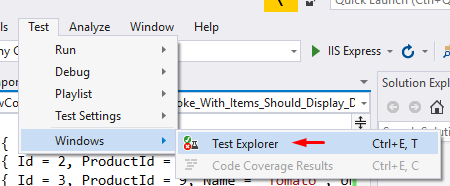
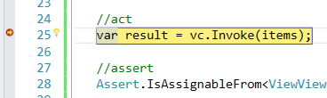

### Introduction

Welcome to the second installment of the "**ASP.NET Core Roadmap to Microservices**" article series.

In the last article, we saw how to build the basic views of the e-commerce application, using views and **Partial Views**. Today we will explore the subject of **View Components** in ASP.NET Core.

What are view components? How they compare to **partial views**? And how they apply in our e-commerce project?

### Partial View vs. View Component
 
The partial views we introduced in the previous article are capable enough to perform the
role of view composition for the e-commerce application.

We have seen how partial views allow us to break up large markup files into smaller components,
and reduce the duplication of common markup content across markup files.

**View Component** is a concept introduced by ASP.NET Core, and is similar to a partial view.
While view components are as capable as partial views in decomposing large views and reducing duplication,
but they're also built differently, and are much more powerful.

Partial views, just like regular views, use **model binding**, that is, the model data which must be provided by
a specific controller action. View components, on the other hand, only depend on the data provided to them as parameters.

Although we are implementing the view components in an e-commerce application, which based on controllers and views, 
it is also possible to develop view components for **Razor Pages**.

### Replacing Basket Partial Views with View Components

In the previous article, we broke the Basket view into smaller partial views, as we can see in the folder structure below:


**Picture**: basket-related partial views

Each one of these markup files is responsible for rendering a different layer of elements inside the basket view:

- Basket/Index (View)
    - Basket Controls (Partial View)
    - Basket List (Partial View)
    - Basket Item (Partial View)

```razor
<partial name="_BasketControls" />

<h3>My Basket</h3>

<partial name="_BasketList" for="@items" />

<br />

<partial name="_BasketControls" />
```
**Listing**: an example of how to use partial views (\Views\Basket\Index.cshtml)

But Partial Views are somehow limited, and don't allow some interesting features that we can find in View Components, such:

- Behavior independent from the hosting view
- Separation of concerns similar to controller/views
- Parameters
- Business logic
- Testability

But these nice features also mean we have a little more work to do in order to create view components.
Besides the markup file, we also have to create a dedicated class for the view component.
But this must reside in a **ViewComponents** folder, which we must create first.

Now let's create a class named BasketListViewComponent inside the **ViewComponents** folder.

This class just needs to have an Invoke() method calling and returning the `Default` view:

```csharp
public class BasketListViewComponent : ViewComponent
{
    public IViewComponentResult Invoke()
    {
        return View("Default");
    }
}
```
**Listing** : the ViewComponents\BasketListViewComponent.cs file

But notice how our previous Basket List partial view had an attribute for the model:

```razor
<partial name="_BasketList" for="@items" />
```

This `@items` attribute will now be passed to the new `BasketListViewComponent` through an items parameter
in the `Invoke()` method of the `BasketListViewComponent` class, and it is then passed as a model
for the `Default` markup file:

```csharp
public class BasketListViewComponent : ViewComponent
{
    public IViewComponentResult Invoke(List<BasketItem> items)
    {
        return View("Default", items);
    }
}
```
**Listing** : the ViewComponents\BasketListViewComponent.cs file

By default, view component class names must have the **-ViewComponent** suffix. But you can override this rule
by using the `ViewComponentAttribute` and setting the name of the component (Notice that this allows you to use 
any class name you want).

```csharp
[ViewComponent(Name = "BasketList")]
public class BasketList : ViewComponent
{
    public IViewComponentResult Invoke(List<BasketItem> items)
    {
        return View("Default", items);
    }
}
```
**Listing** : using attribute to set the view component name

Now let's create the markup (view) file for the component. First, we have to create
a **\Components** folder under the **\Views\Basket** folder, and then 
a **\BasketList** folder under the **\Components** folder. Then we create the `Default.cshtml` file
(which is by the way the default name for any component), which looks exactly like a regular
view file. Add a new MVC view (scaffolding) with no template, no model and no layout:


**Picture**: Adding a new view component view

```razor
@{
    Layout = null;
}

<!DOCTYPE html>

<html>
<head>
    <meta name="viewport" content="width=device-width" />
    <title>Default</title>
</head>
<body>
</body>
</html>
```
**Listing**: \Views\Components\BasketList\Default.cshtml file

Notice that the new BasketList View Component is meant to replace the current BasketList partial view.
Therefore, we will overwrite the contents of the former with the contents of the latter:

```razor
@using MVC.Controllers
@model List<BasketItem>;

@{
    var items = Model;
}

<div class="card">
    <div class="card-header">
        <div class="row">
            <div class="col-sm-6">
                Item
            </div>
            <div class="col-sm-2 text-center">
                Unit Price
            </div>
            <div class="col-sm-2 text-center">
                Quantity
            </div>
            <div class="col-sm-2">
                <span class="pull-right">
                    Subtotal
                </span>
            </div>
        </div>
    </div>
    <div class="card-body">
        @foreach (var item in items)
        {
            <partial name="_BasketItem" for="@item" />
        }
    </div>
    <div class="card-footer">
        <div class="row">
            <div class="col-sm-10">
                <span numero-items>
                    Total: @items.Count
                    item@(items.Count > 1 ? "s" : "")
                </span>
            </div>
            <div class="col-sm-2">
                Total: <span class="pull-right" total>
                    @(items.Sum(item => item.Quantity * item.UnitPrice).ToString("C"))
                </span>
            </div>
        </div>
    </div>
</div>
```
**Listing**: BasketList View Component with the contents of the BasketList partial view (\Views\Components\BasketList\Default.cshtml)

C:\Users\marce\Documents\GitHub\RoadToMicroservices\Part 02\MVC\Views\Basket\Index.cshtml

Now let's update the basket view to replace the partial view tag helper with the view component tag helper.

Open the `\Views\Basket\Index.cshtml` file. We now must make the Tag Helpers available for this file.
So, add the following directive:

```razor
@addTagHelper *, MVC
```

The `@addTagHelper` directive will allow us to use view component tag helpers. The "*" parameter
means all tag helpers will be available, and the "MVC" part means all view components found in the
MVC namespace will be available.

Now comment this line:

```razor
<!--THIS LINE WILL BE COMMENTED OUT-->
@*<partial name="_BasketList" for="@items" />*@
```
**Listing**: removing PartialTagHelper for BasketList (\Views\Basket\Index.cshtml)

Now, let's reference our view component tag helper. View components will be available when
you type the **"vc:"** prefix:


Notice how the BasketList view component is displayed as "basket-list". This is the called
"kebab-case" style (because it looks like, you know, a kebab stick).

Another thing you may have noticed is the `@_Generated_BasketListViewComponentTagHelper` name,
which is the name of the class automatically generated into the assembly when you compile the view component.

Now let's also provide the items parameter for the view component:

```razor
@*<partial name="_BasketList" for="@items" />*@
<vc:basket-list items="@items"></vc:basket-list>
```
**Listing**: the view component tag helper for BasketList (\Views\Basket\Index.cshtml)

At this point, we can run the application, and verify that our view component is now working exactly as the replaced partial view:


#### Moving BasketItem to ViewModels

In the above section we are using `BasketItem` as a view model. So, as a refactoring step, 
let's move it to the `Models\ViewModels` folder:

```csharp
public class BasketItem
{
    public int Id { get; set; }
    public int ProductId { get; set; }
    public string Name { get; set; }
    public decimal UnitPrice { get; set; }
    public int Quantity { get; set; }
}
```
**Listing**: Moving BasketItem.cs to Models\ViewModels

As this has a side effect, we also have to fix the namespace in the folowing files: 

```csharp
using MVC.Models.ViewModels
```

- /ViewComponents/BasketListViewComponent.cs
- Components/BasketList/Default.cshtml
- /Views/Basket/Index.cshtml
- _BasketItem.cshtml


#### Defining Logic For the View Component Class

Currently, the BasketList View Component class is pretty dumb. But now we have a new task to implement
a new business logic for the class:

- If the list parameter is empty, the component must display an empty view
- If the list parameter contains basket items, the component must display the default view

#### Unit Testing View Components

Differently from partial views, view components allow testability. Just like any regular class,
view component classes can be unit-tested. Let's add a new unit testing project to our solution.

##### Adding a New Unit Testing Project

Go to the **File** menu and select:** New > Project > Test > xUnit Test Project (.NET Core)**


**Figure**: Adding a new xUnit project

The new **xUnit** test project always contains an empty test class (`UnitTest1`):

```csharp
public class UnitTest1
{
    [Fact]
    public void Test1()
    {

    }
}
```

The xUnit is one of the unit testing project templates that come with Visual Studio.

The `[Fact]` attribute tells the xUnit framework that a parameterless test method must be run by the **Test Runner**. 
(We are going to see the Test Runner in the next section).

Since we desire to test the `BasketListViewComponent` class, we will rename the test class to
`BasketListViewComponentTest`:

```csharp
public class BasketListViewComponentTest
{
    [Fact]
    public void Test1()
    {

    }
}
```
**Listing**: renaming the test class to BasketListViewComponentTest

Let's also rename the `Test1()` method to something expressive, something that describes
the behavior we are verifying: "calls to the Invoke() method with items should display default view"

```csharp
public class BasketListViewComponentTest
{
    [Fact]
    public void Invoke_With_Items_Should_Display_Default_View()
    {

    }
}
```
**Listing**: creating our first unit test with xUnit

As a good practice, each unit test method must be split in 3 sections, called "Arrange-Act-Assert":

- The **Arrange** section of a unit test method initializes objects and sets the value of the data that is passed to the method under test.
- The **Act** section invokes the method under test with the arranged parameters.
- The **Assert** section verifies that the action of the method under test behaves as expected.

Let's explicitly introduce this sections in the code:

```csharp
public class BasketListViewComponentTest
{
    [Fact]
    public void Invoke_With_Items_Should_Display_Default_View()
    {
        //arrange 

        //act 

        //assert
    }
}
```
**Listing**: the triple A of unit testing: Arrange, Act and Assert

In the arrange section, we must initialize the object:

```csharp
[Fact]
public void Invoke_With_Items_Should_Display_Default_View()
{
    //arrange 
    var vc = new BasketListViewComponent();

    //act 

    //assert

}
```

In the act section, we invoke the method under test with the arranged parameters:
 
```csharp
[Fact]
public void Invoke_With_Items_Should_Display_Default_View()
{
    //arrange 
    var vc = new BasketListViewComponent();

    //act 
    var result = vc.Invoke();

    //assert

}
```

But the `Invoke()` method produces an compilation error:

```
error CS0012: The type 'ViewComponent' is defined in an assembly that is not referenced. You must add a reference to assembly 'Microsoft.AspNetCore.Mvc.ViewFeatures, Version=2.2.0.0, Culture=neutral, PublicKeyToken=adb9793829ddae60'.
```

Press **CTRL + DOT** to open the context menu and and select: **Install package 'Microsoft.AspNetCore.Mvc.ViewFeatures'.**

But remember that the `BasketListViewComponent.Invoke()` method requires an items parameter:

```
Invoke With Items => Display Default View
      ACTION      =>       ASSERT
```

So let's use the arrange section to declare an items variable and populate it with some
basket items:

**Listing**: arranging for the test and calling the Invoke() method

```csharp
public class BasketListViewComponentTest
{
    [Fact]
    public void Invoke_With_Items_Should_Display_Default_View()
    {
        //arrange 
        var vc = new BasketListViewComponent();
        List<BasketItem> items =
        new List<BasketItem>
        {
            new BasketItem { Id = 1, ProductId = 1, Name = "Broccoli", UnitPrice = 59.90m, Quantity = 2 },
            new BasketItem { Id = 2, ProductId = 5, Name = "Green Grapes", UnitPrice = 59.90m, Quantity = 3 },
            new BasketItem { Id = 3, ProductId = 9, Name = "Tomato", UnitPrice = 59.90m, Quantity = 4 }
        };

        //act 
        var result = vc.Invoke(items);

        //assert
    }
}
```
**Listing**: providing a parameter for the Invoke() method

Now it's time to implement the assert section of our unit test. The assert section is where
all verifications occur, to make sure the method under test behaves as expected:

```
       CAUSE      =>       EFFECT
=========================================
Invoke With Items => Display Default View
      ACTION      =>       ASSERT
```

The `BasketListViewComponent.Invoke()` method returns a `IViewComponentResult`, which is an interface. But we must make sure the object returned by the method is
a view, or more specifically, an instance of `ViewViewComponentResult`.

When using xUnit testing framework, we can verify that a variable is of a certain type by using the method
`Assert.IsAssignableFrom<T>(object)`:

```csharp
//act
var result = vc.Invoke(items);
//assert
Assert.IsAssignableFrom<ViewViewComponentResult>(result);
```

Now we have our first testable arrange-act-assert method. Let's use the Test Explorer to execute it:

**Test > Windows > Test Explorer**

OR

**Ctrl+E, T**



When you open the Test Explorer for the first time, you see the test structure for the application:

- MVC.Test (Assembly)
  - MVC.Test.ViewComponents (Namespace)
    - BasketListViewComponentTest (Test class)
      - Invoke_With_Items_Should_Display_Default_View (Test method - Fact)


This structure is quite helpful in keeping the Test Explorer organized, while we 
implement more and more tests. Otherwise, the Test Explorer might be cluttered by the
increasing volume of a plain list.

When we click the **Run All** menu, the application will be recompiled if needed,
then the xUnit testing framework will execute the only existing test so far:


As we can see, the test passed successfully. This kind of execution doesn't allow inspecting objects, parameters, variables, etc. while
the test executes. If you want to debug the execution of the test, you should:

1) Place breakpoints in the testable method (and possibly in the rest of the affected code) as you wish:


2) Righ-click the test name and choose Debug Selected Test menu:


3) Now you can debug the executing code just like you would do with a regular application:



At this point our test is doing a simple test, which is just checking whether the result variable contains a view. But this is not
enough: we must also check if the view in the result is actually the `Default` view.
We can do this by comparing the ViewName property of the `ViewViewComponentResult` object
with the "Default" string. In unit testing methods, we do this by calling the `Assert.Equal(expected, actual)`:

```csharp
//assert
ViewViewComponentResult vvcResult = Assert.IsAssignableFrom<ViewViewComponentResult>(result);
Assert.Equal("Default", vvcResult.ViewName);
```

And here we have the complete test implementation:

```csharp
public class BasketListViewComponentTest
{
    [Fact]
    public void Invoke_With_Items_Should_Display_Default_View()
    {
        //arrange 
        var vc = new BasketListViewComponent();
        List<BasketItem> items =
        new List<BasketItem>
        {
            new BasketItem { Id = 1, ProductId = 1, Name = "Broccoli", UnitPrice = 59.90m, Quantity = 2 },
            new BasketItem { Id = 2, ProductId = 5, Name = "Green Grapes", UnitPrice = 59.90m, Quantity = 3 },
            new BasketItem { Id = 3, ProductId = 9, Name = "Tomato", UnitPrice = 59.90m, Quantity = 4 }
        };

        //act 
        var result = vc.Invoke(items);

        //assert
        ViewViewComponentResult vvcResult = Assert.IsAssignableFrom<ViewViewComponentResult>(result);
        Assert.Equal("Default", vvcResult.ViewName);
    }
}
```
**Listing**: checking the result type and result view name

Any time you change the test method like that, you must run it again.
Running the test again, we can see it's still passing:


Now, the test implementagion can be considered complete, and should not be changed again, 
unless there are changes in the method under test, or in the objects it depends upon.

But be careful not to test more than you should per unit test. Here, always apply the **KISS Principle**:
(*Keep It Simple, Stupid*). Each test must do one thing and one thing only. If a single test method is
accumulating multiple responsibilities, refactor it and split it into multiple test methods
with single responsibilities.


##### Basket Component Without Items Should Display Empty View

It's time to implement the second rule regarding the basket list view component:

- If the list parameter contains basket items, the component must display the default view

In the same `BasketListViewComponentTest` class, let's implement a second unit test method for this rule:

```csharp
[Fact]
public void Invoke_Without_Items_Should_Display_Empty_View()
{
    //arrange 

    //act 

    //assert
}
```
Listing: the new Invoke_Without_Items_Should_Display_Empty_View test method

In this case, the `BasketListViewComponent.Invoke()` method will be called with an empty list:

```csharp
[Fact]
public void Invoke_Without_Items_Should_Display_Empty_View()
{
    //arrange 
    var vc = new BasketListViewComponent();
    //act 
    var result = vc.Invoke(new List<BasketItem>());

    //assert
}
```
**Listing**: calling the Invoke() method with an empty list

The rest of the test is much like the first test we wrote, with the difference that we
are now checking whether the view named "Empty" is being returned.

```csharp
[Fact]
public void Invoke_Without_Items_Should_Display_Empty_View()
{
    //arrange 
    var vc = new BasketListViewComponent();
    //act 
    var result = vc.Invoke(new List<BasketItem>());

    //assert
    ViewViewComponentResult vvcResult = Assert.IsAssignableFrom<ViewViewComponentResult>(result);
    Assert.Equal("Empty", vvcResult.ViewName);
}
```
**Listing**: testing the basket list view component for an empty basket

Now, let's compile and see the new test being displayed in the Test Explorer:


And then we run all the tests, or we run only the specified test:


Notice how the entire structure is marked with the fail icon, except the first
unit test we created, which remains green:


Whenever possible, create a test first, then implement the rules in the business classes until the test passes.
Let's do it now. Let's make the test pass.

We should modify the `BasketListViewComponent` class to include a condition verifying the 
number of items in the basket. If there are no items, we should return an Empty view:

```csharp
public IViewComponentResult Invoke(List<BasketItem> items)
{
    if (items.Count == 0)       // these 3 lines were added
    {                           // so that we can return
        return View("Empty");   // a different view in case
    }                           // of empty basket
    return View("Default", items);
}
```
**Listing**: returning a different view in case of empty basket

Running the tests again, we can notice that everything passes:


But while the second test is passing, we still don't have an Empty view for this basket list condition.
We can solve that by adding a new `Empty.cshtml` markup file in the `\MVC\Views\Basket\` project folder:

```razor
<div class="card">
    <div class="card-body">
        <!--https://getbootstrap.com/docs/4.0/components/alerts/-->
        <div class="alert alert-warning" role="alert">
            There are no items in your basket yet! Click <a asp-controller="catalog"><b>here</b></a> to start shopping!
        </div>
    </div>
</div>
```
**Listing**: the new Empty.cshtml view showing the Bootstrap 4 alert component

We can now stop doing unit tests for a while and start a manual test, where
we try to simulate an empty basket list.

The first step here is to comment out the BasketItem instances in
\MVC\Views\Basket\Index.cshtml file, so that the basket list is empty:

C:\Users\marce\Documents\GitHub\RoadToMicroservices\Part 02\MVC\Views\Basket\Empty.cshtml

```csharp
    List<BasketItem> items = new List<BasketItem>
    {
        @*new BasketItem { Id = 1, ProductId = 1, Name = "Broccoli", UnitPrice = 59.90m, Quantity = 2 },
        new BasketItem { Id = 2, ProductId = 5, Name = "Green Grapes", UnitPrice = 59.90m, Quantity = 3 },
        new BasketItem { Id = 3, ProductId = 9, Name = "Tomato", UnitPrice = 59.90m, Quantity = 4 }*@
    };
```
**Listing**: Commenting the items in order to check the alert while running the application

Running the application again, we can notice the Bootrap Alert component, displaying the alert
message: "There are no items in your basket yet! Click here to start shopping!"


#### Creating a ViewComponent for BasketItem

Not only the basket list, but also the basket item partial view can be converted into a view component.

This require some steps, similar to what we have seen a little earlier:

1) Create a new BasketItemViewComponent class under ViewComponents\ folder

```csharp
public class BasketItemViewComponent : ViewComponent
{
    public BasketItemViewComponent()
    {
    }

    public IViewComponentResult Invoke(BasketItem item)
    {
        return View("Default", item);
    }
}
```
**Listing**: the new BasketItemViewComponent class (\ViewComponents\BasketItemViewComponent.cs)


2) Create a new BasketItem folder under Components

3) Move the partial view file: _BasketItem.cshtml into the folder: Components/BasketItem/

4) Rename this file to Default.cshtml

5) Change the \Views\Basket\Components\BasketList\Default.cshtml file to add the @addTagHelper directive:

```csharp
@addTagHelper *, MVC
```
**Listing**: adding the @addTagHelper directive

6) Remove the reference to the _BasketItem partial view tag helper:

```razor
<partial name="_BasketItem" for="@item" />
```

7) Replace it with the new view component tag helper

```razor
<vc:basket-item item="@item"></vc:basket-item>
```

8) This will give us the following markup:

```razor
<div class="card">
    <div class="card-header">
        <div class="row">
            <div class="col-sm-6">
                Item
            </div>
            <div class="col-sm-2 text-center">
                Unit Price
            </div>
            <div class="col-sm-2 text-center">
                Quantity
            </div>
            <div class="col-sm-2">
                <span class="pull-right">
                    Subtotal
                </span>
            </div>
        </div>
    </div>
    <div class="card-body">
        @foreach (var item in items)
        {
            <vc:basket-item item="@item"></vc:basket-item>
        }
    </div>
    <div class="card-footer">
        <div class="row">
            <div class="col-sm-10">
                <span numero-items>
                    Total: @items.Count
                    item@(items.Count > 1 ? "s" : "")
                </span>
            </div>
            <div class="col-sm-2">
                Total: <span class="pull-right" total>
                    @(items.Sum(item => item.Quantity * item.UnitPrice).ToString("C"))
                </span>
            </div>
        </div>
    </div>
</div>
```
**Listing**: the Components/BasketItem/Default.cshtml file

9) Now, reactivate the code lines containing the BasketItem instances, which we previously
commented out to test the basket list:

```csharp
new BasketItem { Id = 1, ProductId = 1, Name = "Broccoli", UnitPrice = 59.90m, Quantity = 2 },
new BasketItem { Id = 2, ProductId = 5, Name = "Green Grapes", UnitPrice = 59.90m, Quantity = 3 },
new BasketItem { Id = 3, ProductId = 9, Name = "Tomato", UnitPrice = 59.90m, Quantity = 4 }
```
**Listing**: restoring the 3 basket items (\MVC\Views\Basket\Index.cshtml)

10) Last step: delete the _BasketList.cshtml partial view file.

This conversion to view components produce exactly the same result as with partial views:


**Picture**: The Basket Item View Component Screenshot

#### Unit Testing BasketItemViewComponent

Now that we have a view component for BasketItem... let's implement the unit tests for 
the new BasketItemViewComponent. And these are the new business rules we should implement:

1. By default, the Invoke() method should display the default view
2. When explicit asked, the the Invoke() method should display the summary view

##### Implementing the Test For the First Rule

Let's create first the class BasketItemViewComponentTest in the MVC.Test class.
Then we implement the Invoke_Should_Display_Default_View() to add the arrange-act-assert
cycle. This method is very similar to the first unit test we implemented earlier:

```csharp
public class BasketItemViewComponentTest
{
    [Fact]
    public void Invoke_Should_Display_Default_View()
    {
        //arrange
        var vc = new BasketItemViewComponent();
        BasketItem item =
            new BasketItem { Id = 1, ProductId = 1, Name = "Broccoli", UnitPrice = 59.90m, Quantity = 2 };

        //act
        var result = vc.Invoke(item);

        //assert
        ViewViewComponentResult vvcResult = Assert.IsAssignableFrom<ViewViewComponentResult>(result);
        Assert.Equal("Default", vvcResult.ViewName);
        BasketItem resultModel = Assert.IsAssignableFrom<BasketItem>(vvcResult.ViewData.Model);
        Assert.Equal(item.ProductId, resultModel.ProductId);
    }
}
```
**Listing**: setting up the first BasketItemViewComponent unit testing 

You can notice in the above snippet that the most striking difference between 
this and the first unit test we implemented is that now we don't just check the 
view's name. We also verify the view's model content, to make sure that it is of BasketItem type,
and also that the object contains the same product Id as passed as a model.

Please always keep each unit test as small and tidy as possible.

Running the tests, we obtain the results: all 3 tests are passing.


##### The Red / Green / Refactor Cycle

As you implement your unit tests, you can internalize the good habit of applying
the Red/Green/Refactor cycle for each unit test. 

Red/Green/Refactor is a well-known Agile pattern for testing, and consists of
3 steps:


1. Red: each unit test fails initially. This is good news, because the method under test
still has no implementation, and the test is working and correctly detecting the missing/broken rule.
At this point, you must implement or fix the funcionality under test. After the implementation,
you will run thet test and, if it fails again, this means your implementation is wrong, or
the test itself is wrong. Consider the unit test as a safety net, or as an watchdog
guarding your business rules against possible developing mistakes.
2. Green: As soon as the implementation is correct, the test should pass. This means
the purpose of the unit test method has been achieved.  
3. Refactor: changing code can always be dangerous if you don't have a safety net of unit tests to 
protect you against mistakes. That's why it is done after the each test go green: Now you have
a good oportunity to refactor your code, that is, make your code more readable, by renaming
classes/methods/variables, removing unnecessary comments, splitting large methods and classes,
eliminating duplicated code, and enhancements that add quality to your code.
After you refactor your code, you must run tests once again to ensure everything
is still perfectly working.

Only after the refactor step you would go to the next unit test business rule and start 
the "Red" step for the new unit test.

#### Enabling the Summary Mode

Currently, our BasketItem view component only displays the Default markup, which means, the
item contains the Add / Remove buttons and the input box that allows updating the quantity directly.

However, the new business rules require that the BasketItem view component should be prepared to display 
information in a read-only style. We are listing here the changes needed for this new feature.

1. Add a new boolean isSummary parameter to the Invoke() method. This parameter just indicates whether
the component style is summary (read-only) or not (quantities enabled, full mode)

```csharp
public IViewComponentResult Invoke(BasketItem item, bool isSummary = false)
```
**Listing**: adding a isSummary parameter to Invoke() method (ViewComponents/BasketItemViewComponent.cs)

2. Implement a new test: Invoke_Should_Display_SummaryItem_View. Now, we pass a the parameter
(isSummary) as an argument for the Invoke() method call:

```csharp
[Fact]
public void Invoke_Should_Display_SummaryItem_View()
{
    //arrange 
    var vc = new BasketItemViewComponent();
    BasketItem item =
        new BasketItem { Id = 2, ProductId = 5, Name = "Green Grapes", UnitPrice = 59.90m, Quantity = 3 };

    //act 
    var result = vc.Invoke(item, true);

    //assert
    ViewViewComponentResult vvcResult = Assert.IsAssignableFrom<ViewViewComponentResult>(result);
    Assert.Equal("SummaryItem", vvcResult.ViewName);
    BasketItem resultModel = Assert.IsAssignableFrom<BasketItem>(vvcResult.ViewData.Model);
    Assert.Equal(item.ProductId, resultModel.ProductId);
}
```
**Listing**: testing behavior when summary style of ViewComponent is invoked

3. Running the tests again, the new test will fail, as expected:


4. Now, implement the required rule in the Invoke() of the BasketItemViewComponent class.
You can do it by including a condition in order to verify the new parameter and return the SummaryItem view (which is still not implemented):

```csharp
if (isSummary == true)
{
    return View("SummaryItem", item);
}
```
**Listing**: returning a different view for summary presentation mode (ViewComponents/BasketItemViewComponent.cs)

5. Running the tests again, the test will pass:


6. Create the new view for the SummaryItem mode (SummaryItem.cshtml file), under the 
Views/Basket/Components/BasketItem/ folder:

```razor
@using MVC.Controllers

@model BasketItem

@{
    var item = Model;
}

<div class="row row-center">
    <div class="col-sm-2">@item.ProductId</div>
    <input type="hidden" name="productId" value="012" />
    <div class="col-sm-4">@item.Name</div>
    <div class="col-sm-2 text-center">@item.UnitPrice.ToString("C")</div>
    <div class="col-sm-2 text-center">@item.Quantity</div>
    <div class="col-sm-2">
        <div class="pull-right">
            <span class="pull-right" subtotal>
                @((item.Quantity * item.UnitPrice).ToString("C"))
            </span>
        </div>
    </div>
</div>
<br />
```
**Listing**: the new summary item view component (Views/Basket/Components/BasketItem/SummaryItem.cshtml)

7. We must pass the isSummary information to the basket item component. How do we do it?
We must provide it via the container, which is the Basket List view component. But
the Basket List (still) does not have the isSummary information. We should provide it as well.
So let's create a new class, that serves as a new model for the basket list component,
that is, such class will be a "view model". This class will be created in a new folder
named ViewModels.

```csharp
public class BasketItemList
{
    public List<BasketItem> List { get; set; }
    public bool IsSummary { get; set; }
}
```
**Listing**: the new BasketItemList class (ViewModels\BasketItemList.cs)


8. In the code above, we introduced a new isSummary parameter, which has a side effect in other parts
of the application, e.g., in the Basket List. We also have to introduce the same parameter in the Invoke() 
method of BasketListViewComponent class:

```csharp
public IViewComponentResult Invoke(List<BasketItem> items, bool isSummary)
```
**Listing**: adding a isSummary parameter to Invoke() method (/ViewComponents/BasketListViewComponent.cs)


9. Also, the Invoke() method BasketList component should pass the new view model 
(BasketItemList class) as an argument for the View() method:

```csharp
return View("Default", new BasketItemList
{
    List = items,
    IsSummary = isSummary
});
```
**Listing**: passing the new view model to the View() method

10. Modify the Basket view to provide the new isSummary parameter.

```razor
<vc:basket-list items="@items" is-summary="false"></vc:basket-list>
```
**Listing**: adding the new is-summary argument to the view component tag helper (/Views/Basket/Index.cshtml)

Notice that we are hard-coding the isSummary here, because the Basket view must 
always display the BasketList view component in its full mode, not summary mode.

11. Modify the BasketList Default view to use the BasketItemList class as Model

```razor
@using MVC.Models.ViewModels
@addTagHelper *, MVC
@model BasketItemList;
```
**Listing**: the BasketList Default view  (Views\Basket\Components\BasketList\Default.cshtml)

12. Modify the BasketList view component tag helper to provide the new isSummary parameter.

```razor
<vc:basket-item item="@item" is-summary="Model.IsSummary"></vc:basket-item>
```

...and modify the rest of the same file to reflect the new Model:

```razor
<div class="card-body">
    @foreach (var item in Model.List)
    {
        <vc:basket-item item="@item" is-summary="@Model.IsSummary"></vc:basket-item>
    }
</div>
<div class="card-footer">
    <div class="row">
        <div class="col-sm-10">
            <span numero-items>
                Total: @Model.List.Count
                item@(Model.List.Count > 1 ? "s" : "")
            </span>
        </div>
        <div class="col-sm-2">
            Total: <span class="pull-right" total>
                @Model.List.Sum(item => item.Quantity * item.UnitPrice).ToString("C"))
            </span>
        </div>
    </div>
</div>
```

**Listing**: adding the new is-summary argument to the view component tag helper (/Views/BasketItem/Index.cshtml)

13. Run the application and make sure the basket view is displaying the data correctly:


14. Now, let's use reutilize the BasketList view component in the checkout view.
First, let's modify that checkout view to provide some dummy data for the basket list:

```razor
@using MVC.Controllers
@addTagHelper *, MVC
@model string

@{
    ViewData["Title"] = "Checkout";
    var email = "alice@smith.com";

    List<BasketItem> items = new List<BasketItem>
    {
        new BasketItem { Id = 1, ProductId = 1, Name = "Broccoli", UnitPrice = 59.90m, Quantity = 2 },
        new BasketItem { Id = 2, ProductId = 5, Name = "Green Grapes", UnitPrice = 59.90m, Quantity = 3 },
        new BasketItem { Id = 3, ProductId = 9, Name = "Tomato", UnitPrice = 59.90m, Quantity = 4 }
    };
}
```
**Listing**: adding the summary data checkout view (/Views/Checkout/Index.cshtml)

Now let's append the following markup code to implement the BasketList view component
with the Summary mode turned on:

```razor
<h4>Summary</h4>

<vc:basket-list items="@items" is-summary="true"></vc:basket-list>
```
**Listing**: adding the summary basket view component to the checkout view (/Views/Checkout/Index.cshtml)

15. Run the application again, fill in the registration form and verify the Checkout view.
Unfortunately, this will produce an exception:

```
An unhandled exception occurred while processing the request.
InvalidOperationException: The view 'Components/BasketList/Default' was not found. The following locations were searched:
/Views/Checkout/Components/BasketList/Default.cshtml
/Views/Shared/Components/BasketList/Default.cshtml
/Pages/Shared/Components/BasketList/Default.cshtml
```

Why did this exception happened? The problem is that the calling view is inside the Checkout
folder, which does not contain a file in the /Components/BasketList/Default.cshtml path.
We can solve that by refactoring our application and moving each basket-related
view component to under the /Views/Shared project folder:


**Picture**: The Summary mode of Basket List View Component displayed in Checkout view

#### Fixing All Tests for IBasketService

So far, we have been working with dummy data, declaring and initializing variables
that will eventually used by the views to render and display the user interface, e.g. in
Catalog, Basket and Checkout views.

However, as we progress in this article series, we will take steps to a more
realistic scenario, where these data are provided by a set of services, that 
may retrieve data from some sort of database or web service.

So, from now on we will remove these lines where we declare/initialize dummy data, 
and replace them with requests to specialized services.

First, we create a /Services folder. Here, we will put the interfaces and concrete
implementation for our service classes.

Second, we create a a new interace named IBasketService. This interface provides
the "contract" for a method that returns a collection of basket items:

```csharp
public interface IBasketService
{
    List<BasketItem> GetBasketItems();
}
```
**Listing**: the new IBasketService interface (/Services/IBasketService.cs)

And then we implement the concrete class inheriting from IBasketService, but
returning the dummy data from the GetBasketItems() method.

```csharp
public class BasketService : IBasketService
{
    public List<BasketItem> GetBasketItems()
    {
        return new List<BasketItem>
        {
            new BasketItem { Id = 1, ProductId = 1, Name = "Broccoli", UnitPrice = 59.90m, Quantity = 2 },
            new BasketItem { Id = 2, ProductId = 5, Name = "Green Grapes", UnitPrice = 59.90m, Quantity = 3 },
            new BasketItem { Id = 3, ProductId = 9, Name = "Tomato", UnitPrice = 59.90m, Quantity = 4 }
        };
    }
}
```
**Listing**: the new BasketService class (/Services/BasketService.cs)

You may be thinking "but where is the database?". We are still not working with persistence/database logic.
That would require a lot of work and obscure the focus of this article. But in the following articles
there will be plenty of time to implement data retrieval/persistence for our needs.

In order to use this service in our application, we could create instances of our services
class inside of our controllers/view components and then consume them, therefore
creating a dependency between these controllers/components and our services. But instead 
of creating instances directly, we will be resorting to the Dependency Injection (DI)
design pattern. Dependency Injection means that a component explicitly describes which services
it depends on via constructor parameters, but each instance of any service is created
outside of the component that uses it, that is, each instance is created in the Dependency
Injection Container, which is a built-in component of ASP.NET Core. Thus, we avoid
the instance creation through the new operator, and rely on the Dependency Injection Container
to crete the instances for us.

Let's configure the dependency injection for the BasketService class, adding a transient
service. By "transient", we mean that a new instance should be create every time
a component requires it. That is, no service instances will be ever reutilized.

```csharp
...
using MVC.Services; 
...
public void ConfigureServices(IServiceCollection services)
{
    ...
    services.AddTransient<IBasketService, BasketService>();
    ...
}
...
```
**Listing**: new lines added to Startup class (MVC/Startup.cs)

Now, we modify the BasketListViewComponent to make it dependent on the IBasketService
instance.

```csharp
using MVC.Services;
.
.
.
private readonly IBasketService basketService;

public BasketListViewComponent(IBasketService basketService)
{
    this.basketService = basketService;
}
```

And we also remove the List<BasketItem> items parameter, since these data will come now
from the basketService object:

```csharp
public IViewComponentResult Invoke(bool isSummary)
{
    List<BasketItem> items = basketService.GetBasketItems();
.
.
.
```
**Listing**: consuming IBasketService via dependency injection

Notice that the `public BasketListViewComponent(IBasketService basketService)` constructor
requires a parameter of an interface type, not a concrete class type. This is desirable,
because we should "program to an interface" whenever possible. It's up to the Dependency Injection Container
to use the application configuration we defined previously, in order to discover which concrete
class should be instantiated according to the given interface.

Now we remove this lines from the Catalog index view:

```csharp
//List<BasketItem> items = new List<BasketItem>
//{
//    new BasketItem { Id = 1, ProductId = 1, Name = "Broccoli", UnitPrice = 59.90m, Quantity = 2 },
//    new BasketItem { Id = 2, ProductId = 5, Name = "Green Grapes", UnitPrice = 59.90m, Quantity = 3 },
//    new BasketItem { Id = 3, ProductId = 9, Name = "Tomato", UnitPrice = 59.90m, Quantity = 4 }
//};
```

And then change this line to remove the `items` attribute... 


```csharp
<!--REMOVE OR COMMENT OUT THIS LINE-->
<!--<vc:basket-list items="@items" is-summary="false"></vc:basket-list>-->

<vc:basket-list is-summary="false"></vc:basket-list>
```
**Listing**: the view component tag helper without the `items` attribute

Also, remove this lines from the checkout view:
```csharp
//List<BasketItem> items = new List<BasketItem>
//{
//    new BasketItem { Id = 1, ProductId = 1, Name = "Broccoli", UnitPrice = 59.90m, Quantity = 2 },
//    new BasketItem { Id = 2, ProductId = 5, Name = "Green Grapes", UnitPrice = 59.90m, Quantity = 3 },
//    new BasketItem { Id = 3, ProductId = 9, Name = "Tomato", UnitPrice = 59.90m, Quantity = 4 }
//};
```

And change this line to remove the `items` attribute... 
```csharp
<!--REMOVE OR COMMENT OUT THIS LINE-->
<!--<vc:basket-list items="@items" is-summary="true"></vc:basket-list>-->

<vc:basket-list is-summary="true"></vc:basket-list>
```
**Listing**: the view component tag helper without the `items` attribute

At this point, we would usually just run the application to check if everything
went fine, but unfortunately the compiler is accusing some errors that we must correct first.

#### Mocking in Unit Tests

Currently, our tests are calling the Invoke() method and passing an items collection as an argument:

```csharp
var result = vc.Invoke(items);
.
.
.
var result = vc.Invoke(new List<BasketItem>());
```

However, we have previously removed the items parameter from the Invoke() method. So let's remothe it 
also from the method call:

```csharp
var result = vc.Invoke();
.
.
.
var result = vc.Invoke();
```

But now the BasketListViewComponent class has a new IBasketService constructor parameter, which the tests don't provide yet.
We could simply provide a new instance of BasketService class and pass it as an argument for the constructor, 
but using concrete class instances in the arrange section of a unit test is a bad practice. We
should provide this kind of dependence through a technique called "mocking". A mock is
an object that substitutes some of the dependencies of the object under test inside a unit
test. This allows the testing conditions to be more controlled and self-contained.

We will introduce mock objects to provide a substitute for the IBasketService interface
wherever needed. 

There are a number of .NET-compatible Mock frameworks out there, and we are
working with the Moq Library, which is a popular Mock framework for .NET Core.

Via Tools > Nuget Package Manager > Package Manager Console, install the Moq library
through the command line:

```csharp
Install-Package Moq -Version 4.10.1
```

Now we add the namespace references in the BasketListViewComponentTest class:

add these lines:
```csharp
using Moq;
using MVC.Services;
```
Listing: BasketListViewComponentTest.cs file

Currently, the arrange section looks like:

```csharp
//arrange 
var vc = new BasketListViewComponent();
List<BasketItem> items =
new List<BasketItem>
{
    new BasketItem { Id = 1, ProductId = 1, Name = "Broccoli", UnitPrice = 59.90m, Quantity = 2 },
    new BasketItem { Id = 2, ProductId = 5, Name = "Green Grapes", UnitPrice = 59.90m, Quantity = 3 },
    new BasketItem { Id = 3, ProductId = 9, Name = "Tomato", UnitPrice = 59.90m, Quantity = 4 }
};
```
Listing: BasketListViewComponentTest.cs file

But with Moq, we introduce a new mock object called basketServiceMock, using
the generic Mock<T> class:

```csharp
//arrange 
Mock<IBasketService> basketServiceMock =
    new Mock<IBasketService>();
var vc = new BasketListViewComponent();
List<BasketItem> items =
new List<BasketItem>
{
    new BasketItem { Id = 1, ProductId = 1, Name = "Broccoli", UnitPrice = 59.90m, Quantity = 2 },
    new BasketItem { Id = 2, ProductId = 5, Name = "Green Grapes", UnitPrice = 59.90m, Quantity = 3 },
    new BasketItem { Id = 3, ProductId = 9, Name = "Tomato", UnitPrice = 59.90m, Quantity = 4 }
};
```

Now, we can have a great deal of control over this mock object. This is quite
useful, because we no longer depend on the concrete implementation of the BasketService class 
to provide us with data. Instead, we configure the GetBasketItems() method to
return exactly the items object we had initialized earlier in the unit test. We configure
the return of a method through the .Setup() method:

```csharp
basketServiceMock.Setup(m => m.GetBasketItems())
    .Returns(items);
```

Now we can easily pass the mock object as an argument to the constructor of the class
under test:

```csharp
var vc = new BasketListViewComponent(basketServiceMock.Object);
```

And here is the complete arrange section:

```csharp
//arrange
Mock<IBasketService> basketServiceMock =
    new Mock<IBasketService>();
List<BasketItem> items =
new List<BasketItem>
{
    new BasketItem { Id = 1, ProductId = 1, Name = "Broccoli", UnitPrice = 59.90m, Quantity = 2 },
    new BasketItem { Id = 2, ProductId = 5, Name = "Green Grapes", UnitPrice = 59.90m, Quantity = 3 },
    new BasketItem { Id = 3, ProductId = 9, Name = "Tomato", UnitPrice = 59.90m, Quantity = 4 }
};
basketServiceMock.Setup(m => m.GetBasketItems())
    .Returns(items);
var vc = new BasketListViewComponent(basketServiceMock.Object);
```
**Listing**: the arrange section of the BasketListViewComponentTest's Invoke_With_Items_Should_Display_Default_View method

Similarly, we also implement the mock object for the the other method (Invoke_Without_Items_Should_Display_Empty_View()),
but this time we make the Setup() method return an empty list:

```csharp
//arrange 
Mock<IBasketService> basketServiceMock =
    new Mock<IBasketService>();
basketServiceMock.Setup(m => m.GetBasketItems())
    .Returns(new List<BasketItem>());
var vc = new BasketListViewComponent(basketServiceMock.Object);
```
**Listing**: acting against BasketListViewComponent with a mock object

Running the tests again, all tests will pass without problem:


This means our Moq objects were well implemented, configured and used.

And running the application, we see the basket list data which is provided by the
new BasketService class:


### Replacing Catalog Partial Views with View Components

Now let's refactor yet another batch of our partial views, in order to
replace them with view components. This time, since we already know the motivation
and did it already once in the case of the basket partial views, we are going to show the
sequence of steps more quickly and without much detail.

The motivation for this changes is to keep the Razor markup files (.cshtml) 
cleaner, smaller and more testable.

#### Creating ViewComponent for Categories

In this section, we replace the outermost layer of the Catalog 
markup file (Views/Catalog/_Categories.cshtml) with a view component.

1. First, let's create the CategoriesViewComponent class:

```csharp
public class CategoriesViewComponent : ViewComponent
{
    public CategoriesViewComponent()
    {
    }

    public IViewComponentResult Invoke(List<Product> products)
    {
        return View("Default", products);
    }
}
```
**Listing**: the new CategoriesViewComponent class (/ViewComponents/CategoriesViewComponent.cs)

2. Then we move the Views/Catalog/_Categories.cshtml file to
the /Catalog/Components/Categories/ location, renaming it to Default.cshtml
after that. 

3. Next, we add the addTagHelper directive to the /Views/Catalog/Index.cshtml file.

```csharp
@addTagHelper *, MVC
@model List<Product>;
```

4. Also, we replace the partial tag helper...
```csharp
<partial name="_Categories" for="@Model" />
```

...with the Categories view component tag helper:
```csharp
<vc:categories products="@Model"></vc:categories>
```

#### Creating ViewComponent for ProductCard

In this section, we replace the innermost layer of the Catalog markup
with a view component for displaying the Product Card.

1. We start by creating a new class at /MVC/ViewComponents/ProductCardViewComponent.cs file.

```csharp
public class ProductCardViewComponent : ViewComponent
{
    public ProductCardViewComponent()
    {

    }

    public IViewComponentResult Invoke(Product product)
    {
        return View("Default", product);
    }
}
```
**Listing**: the new ProductCardViewComponent class (/ViewComponents/ProductCardViewComponent.cs)

2. Then we add the addTagHelper directive to
Part 02/MVC/Views/Catalog/Components/Categories/Default.cshtml

```csharp
@addTagHelper *, MVC
@model List<Product>;
```

3. Next, re replace this foreach instruction...
```razor
foreach (var productIndex in productsInPage)
{
      <partial name="_ProductCard" for="@productIndex" />
}
```

...with the foreach instruction with ProductCard view component:
```razor
foreach (var product in productsInPage)
{
      <vc:product-card product="@product"></vc:product-card>
}
```

4. And then we move the file 
/MVC/Views/Catalog/_ProductCard.cshtml to the 
Catalog/Components/ProductCard/ location, renaming it to Default.cshtml after that.

#### Creating ViewComponent for CaouselPage

Each category is displayed in a different carousel control, in groups of 4 products
at a time, which we call "Carousel pages". Here we show how to create a view component
for the carousel page.

1. first, we create the file /Models/ViewModels/CarouselPageViewModel.cs

```csharp
public class CarouselPageViewModel
{
    public CarouselPageViewModel()
    {

    }

    public CarouselPageViewModel(List<Product> products, int pageIndex)
    {
        Products = products;
        PageIndex = pageIndex;
    }

    public List<Product> Products { get; set; }
    public int PageIndex { get; set; }
}
```
**Listing**: the new CarouselPageViewModel class (/Models/ViewModels/CarouselPageViewModel.cs)

2. Then we Create the view model file at 
/MVC/Models/ViewModels/CarouselViewModel.cs

```csharp
public class CarouselViewModel
{
    public CarouselViewModel()
    {

    }

    public CarouselViewModel(Category category, List<Product> products, int pageCount, int pageSize)
    {
        Category = category;
        Products = products;
        PageCount = pageCount;
        PageSize = pageSize;
    }

    public Category Category { get; set; }
    public List<Product> Products { get; set; }
    public int PageCount { get; set; }
    public int PageSize { get; set; }
}
```
**Listing**: the new CarouselViewModel class (/Models/ViewModels/CarouselViewModel.cs)

3. Next, we create another view model at
/MVC/Models/ViewModels/CategoriesViewModel.cs

```csharp
public class CategoriesViewModel
{
    public CategoriesViewModel()
    {

    }

    public CategoriesViewModel(List<Category> categories, List<Product> products, int pageSize)
    {
        Categories = categories;
        Products = products;
        PageSize = pageSize;
    }

    public List<Category> Categories { get; set; }
    public List<Product> Products { get; set; }
    public int PageSize { get; set; }
}
```
**Listing**: the new CategoriesViewModel class (/Models/ViewModels/CategoriesViewModel.cs)

4. Only then we create the view component class, at
/ViewComponents/CarouselPageViewComponent.cs

```csharp
public class CarouselPageViewComponent : ViewComponent
{
    public CarouselPageViewComponent()
    {

    }

    public IViewComponentResult Invoke(List<Product> productsInCategory, int pageIndex, int pageSize)
    {
        var productsInPage =
            productsInCategory
            .Skip(pageIndex * pageSize)
            .Take(pageSize)
            .ToList();

        return View("Default", 
            new CarouselPageViewModel(productsInPage, pageIndex));
    }
}
```
**Listing**: the new CarouselPageViewComponent class (/ViewComponents/CarouselPageViewComponent.cs)

5. and we create yet another view component class at
/MVC/ViewComponents/CarouselViewComponent.cs. This component
is responsible for grouping all the carousel pages:

```csharp
public class CarouselViewComponent : ViewComponent
{
    public CarouselViewComponent()
    {

    }

    public IViewComponentResult Invoke(Category category, List<Product> products, int pageSize)
    {
        var productsInCategory = products
            .Where(p => p.Category.Id == category.Id)
            .ToList();
        int pageCount = (int)Math.Ceiling((double)productsInCategory.Count() / pageSize);

        return View("Default", 
            new CarouselViewModel(category, productsInCategory, pageCount, pageSize));
    }
}
```
**Listing**: the new CarouselViewComponent class (/ViewComponents/CarouselViewComponent.cs)

Notice in the snippet above how we moved the C# code from the razor catalog view
to the view component. This allows us to keep the markup cleaner and smaller.

6. Now we modify the 
/ViewComponents/CategoriesViewComponent.cs to include the C#
code regarding the pagination logic that was in the view Razor markup:

```csharp
    public class CategoriesViewComponent : ViewComponent
    {
        const int PageSize = 4;
        public CategoriesViewComponent()
        {
        }

        public IViewComponentResult Invoke(List<Product> products)
        {
            var categories = products
                .Select(p => p.Category)
                .Distinct()
                .ToList();
            return View("Default", new CategoriesViewModel(categories, products, PageSize));
        }
    }
```
**Listing**: the CategoriesViewComponent class updated (/ViewComponents/CategoriesViewComponent.cs)

7. Now it's time to implement the view component-related markup files.

8. The first one we create at:
/Views/Catalog/Components/Carousel/Default.cshtml. This view component
markup contains a single Bootstrap Carousel component, which corresponds to
a single category.

```razor
@using MVC.Models.ViewModels
@addTagHelper *, MVC
@model CarouselViewModel

<h3>@Model.Category.Name</h3>

<div id="carouselExampleIndicators-@Model.Category.Id" class="carousel slide" data-ride="carousel">
    <div class="carousel-inner">
        @{
            for (int pageIndex = 0; pageIndex < Model.PageCount; pageIndex++)
            {
                <vc:carousel-page products-in-category="@Model.Products"
                                  page-index="@pageIndex"
                                  page-size="@Model.PageSize">
                </vc:carousel-page>
            }
        }
    </div>
    <a class="carousel-control-prev" href="#carouselExampleIndicators-@Model.Category.Id" role="button" data-slide="prev">
        <span class="carousel-control-prev-icon" aria-hidden="true"></span>
        <span class="sr-only">Previous</span>
    </a>
    <a class="carousel-control-next" href="#carouselExampleIndicators-@Model.Category.Id" role="button" data-slide="next">
        <span class="carousel-control-next-icon" aria-hidden="true"></span>
        <span class="sr-only">Next</span>
    </a>
</div>
```
**Listing**: the new Carousel/Default view (/Views/Catalog/Components/Carousel/Default.cshtml)

9. Then we create a new markup file at /Catalog/Components/CarouselPage/Default.cshtml

10. which correspons to a Carousel page, that is, a group of 4 products.

```razor
@using MVC.Models.ViewModels
@addTagHelper *, MVC
@model CarouselPageViewModel

<div class="carousel-item @(Model.PageIndex == 0 ? "active" : "")">
    <div class="container">
        <div class="row">
            @{
                foreach (var product in Model.Products)
                {
                    <vc:product-card product="@product"></vc:product-card>
                }
            }
        </div>
    </div>
</div> 
```
**Listing**: the new CarouselPage/Default view (/Views/Catalog/Components/CarouselPage/Default.cshtml)

11. Now we modify the view component view markup file for the category, at
Views/Catalog/Components/Categories/Default.cshtml. This file now becomes
much cleaner and readable, as we can see:

```razor
@using MVC.Models.ViewModels
@addTagHelper *, MVC
@model CategoriesViewModel

<div class="container">

    @foreach (var category in Model.Categories)
    {
        <vc:carousel category="@category" products="@Model.Products" page-size="@Model.PageSize"></vc:carousel>
    }
</div>
```
**Listing**: the updated Categories/Default markup file (/Views/Catalog/Components/Categories/Default.cshtml)

### User Notifications Counters

View Components are typically invoked from a layout page. This is so because
the layout page allows components to be displayed across the many views of the application. That is, 
with a view component your web application can have reusable rendering logic that would otherwise
clutter your controllers, views or partial views. Typical cases for view components are:
- navigation menus
- login panel
- shopping cart
- sidebar content/menu
Unlike partial views, the view components can provide a self-contained black box, which business logic is 
independent and isolated from the view it is inserted into.


In the following sections, we will use view components to render navigation bar icons displaying: 
- user notification count
- basket item count

#### Creating Navigation Bar Notification Icons

Once again, we will use the Font Awesome to display icons for our application.

We start by creating the HTML elements for the user notification icons.

```razor
<div class="navbar-collapse collapse justify-content-end">
    <ul class="nav navbar-nav">
        <li>
            <div class="container-notification">
                <a asp-controller="notifications"
                    title="Notifications">
                    <div class="user-count notification show-count fa fa-bell" data-count="2">
                    </div>
                </a>
            </div>
        </li>
        <li>
            <span>
                &nbsp;
                &nbsp;
            </span>
        </li>
        <li>
            <div class="container-notification">
                <a asp-action="index" asp-controller="basket"
                    title="Basket">
                    <div class="user-count userbasket show-count fa fa-shopping-cart" data-count="3">
                    </div>
                </a>
            </div>
        </li>
    </ul>
</div>
```
**Listing**: the notification elements at the notification bar (/Views/Shared/_Layout.cshtml)

Notice how the two notification have almost the same HTML elements. Later on,
we will refactor them to eliminate this duplication.

Running the aplication, we have both icons displayed at the top right position of 
any of the applications pages. This is so because the layout markup contains the
elements that are shared across multiple views.


Now let's configure the style for the number for the counter, adding
the following snippet to the site.css:

```css
/*change the default link color from blue to black*/
.user-count::before,
.user-count::after {
    color: #000;
}

/*create a yellow circle for the count number*/
.user-count::after {
    font-family: Arial;
    font-size: 0.7em;
    font-weight: 700;
    position: absolute;
    top: -10px;
    right: -10px;
    padding: 4px 6px;
    line-height: 100%;
    border-radius: 60px;
    background: #ffcc00;
    opacity: 0;
    content: attr(data-count);
    opacity: 0;
    -webkit-transform: scale(0.5);
    transform: scale(0.5);
    transition: transform, opacity;
    transition-duration: 0.3s;
    transition-timing-function: ease-out;
}

/*define the circle to be as large as the icon*/
.user-count.show-count::after {
    -webkit-transform: scale(1);
    transform: scale(1);
    opacity: 1;
}
```
**Listing**: the cascade style sheet with styling for the user count controls (/wwwroot/css/site.css)

Now we can see the notification numbers inserted in a yellow circle,
according to the new css style we added:


**Picture**: Notification Icons with style applied

#### Creating UserCounter ViewComponent

We know that each viewcomponent typically has:

- a ViewComponent class
- a Default markup file
- a model

Let's implement the model first. In this case, we are creating a
new UserCountViewModel which will hold data to be used by the notification counters:

- Controller name 
- Title (tool tip text)
- Css Class 
- Icon (Font Awesome icon class) 
- Count 

```csharp
public class UserCountViewModel
{   
    public UserCountViewModel(string title, string controllerName, string cssClass, string icon, int count)
    {
        Title = title;
        ControllerName = controllerName;
        CssClass = cssClass;
        Icon = icon;
        Count = count;
    }

    public string ControllerName { get; set; }
    public string Title { get; set; }
    public string CssClass { get; set; }
    public string Icon { get; set; }
    public int Count { get; set; }
}
```
Listing: the new UserCountViewModel class (/Models/ViewModels/UserCountViewModel.cs)


As usual, the view component requires a view component class:

```csharp
public class UserCounterViewComponent : ViewComponent
{
    public UserCounterViewComponent()
    {

    }

    public IViewComponentResult Invoke(string title, string controllerName, string cssClass, string icon, int count)
    {
        var model = new UserCountViewModel(title, controllerName, cssClass, icon, count);
        return View("Default", model);
    }
}
```
**Listing**: the new UserCounterViewComponent class (/ViewComponents/UserCounterViewComponent.cs)

Notice how the view component class above accepts many parameters required
by the view model:

```razor
@using MVC.Models.ViewModels
@addTagHelper *, MVC
@model UserCountViewModel;

<div class="container-notification">
    <a asp-controller="@Model.ControllerName"
       title="@Model.Title">
        <div class="user-count @(Model.CssClass) show-count fa fa-@(Model.Icon)" data-count="@(Model.Count)">
        </div>
    </a>
</div> 
```
**Listing**: the new UserCounter/Default markup file (/Views/Shared/Components/UserCounter/Default.cshtml)

Now it's time to apply our UserCounter view component tag helper to the
layout page. But first we have to remove the following existing lines...

```razor
<div class="container-notification">
    <a asp-controller="notifications"
        title="Notifications">
        <div class="user-count notification show-count fa fa-bell" data-count="2">
        </div>
    </a>
</div>
.
.
.
<div class="container-notification">
    <a asp-action="index" asp-controller="basket"
        title="Basket">
        <div class="user-count userbasket show-count fa fa-shopping-cart" data-count="3">
        </div>
    </a>
</div>
```

...and replace them with these lines:

```razor
@addTagHelper *, MVC
.
.
.
<vc:user-counter 
    title="Notifications"
    controller-name="notifications"
    css-class="notification"
    icon="bell"
    count="2">
</vc:user-counter>
.
.
.
<vc:user-counter 
    title="Basket"
    controller-name="basket"
    css-class="basket"
    icon="shopping-cart"
    count="3">
</vc:user-counter>
.
.
.
```
**Listing**: UserCounter Tag Helpers added to the layout file (/Views/Shared/_Layout.cshtml)

You can see by the above markup that our layout page became cleaner and more
readable.

Running our application once again, we can make sure the view components
replaced the old HTML elements successfully, without breaking the layout:


**Picture**: Notification Icons rendered by view components

#### Creating UserCounterService

Previously in this article, we showed how to create a service for the
basket view component. This service had to be first configured in the Startup class,
so that any parameter of the service interface type could be provided as the corresponding
concrete class implementation.

Now we are going to create a similar service class and interface for the user notification component,
following the same steps. First, let's create an interface with two methods: each one retrieves
a different count number:

```csharp
public interface IUserCounterService
{
    int GetBasketCount();
    int GetNotificationCount();
}
```
**Listing**: the new IUserCounterService interface (/Services/IUserCounterService.cs)

Then the UserCounterService class will be created to provide the concrete
class:

```csharp
public class UserCounterService : IUserCounterService
{
    public int GetNotificationCount()
    {
        return 7;
    }

    public int GetBasketCount()
    {
        return 9;
    }
}
```
**Listing**: the new UserCounterService class (/Services/UserCounterService.cs)

Notice how the count numbers are hard coded. Don't worry, in the following articles
we will have plenty of time to implement the business rules and database logic for this
feature.

Next, we configure the dependency injection rule for the service. In this case,
any IUserCounterService parameter will be provided as an instance of the UserCounterService class
through the built-in Dependency Injection Container of ASP.NET Core:

```csharp
services.AddTransient<IUserCounterService, UserCounterService>();
```
**Listing**: new dependency injection instructions (/Startup.cs)

Notice that we have two types of notifications, but only one view component. Therefore,
we must distinguish between them using some kind of code. We are going to create
a new UserCounterType enum in order to codify our user counter types:

```csharp
public enum UserCounterType
{
    Notification = 1,
    Basket = 2
}
```
**Listing**: the new UserCounterType enum (/ViewComponents/UserCounterViewComponent.cs)

And now we can refactor the UserCounterViewComponent class, passing the IUserCounterService
as a constructor parameter, and modify the Invoke() method to accept the UserCounterType
parameter:

```csharp
protected readonly IUserCounterService userCounterService;
 
public UserCounterViewComponent(IUserCounterService userCounterService)
{
    this.userCounterService = userCounterService;
}
.
.
.
public IViewComponentResult Invoke(string title, string controllerName, string cssClass, string icon, UserCounterType userCounterType)
{
    int count = 0;

    if (userCounterType == UserCounterType.Notification)
    {
        count = userCounterService.GetNotificationCount();
    }
    else if (userCounterType == UserCounterType.Basket)
    {
        count = userCounterService.GetBasketCount();
    }
    ...
```
**Listing**: modifying the UserCounterViewComponent class to use enum (/ViewComponents/UserCounterViewComponent.cs)

Now, we must refactor the UserCounter view component tag helpers int the layout page,
removing the count attribute and providing the new user-counter-type attribute:

```razor
<vc:user-counter title="Notifications"
    controller-name="notifications"
    css-class="notification"
    icon="bell"
    user-counter-type="Notification">
</vc:user-counter>
.
.
.
<vc:user-counter title="Basket"
    controller-name="basket"
    css-class="basket"
    icon="shopping-cart"
    user-counter-type="Basket">
</vc:user-counter>
```
**Listing**: the user counter tag helpers with the appropriate UserCounterType enum (/Views/Shared/_Layout.cshtml)


#### Creating NotificationCounter, BasketCounter Subclasses

In the previous section, we learned how to create a single view component with dual
behavior: it could be used as a User Notification counter or a Basket counter.

However, using coded types often requires the intense use of conditional structures, such
as if and switch, which is considered a "code smell", in other words, a bad programming practice,
because it defeats the purpose of object-oriented programming. Even if there aren't many
if/switch instructions in the code, it can be considered as a case of OOP
subutilization, because this is a situation where the code is screaming for refactoring and
polymorphism.  

There is a known technique called Replace Type Code with Subclasses, which we will 
be applying here:

https://refactoring.guru/replace-type-code-with-subclasses

It consists of creating diferent subclasses for each group of distinct behaviors and thus
we can eliminate the use of coded types and if/switch statements.

Let's first create make the UserCounterViewComponent an abstract class. This way, we can
avoid the direct instantiation, forcing developers to create objects from the classes inheriting
from the UserCounterViewComponent superclass:

```csharp
public abstract class UserCounterViewComponent : ViewComponent
{
    protected readonly IUserCounterService userCounterService;

    public UserCounterViewComponent(IUserCounterService userCounterService)
    {
        this.userCounterService = userCounterService;
    }

    protected IViewComponentResult Invoke(string title, string controllerName, string cssClass, string icon, int count)
    {
        var model = new UserCountViewModel(title, controllerName, cssClass, icon, count);
        return View("~/Views/Shared/Components/UserCounter/Default.cshtml", model);
    }
}
```
**Listing**: the UserCounterViewComponent class became superclass (/ViewComponents/UserCounterViewComponent.cs)


Now we create a new NotificationCounterViewComponent class inheriting from UserCounterViewComponent.
You can see how we eliminated the use of coded types and if statements:

```csharp
public class NotificationCounterViewComponent : UserCounterViewComponent
{
    public NotificationCounterViewComponent(IUserCounterService userCounterService) : base(userCounterService) { }

    public IViewComponentResult Invoke(string title, string controllerName, string cssClass, string icon)
    {
        int count = userCounterService.GetNotificationCount();
        return Invoke(title, controllerName, cssClass, icon, count);
    }
}
```
**Listing**: updates needed so that the NotificationCounterViewComponent class becomes a subclass

Also, the BasketCounterViewComponent class must inherit from the base class:

```csharp
public class BasketCounterViewComponent : UserCounterViewComponent
{
    public BasketCounterViewComponent(IUserCounterService userCounterService) : base(userCounterService) { }

    public IViewComponentResult Invoke(string title, string controllerName, string cssClass, string icon)
    {
        int count = userCounterService.GetBasketCount();
        return Invoke(title, controllerName, cssClass, icon, count);
    }
}
```
**Listing**: updates needed so that the BasketCounterViewComponent class becomes a subclass

Now it's time to recompile the project and replace the <vc:user-counter> tag helper with
the specialized view component tag helpers:

```razor
<vc:notification-counter 
    title="Notifications"
    controller-name="notifications"
    css-class="notification"
    icon="bell">
</vc:notification-counter>
.
.
.
<vc:basket-counter 
    title="Basket"
    controller-name="basket"
    css-class="basket"
    icon="shopping-cart">
</vc:basket-counter>    
```
**Listing**: replacing the old UserCounter tag helpers with specialized counter tag helpers (/Views/Shared/_Layout.cshtml)

Finally, we just run the application again to check if the new view components are rendered correctly:


**Picture**: Notification Icons rendered by subclass view components

### Conclusion

We have seen in this article how to use view components with ASP.NET Core 2.2+.
We started by comparing our previous approach against the advantage of the view components, discussing
how we could benefit from a series of refactoring and upgrades to view components.

The article goes on and provide business logic for the view components, and these component rules
are verified thanks to the use of unit tests. We have used xUnit testing framework to create
a simple testing project, using the arrange/act/assert approach, along with mock objects
provided by the Moq framework. 

We've learned how view components have a dedicated C# class, which can receive parameters, benefit from dependency injection 
techniques. Services can be provided for the component constructor, thanks to the built-in
ASP.NET Core dependency injection mechanism. We have seen how view components can be nested so that
different layers of a same view can be displayed by different components.

At the end, we saw how view components can be used to create self-contained, view-independent
components that are hosted in the application layout page to be displayed across multiple views
of the application. Also, we explored polymorphism and inheritance with view components, showing
that this technology can be helpful in enforcing good programming practices, even in the application
view layer.

That's it! And so we finish the second part of the article series. 
If you reached this line, thank you very much for your patience. 
If you liked this article, or have any complaints or suggestions, 
please leave a comment below. I'll be pleased to have your feedback!

### History

* 2019-05-01: Initial version