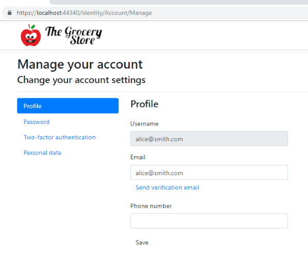
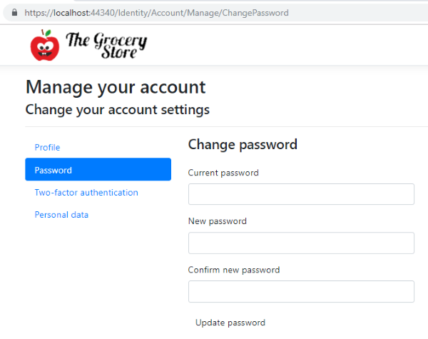
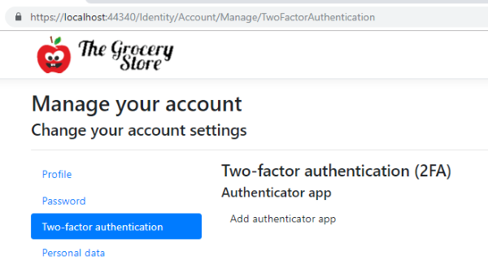
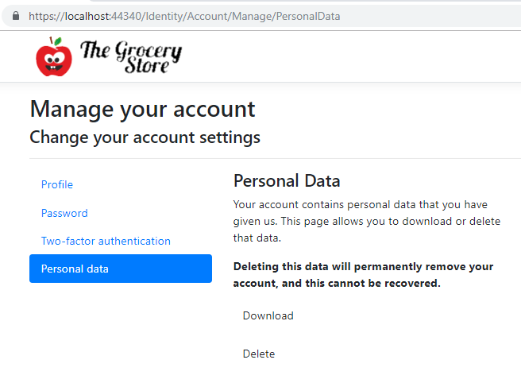

### CAROUSEL - PUT THIS COMMIT FIRST!

Part 03/MVC/wwwroot/css/site.css

ADD

.carousel-control-prev
,.carousel-control-next {
    width: 32px;
}

.carousel-control-prev {
    margin-left: -32px;
}

.carousel-control-next {
    margin-right: -32px;
}

REMOVE

    margin-left: -200px;
.
.
.
    margin-right: -200px;


### Identity added

At the end of part 2 of this sequence of courses, we had an e-commerce application
with views in which the user could choose products from a catalog, 
place them in the shopping basket and fill in a registration form with address and 
other personal data for future shipping procedures.

Our application does not currently require user login or password of any kind. 
A growing number of e-commerce websites also choose not to require this type of 
information, requesting only the customer's credit card or other payment methods 
at the checkout page. On the other hand, many e-commerce websites require a login 
and password to authenticate the user.

Both models have benefits and drawbacks. An e-commerce website that does not require 
authentication is more convenient for customers as it reduces friction that could hurt 
conversions, in user experience parlance. On the other hand, authentication enables 
you to identify users and possibly better analyze their behavior during accesses, as 
well as allowing you to provide certain benefits, such as displaying an order history 
of a customer that has previously purchased on the website. In this course, we will 
follow the second approach.

In this third course of the series, we will use a login system and ensure that our 
application is accessed only by authenticated users. It allows you to protect the 
sensitive points of the application from anonymous users. With authentication, we 
ensure the user enters the system through a secure identification service. That also 
enables the application to track user access, identify usage patterns, automatically 
fill out registration forms, view customer order history, and other conveniences, 
enhancing user experience.

If all you need is a user table with login and password columns and a user profile 
for your application, then ASP.NET Core Identity is the best option for you.

In this chapter, we will learn how to install ASP.NET Core Identity in our e-commerce 
solution and take advantage of the security, login/logout, authentication, and user 
profile features provided by this framework.

By default, the database engine used by Identity is SQL Server. However, we will be 
using SQLite, which is a simpler and more compact database engine than SQL Server. 
Before installing Identity, we will prepare the project to use this new database 
engine.

Soon, we will install the NuGet package for the SQLite database management engine.

Right-click the MVC project name, choose the Add NuGet Package submenu, and the package 
installation page opens, enter the package name: Microsoft.EntityFrameworkCore.SQLite

[Picture: NuGet Solution]

Now click the "Install" button and wait for the package to install.

Okay, now the project is ready to receive the scaffolding of ASP.NET Core Identity.

Applying the ASP.NET Core Identity Scaffold

Installing a new ASP.NET Core with Identity from the beginning is different from 
installing Identity in an existing project. Since our project does not have Identity, 
we will install a package of files containing the functionalities we need. This process 
is analogous to building walls in a construction site using prefabricated modules. 
This process is known as scaffolding.

If we had to manually create login/logout, authentication and other features in our 
application, that would require a lot of effort. We are talking about the development 
of views, business logic, model entities, data access, security, etc., in addition to 
many hours of unit testing, functional testing, integrated testing and so on.

Fortunately, our application can benefit from authentication and authorization features 
without much effort. Authentication and authorization are ubiquitous in web applications. 
Because of this, Microsoft provides a package of files to be transparently installed in 
ASP.NET Core projects without such features. It's called ASP.NET Core Identity.

To apply ASP.NET Core Identity in our solution, we need to right-click the project, click 
Add Scaffolded Item and then choose the Add option. That will open a new Add Scaffold 
dialog window.

[PICTURE XXXX]

- The sensitive points in our application (such as the cart and checkout screens)
are vulnerable to hackers, robots and other types of malicious software that can
forge false requests or steal information.
- Our application does not know who is currently accessing, so it is not possible
to provide certain conveniences, such as automatically filling the registration
for a user who has previously purchased at our website.
- Orders currently store the user's personal data, but nothing prevents a user
from making purchases and filling in someone else's data. Thus, the application
does not know if the data is being provided by an appropriate person.

In this part 3 of the course, we will use a login system and ensure that our
application is accessed only by authenticated users. This will allow you to
protect sensitive points of the application from accessing anonymous users. By
implementing authentication, we will ensure that the user access sensitive points
of the system through a secure identification process. This will also enable the
application to further track user access, identify usage patterns, automatically
fill out registration forms, view customer order history, and other conveniences
that enhance the user experience in the application.


If all you need is a user table with a password login and a user profile, then
**ASP.NET Core Identity** is the best option for you.

In this chapter, we will learn how to install ASP.NET Core Identity in our
e-commerce solution and take advantage of the security, login/logout,
authentication, and user profile features provided by this framework.

The installation of Identity in a brand ASP.NET Core MVC project from start is
quite different from the installation of Identity in an existing application.

To install it in our project, which still does not have Identity, we will follow a
process in which the installation adds to our project a group of ready-made files
(similar to prefabricated modules that are seen in civil construction), and this
process is called scaffolding.

But before we install the ASP.NET Core Identity package itself, it is necessary to
prepare our project for a new SQLite database that will be used by Identity to
hold user, profile and other related information.

Below, we will install the NuGet package for the SQLite database management engine.

Right-click the MVC project name, choose the Add NuGet Package submenu and then enter 
the package name: 

Microsoft.EntityFrameworkCore.Sqlite


Now click the "Install" button and wait for the package to install.

Okay, now the project is ready to go through the scaffolding of ASP.NET Core Identity.

### Applying the ASP.NET Core Identity Scaffold

Manually creating login/logout, authentication and other features in our application
 would normally require a lot of effort, both for the development of views and for 
creating business logic, model entities, data access, security, etc., in addition to 
many hours of unit testing, functional tests, integrated testing, etc.

Fortunately, we can use the benefits of authentication and authorization features in 
our application without much effort. Because this type of functional requirement is 
virtually universal in web applications, Microsoft provides a package of files that 
can be transparently installed on ASP.NET Core projects. This package is called 
ASP.NET Core Identity.

In order to apply ASP.NET Core Identity in our solution, we right-click on the name 
of the MVC project and choose the Add Scaffolded Item menu. Then, we choose Add, 
which will open a new window dialog called Add Scaffold.


Here, we will choose the Installed> Identity> Identity option.

AppIdentityContext, AppIdentityUser

The ASP.NET Core Identity Scaffold will open a new dialog window containing a series
of configuration parameters, which allow you to define the layout of the pages, what
features are included, data and user context classes, and also which type of database 
(SQL Server or SQLite).


Here we choose:

- Layout: The _Layout.cshtml file already exists in our project. This will cause the 
new login, log out and other pages to share the same standard layout as the rest of 
our MVC application.
- Identity pages: Login, Logout, Register, ExternalLogin. These pages are sufficient 
for our application. However, notice that much more functionality can be added.
- Context class: AppIdentityContext: This class will be created after confirmation.
- User class: AppIdentityUser. This class will be created in the after confirmation.

Once we confirm these parameters for the ASP.NET Core Identity scaffold, our project 
is modified, and the most notable change is the creation of a folder and file structure 
under the Areas/Identity folder of our project.


What can we recognize in these files/folders above?

- The new AppIdentityContext class: It defines the context with the entities and 
relationships required to configure the Entity Framework Core.
- The new AppIdentityUser class: it contains the user profile data used in the ASPNET 
Core Identity authentication and authorization process.
- The pages below Pages/Account: these are pages containing the markup code (HTML) for 
login, log out and other Identity views. They are Razor Pages, that is, an MVC 
structure where the view  resides in a single the .cshtml file while the controller 
actions and the model class (PageModel) are included in a single .cshtml.cs file
- Auxiliary Partial Views
- IdentityHostingStartup class: This class is executed by the WebHost of our application, 
which is declared in the Program.cs file.
- IdentityHostingStartup class configures the database and other service types that
ASP.NET Identity Core needs to work.

### Adding ASP.NET Core Identity Model Migration

It is not enough to just add the ASP.NET Core Identity files to our project. We still 
have to generate the database schema so that the tables and initial data for ASP.NET 
Identity Core required configuration are also created.

When we did the scaffolding of ASP.NET Identity Core, we added a new Identity data model 
to our project, as we can see in the IdentityHostingStartup.cs file class:

```csharp
public void Configure(IWebHostBuilder builder)
{
    builder.ConfigureServices((context, services) => {
        services.AddDbContext<AppIdentityContext>(options =>
            options.UseSqlite(
                context.Configuration.GetConnectionString("AppIdentityContextConnection")));

        services.AddDefaultIdentity<AppIdentityUser>()
            .AddEntityFrameworkStores<AppIdentityContext>();
    });
}
```

Note that the above Entity Framework configuration (AddDbContext method) is using the 
AppIdentityContext class, which name we chose in the scaffolding process.

At the same time, a new connection string has also been added to the appsettings.json 
configuration file. This configuration string is exclusive to the SQLite database used 
by Identity:

appsettings.json

    "AllowedHosts": "*",
    "ConnectionStrings": {
    "AppIdentityContextConnection": "DataSource=MVC.db"
    }

But notice that the Identity SQLite database has not yet been created. We need to 
create it by using the technique called Migration, which we saw in the previous courses.

To do this, open the Tools> Package Manager Console menu, and type in the console:

PM> Add-Migration Identity

However, when executing this command, we receive an error message, indicating that 
there is more than one context in our project:

More than one DbContext has been found. Specify which one to use. Use the '-Context' 
parameter for PowerShell commands and the '--context' parameter for dotnet commands.

This means that the migration does not know which of the two contexts to use. You must 
specify the Identity context using the -Context parameter:


PM> Update-Database

Startup.cs

    app.UseStaticFiles();
    app.UseAuthentication();


_Layout.cshtml

    <div class="navbar-collapse collapse justify-content-end">
        <partial name="_LoginPartial" />
        <ul class="nav navbar-nav">


_Layout.cshtml

    @if (User.Identity.IsAuthenticated)
    {
        <ul class="nav navbar-nav">
            <li>
                <vc:notification-counter title="Notifications"...

                <vc:basket-counter title="Basket"...

            </li>
        </ul>
    }











### Identity Core


Part 03/MVC/Controllers/BasketController.cs

REMOVE

using Microsoft.AspNetCore.Mvc;

ADD

using Microsoft.AspNetCore.Authorization;
using Microsoft.AspNetCore.Mvc;

[Authorize]


Part 03/MVC/Controllers/CheckoutController.cs

REMOVE

using Microsoft.AspNetCore.Mvc;

ADD

using Microsoft.AspNetCore.Authorization;
using Microsoft.AspNetCore.Mvc;

 [Authorize]

Part 03/MVC/Controllers/NotificationsController.cs

REMOVE

using Microsoft.AspNetCore.Mvc;

ADD

using Microsoft.AspNetCore.Authorization;
using Microsoft.AspNetCore.Mvc;

  [Authorize]

Part 03/MVC/Controllers/RegistrationController.cs

ADD 

using Microsoft.AspNetCore.Authorization;
using Microsoft.AspNetCore.Mvc;
using MVC.Areas.Identity.Data;
using MVC.Models.ViewModels;
using MVC.Services;

[Authorize]


https://localhost:44340/Identity/Account/Login?ReturnUrl=%2FBasket


Part 03/MVC/MVC.csproj

<PackageReference Include="IdentityModel" Version="3.10.10" />

CREATED

Part 03/MVC/MVC.db
Part 03/MVC/Migrations/20190503043129_UserProfileData.cs
Part 03/MVC/Migrations/AppIdentityContextModelSnapshot.cs

ADDED

Part 03/MVC/Models/ViewModels/RegistrationViewModel.cs

namespace MVC.Models.ViewModels
{
    public class RegistrationViewModel
    {
        public string UserId { get; set; }
        public string Name { get; set; }
        public string Email { get; set; }
        public string Phone { get; set; }
        public string Address { get; set; }
        public string AdditionalAddress { get; set; }
        public string District { get; set; }
        public string City { get; set; }
        public string State { get; set; }
        public string ZipCode { get; set; }
    }
}

Part 03/MVC/Services/IIdentityParser.cs

using System.Security.Principal;

namespace MVC.Services
{
    public interface IIdentityParser<T>
    {
        T Parse(IPrincipal principal);
    }
}

Part 03/MVC/Services/IdentityParser.cs

using System.Security.Principal;

namespace MVC.Services
{
    public interface IIdentityParser<T>
    {
        T Parse(IPrincipal principal);
    }
}

Part 03/MVC/Services/IdentityParser.cs

using MVC.Areas.Identity.Data;
using System;
using System.Linq;
using System.Security.Claims;
using System.Security.Principal;

namespace MVC.Services
{
    public class IdentityParser : IIdentityParser<AppIdentityUser>
    {
        public AppIdentityUser Parse(IPrincipal principal)
        {
            if (principal is ClaimsPrincipal claims)
            {
                return new AppIdentityUser
                {
                    Name = claims.Claims.FirstOrDefault(x => x.Type == "name")?.Value ?? "",
                    Email = claims.Claims.FirstOrDefault(x => x.Type == "email")?.Value ?? "",
                    Phone = claims.Claims.FirstOrDefault(x => x.Type == "phone")?.Value ?? "",
                    Address = claims.Claims.FirstOrDefault(x => x.Type == "address")?.Value ?? "",
                    AdditionalAddress = claims.Claims.FirstOrDefault(x => x.Type == "address_details")?.Value ?? "",
                    District = claims.Claims.FirstOrDefault(x => x.Type == "district")?.Value ?? "",
                    City = claims.Claims.FirstOrDefault(x => x.Type == "city")?.Value ?? "",
                    State = claims.Claims.FirstOrDefault(x => x.Type == "state")?.Value ?? "",
                    ZipCode = claims.Claims.FirstOrDefault(x => x.Type == "zip_code")?.Value ?? ""
                };
            }
            throw new ArgumentException(message: "The principal must be a ClaimsPrincipal", paramName: nameof(principal));
        }
    }
}

Part 03/MVC/Startup.cs

using IdentityModel;


using Microsoft.AspNetCore.Identity;

using MVC.Areas.Identity.Data;


services.AddTransient<IIdentityParser<AppIdentityUser>, IdentityParser>();

services.Configure<IdentityOptions>(options =>
{
    options.ClaimsIdentity.UserIdClaimType = JwtClaimTypes.Subject;
    options.ClaimsIdentity.UserNameClaimType = JwtClaimTypes.Name;
});


Part 03/MVC/Views/Registration/Index.cshtml

@using MVC.Models.ViewModels
@model RegistrationViewModel
@{


        //<input type="text" class="form-control" />
        <input type="text" class="form-control" value="@Model.Name" />

Part 03/MVC/Areas/Identity/Data/AppIdentityUser.cs

ADD

        public string Name { get; set; }
        public string Phone { get; set; }
        public string Address { get; set; }
        public string AdditionalAddress { get; set; }
        public string District { get; set; }
        public string City { get; set; }
        public string State { get; set; }
        public string ZipCode { get; set; }


Part 03/MVC/Controllers/BaseController.cs

ADD

        protected string GetUserId()
        {
            return @User.FindFirst("sub")?.Value;
        }

### AddMicrosoftAccount

Part 03/MVC/Startup.cs

//using System;
//using System.Collections.Generic;
//using System.Linq;
//using System.Threading.Tasks;
//using IdentityModel;
using IdentityModel;

//using Microsoft.AspNetCore.HttpsPolicy;

            services.AddAuthentication().AddMicrosoftAccount(microsoftOptions =>
            {
                microsoftOptions.ClientId = Configuration["Authentication_Microsoft_ApplicationId"];
                microsoftOptions.ClientSecret = Configuration["Authentication_Microsoft_Password"];
            });


Part 03/MVC/appsettings.json

//  }
  },
  "Authentication_Microsoft_ApplicationId": "365218f7-1110-4d12-ad00-2472000b3219",
  "Authentication_Microsoft_Password": "wutBVKOC4[lgpwLC4147$-("

### Persisting User Data to Session

Part 03/MVC/Controllers/BasketController.cs

//var clientId = GetUserId();

Part 03/MVC/Controllers/CheckoutController.cs

    public class CheckoutController : BaseController
    {
        //public IActionResult Index()
        private readonly IHttpHelper httpHelper;

        public CheckoutController(IHttpHelper httpHelper)
        {
            this.httpHelper = httpHelper;
        }

        [HttpPost]
        [ValidateAntiForgeryToken]
        public async Task<IActionResult> Index(RegistrationViewModel registration)
        {
            httpHelper.SetRegistration(GetUserId(), registration);
            return View();
        }


Part 03/MVC/Controllers/HttpHelper.cs

using Microsoft.AspNetCore.Http;
using MVC.Models.ViewModels;
using Newtonsoft.Json;

namespace MVC.Controllers
{
    public class HttpHelper : IHttpHelper
    {
        private readonly IHttpContextAccessor contextAccessor;

        public HttpHelper(IHttpContextAccessor contextAccessor)
        {
            this.contextAccessor = contextAccessor;
        }

        public void SetRegistration(string clientId, RegistrationViewModel registrationViewModel)
        {
            string json = JsonConvert.SerializeObject(registrationViewModel.GetClone());
            contextAccessor.HttpContext.Session.SetString($"registration_{clientId}", json);
        }

        public RegistrationViewModel GetRegistration(string clientId)
        {
            string json = contextAccessor.HttpContext.Session.GetString($"registration_{clientId}");
            if (string.IsNullOrWhiteSpace(json))
                return new RegistrationViewModel();

            return JsonConvert.DeserializeObject<RegistrationViewModel>(json);
        }
    }
}

Part 03/MVC/Controllers/IHttpHelper.cs

using MVC.Models.ViewModels;

namespace MVC.Controllers
{
    public interface IHttpHelper
    {
        RegistrationViewModel GetRegistration(string clientId);
        void SetRegistration(string clientId, RegistrationViewModel registrationViewModel);
    }
} 

Part 03/MVC/Controllers/RegistrationController.cs

    public class RegistrationController : BaseController
    {
        //private readonly IIdentityParser<AppIdentityUser> appUserParser;
        private readonly IHttpHelper httpHelper;

        //public RegistrationController(IIdentityParser<AppIdentityUser> appUserParser)
        public RegistrationController(IHttpHelper httpHelper)
        {
            //this.appUserParser = appUserParser;
            this.httpHelper = httpHelper;
        }

        public IActionResult Index()
        {
 //           var usuario = appUserParser.Parse(HttpContext.User);
 //           var viewModel = new RegistrationViewModel
 //           {
 //               District = usuario.District,
 //               ZipCode = usuario.ZipCode,
 //               AdditionalAddress = usuario.AdditionalAddress,
 //               Email = usuario.Email,
 //               Address = usuario.Address,
 //               City = usuario.City,
 //               Name = usuario.Name,
 //               Phone = usuario.Phone,
 //               State = usuario.State
 //           };
            var viewModel = httpHelper.GetRegistration(GetUserId());

Part 03/MVC/Models/ViewModels/RegistrationViewModel.cs

        public RegistrationViewModel()
        {

        }

        public RegistrationViewModel(string name, string email, string phone, string address, string additionalAddress, string district, string city, string state, string zipCode)
        {
            Name = name;
            Email = email;
            Phone = phone;
            Address = address;
            AdditionalAddress = additionalAddress;
            District = district;
            City = city;
            State = state;
            ZipCode = zipCode;
        }


        public RegistrationViewModel GetClone()
        {
            return new RegistrationViewModel(this.Name, this.Email, this.Phone, this.Address, this.AdditionalAddress, this.District, this.City, this.State, this.ZipCode);
        }


Part 03/MVC/Startup.cs

            services.AddDistributedMemoryCache();
            services.AddSession();
.
.
.

            services.AddTransient<IHttpHelper, HttpHelper>();
.
.
.
            app.UseSession();

Part 03/MVC/Views/Registration/Index.cshtml

//<form method="post" action="checkout">
<form method="post" asp-controller="checkout" asp-action="index">

//    <input type="text" class="form-control" value="@Model.Name" />
    <input class="form-control" asp-for="@Model.Name" />

    //<label class="control-label">Email</label>
    //<input type="email" class="form-control" />
    <label class="control-label" for="email">Email</label>
    <input type="email" class="form-control" id="email" asp-for="@Model.Email">
    <span asp-validation-for="@Model.Email" class="text-danger"></span>

//<input type="text" class="form-control" />
<input class="form-control" asp-for="@Model.Phone" />

    //<input type="text" class="form-control" />
    <input class="form-control" asp-for="@Model.Address" />

    //<input type="text" class="form-control" />
    <input class="form-control" asp-for="@Model.AdditionalAddress" />

    //<input type="text" class="form-control" />
    <input class="form-control" asp-for="@Model.District" />

    //<input type="text" class="form-control" />
    <input class="form-control" asp-for="@Model.City" />

    //<input type="text" class="form-control" />
    <input class="form-control" asp-for="@Model.State" />

    //<input type="text" class="form-control" />
    <input  class="form-control" asp-for="@Model.ZipCode" />

### Form validation

Part 03/MVC/Controllers/CheckoutController.cs

//    httpHelper.SetRegistration(GetUserId(), registration);
//    return View();
    if (ModelState.IsValid)
    {
        httpHelper.SetRegistration(GetUserId(), registration);
        return View(registration);
    }
    return RedirectToAction("Index", "Registration");


Part 03/MVC/Controllers/HttpHelper.cs

//    return new RegistrationViewModel();
    return new RegistrationViewModel(clientId);

Part 03/MVC/Models/ViewModels/RegistrationViewModel.cs

//    public RegistrationViewModel(string name, string email, string phone, string address, string additionalAddress, string district, string city, string state, string zipCode)
    public RegistrationViewModel(string userId)
    {
        UserId = userId;
    }

    public RegistrationViewModel(string userId, string name, string email, string phone, string address, string additionalAddress, string district, string city, string state, string zipCode)
    {
        UserId = userId;


[Required]
[Required]
[Required]
[Required]...


Part 03/MVC/Views/Checkout/Index.cshtml

//@model string
@model RegistrationViewModel

    <p>Thank you very much, <b>@Model.Name</b>!</p>
    <p>Your order has been placed.</p>
//    <p>Soon you will receive an e-mail at <b>@email</b> including all order details.</p>
    <p>Soon you will receive an e-mail at <b>@Model.Email</b> including all order details.</p>


Part 03/MVC/Views/Registration/Index.cshtml

<input type="hidden" asp-for="@Model.UserId" />

//                        <label class="control-label">Customer Name</label>
//                        <input class="form-control" asp-for="@Model.Name" />
                        <label class="control-label" for="name">Customer Name</label>
                        <input type="text" class="form-control" id="name" asp-for="@Model.Name" />

//                        <label class="control-label">Phone</label>
//                        <input class="form-control" asp-for="@Model.Phone" />
                        <label class="control-label" for="phone">Phone</label>
                        <input type="text" class="form-control" id="phone" asp-for="@Model.Phone" />
                        <span asp-validation-for="@Model.Phone" class="text-danger"></span>
                        <span asp-validation-for="@Model.Name" class="text-danger"></span>

@section Scripts
{
    <partial name="~/Views/Shared/_ValidationScriptsPartial.cshtml"/>
}

### Obtaining email from identity

Part 03/MVC/Controllers/BaseController.cs

        protected string GetUserId()
        {
            //return @User.FindFirst("sub")?.Value;
            return @User.FindFirst(JwtClaimTypes.Subject)?.Value;
        }

        protected string GetUserEmail()
        {
            return @User.FindFirst(JwtClaimTypes.Name)?.Value;
        }


Part 03/MVC/Controllers/HttpHelper.cs

        //public RegistrationViewModel GetRegistration(string clientId)
        public RegistrationViewModel GetRegistration(string clientId, string email)
        {
            string json = contextAccessor.HttpContext.Session.GetString($"registration_{clientId}");
            if (string.IsNullOrWhiteSpace(json))
                //return new RegistrationViewModel(clientId);
                return new RegistrationViewModel(clientId, email);

Part 03/MVC/Controllers/IHttpHelper.cs

        //RegistrationViewModel GetRegistration(string clientId);
        RegistrationViewModel GetRegistration(string clientId, string email);

Part 03/MVC/Controllers/RegistrationController.cs

            //var viewModel = httpHelper.GetRegistration(GetUserId());
            var viewModel = httpHelper.GetRegistration(GetUserId(), GetUserEmail());

Part 03/MVC/Models/ViewModels/RegistrationViewModel.cs

        public RegistrationViewModel(string userId, string email) : this(userId)
        {
            Email = email;
        }

        public RegistrationViewModel(string userId, string name, string email, string phone, string address, string additionalAddress, string district, string city, string state, string zipCode)
            : this(userId, email)
        {
            //UserId = userId;
            Name = name;
            //Email = email;

