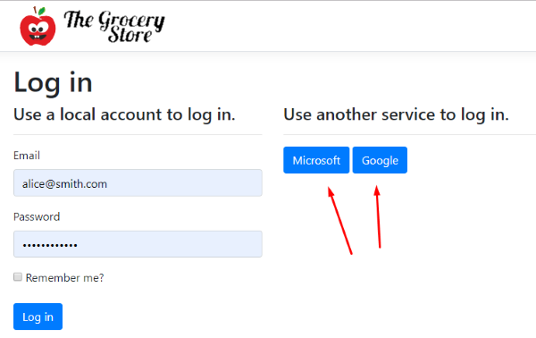

### CAROUSEL - PUT THIS COMMIT FIRST!

### Introduction


At the end of part 2 of this sequence of courses, we had an e-commerce application
with views in which the user could choose products from a catalog, 
place them in the shopping basket and fill in a registration form with address and 
other personal data for future shipping procedures.

Our application does not currently require user login or password of any kind. 
A growing number of e-commerce websites also choose not to require this type of 
information, requesting only the customer's credit card or other payment methods 
at the checkout page. On the other hand, many e-commerce websites require a login 
and password to authenticate the user.

Both models have benefits and drawbacks. An e-commerce website that does not require 
authentication is more convenient for customers as it reduces friction that could hurt 
conversions, in user experience parlance. On the other hand, authentication enables 
you to identify users and possibly better analyze their behavior over time, as 
well as allowing you to provide users with certain benefits, such as displaying an order history 
of a customer that has previously purchased on the website. In this course, we will 
follow the second approach.

In this third course of the series, we will use a login system and ensure that our 
application is accessed only by authenticated users. It allows you to protect the 
sensitive points of the application from anonymous users. With authentication, we 
ensure the user enters the system through a secure identification service. That also 
enables the application to track user access, identify usage patterns, automatically 
fill out registration forms, view customer order history, and other conveniences, 
enhancing user experience.

If all you need is a user table with login and password columns and a user profile 
for your application, then ASP.NET Core Identity is the best option for you.

In this chapter, we will learn how to install ASP.NET Core Identity in our e-commerce 
solution and take advantage of the security, login/logout, authentication, and user 
profile features provided by this framework.

By default, the database engine used by Identity is SQL Server. However, we will be 
using SQLite, which is a simpler and more compact database engine than SQL Server. 
Before installing Identity, we will prepare the project to use this new database 
engine.

Right-click the MVC project name, choose the Add NuGet Package submenu, and the package 
installation page opens, enter the package name: Microsoft.EntityFrameworkCore.SQLite


Now click the "Install" button and wait for the package to install.

Okay, now the project is ready to receive the ASP.NET Core Identity scaffolding.

#### Applying the ASP.NET Core Identity Scaffold


Installing a new ASP.NET Core with Identity from the beginning is different from 
installing it in an existing project. Since our project does not have Identity, 
we will install a package of files containing the functionalities we need. This process 
is similar to building walls in a construction site using prefabricated modules. 
This process is known as scaffolding.

If we had to manually create login/logout, authentication and other features in our 
application, that would require a lot of effort. We are talking about the development 
of views, business logic, model entities, data access, security, etc., in addition to 
many hours of unit testing, functional testing, integrated testing and so on.

Fortunately, our application can benefit from authentication and authorization features 
without much effort. Authentication and authorization are ubiquitous in web applications. 
Because of this, Microsoft provides a package of files to be transparently installed in 
ASP.NET Core projects that lack such features. It's called ASP.NET Core Identity.

To apply ASP.NET Core Identity in our solution, we right-click the project, click 
Add Scaffolded Item and then choose the Add option. That will open a new Add Scaffold 
dialog window.


Here, we will choose Installed > Identity > Identity. 


The ASP.NET Core Identity Scaffold will open a new dialog window containing a series of 
configuration parameters. There, you can define the layout of the pages, what source code 
you will include, the data and user context classes, and also which type of database 
(SQL Server or SQLite) Identity will use.


Let's select this options:

- Layout: The _Layout.cshtml file that already exists in our project. It will define a basic 
markup to be shared by the Identity pages and the rest of our application.
- Identity pages: Login, Logout, Register, ExternalLogin. The scaffolding process will 
copy those pages to our application, where you can edit them. Note that you still can 
navigate to the other Identity pages that you left unmarked, but you cannot modify or 
customize them since they will not be present in the project.
- Context class: AppIdentityContext.
- User class: AppIdentityUser. Represents a user in the identity system

After confirming these parameters, the scaffolding will modify our project.
The most notable change is the new file structure under the Areas / Identity folder of our project.


Observe the new structure under Areas folder:

- The AppIdentityContext class: this is the class for the Entity Framework database context used for identity.
- The AppIdentityUser class: it represents a user in the identity system.
- The pages below Pages / Account: Those are pages containing the markup code for Identity 
pages. They are Razor Pages, that is, a kind of MVC structure type where the view is in 
the file and the actions of the controller and the template reside in a single file. As we 
have said, these pages can be modified and customized in our application, but the other 
- Identity pages can be accessed, but not changed, since their files are not present in the 
project.
- Partial Views: _ValidationScriptPartial, _ViewImports, _ViewStart
- IdentityHostingStartup class: The ASP.NET Core WebHost executes this class as soon as the 
application runs. The IdentityHostingStartup class configures database and other services 
that Identity needs to work.

#### Creating and Applying ASP.NET Core Identity Model Migration

It is not enough to install the ASP.NET Core Identity package in our project; we still have 
to generate the database schema, which includes tables and initial data required by for ASP.NET 
Identity Core.

When we made the scaffolding of ASP.NET Identity Core, a new Identity data model was 
automatically added to our project, as we can see in the IdentityHostingStartup.cs file class:

```csharp
public void Configure(IWebHostBuilder builder)
{
    builder.ConfigureServices((context, services) => {
        services.AddDbContext<AppIdentityContext>(options =>
            options.UseSqlite(
                context.Configuration.GetConnectionString("AppIdentityContextConnection")));

        services.AddDefaultIdentity<AppIdentityUser>()
            .AddEntityFrameworkStores<AppIdentityContext>();
    });
}
```

Notice how the above Entity Framework configuration (AddDbContext method) is using the 
AppIdentityContext class, whose name we chose in the scaffolding process.

The same process also added a new AppIdentityContextConnection connection string to the 
appsettings.json configuration file. ASP.NET Core Identity will use this connection 
string to access the SQLite database:

```json
.
.
.
"AllowedHosts": "*",
"ConnectionStrings": {
    "AppIdentityContextConnection": "DataSource=MVC.db"
}
```

But note that the scaffolding process alone did not create the Identity SQLite database 
by itself. This can be achieved by creating a new Migration, which we saw in the previous 
courses.

To add a new migration, open the Tool s> Package Manager Console menu, and type in the 
console.

```
PM> Add-Migration Identity 
```

The above command added the classes containing the migration statements, but it did not 
create the database itself:


To create the database, you must apply the migration by executing the Update-Database command:

```
PM> Update-Database -verbose
```

This command creates the MVC.db database file defined in the connection string included in 
the appsettings.json configuration file:


Let's take a look at this file by double-clicking on it. This will open the DB Browser for 
SQLite application we installed at the beginning of this article:


That's it! Now our application already has all the necessary components to perform 
authentication and authorization. From now on, we will start using these components to 
integrate ASP.NET Core Identity features in our application.

### Adding ASP.NET Core Identity Components to the Back-End


The Identity components are already present in our project. However, we 
need to add further configuration that will integrate these components 
with the rest of the application.

In software architecture, that is referred to as middleware.

ASP.NET Core provides a standard approach to integrate a middleware into the 
normal execution of the application. This mechanism resembles a water pipeline. Each 
new service further extends the plumbing system, taking the water at one end, and 
passing it to the next segment.

Similarly, ASP.NET Core will pass requests along a chain of middlewares. Upon receiving 
a request, each middleware decides either to process it or to pass the request to the next 
middleware in the chain. If the user is anonymous and the resource requires authorization, 
then Identity will redirect the user to the login page.

The scaffolding process created the IdentityHostingStartup class, which already configured 
some Identity services.

```csharp
public void Configure(IWebHostBuilder builder)
{
    ...
        services.AddDefaultIdentity<AppIdentityUser>()
            .AddEntityFrameworkStores<AppIdentityContext>();
    ...
}
```

The AddDefaultIdentity() method adds a set of common identity services to the application, 
including a default UI, token providers, and configures authentication to use identity 
cookies.

Identity is enabled by calling UseAuthentication. This method adds authentication middleware 
to the request pipeline:

```csharp
    ...
    app.UseStaticFiles();
    app.UseAuthentication();
    ...
```

The UseAuthentication() method adds the AuthenticationMiddleware to the specified 
ApplicationBuilder, which enables authentication capabilities.

However, the above code configures just the back end behavior. For the front end, 
you can integrate ASP.NET Core Identity views with the application user interface 
by including an Identity in the layout markup that will allow users to log in or 
register.

### Adding ASP.NET Core Identity Components to the Front-End


The ASP.NET Core Identity scaffolding process includes the LoginPartial file in
the Views\Shared folder. This file contains the partial view that displays either the 
authenticated user name or hyperlinks for login and registration.


```
@using Microsoft.AspNetCore.Identity
@using MVC.Areas.Identity.Data
@inject SignInManager<AppIdentityUser> SignInManager
@inject UserManager<AppIdentityUser> UserManager

<ul class="navbar-nav">
@if (SignInManager.IsSignedIn(User))
{
    <li class="nav-item">
        <a id="manage" class="nav-link text-dark" asp-area="Identity" asp-page="/Account/Manage/Index" title="Manage">Hello @UserManager.GetUserName(User)!</a>
    </li>
    <li class="nav-item">
        <form id="logoutForm" class="form-inline" asp-area="Identity" asp-page="/Account/Logout" asp-route-returnUrl="@Url.Action("Index", "Home", new { area = "" })">
            <button id="logout" type="submit" class="nav-link btn btn-link text-dark">Logout</button>
        </form>
    </li>
}
else
{
    <li class="nav-item">
        <a class="nav-link text-dark" id="register" asp-area="Identity" asp-page="/Account/Register">Register</a>
    </li>
    <li class="nav-item">
        <a class="nav-link text-dark" id="login" asp-area="Identity" asp-page="/Account/Login">Login</a>
    </li>
}
</ul>
```

You can add this component to any of the application views, with the line below:

```
<partial name="_LoginPartial" />
```

However, adding this line more than one time would cause undesirable code duplication. 
We can avoid this redundancy by including the line above in the standard layout view of 
the application (_Layout.cshtml file) since this will cause the component to be visible 
through all of our e-commerce views. We need to include it more specifically in the 
application's navigation bar, inside the <div> element that contains the "navbar-collapse" 
class:

_Layout.cshtml

```
    <div class="navbar-collapse collapse justify-content-end">
        <partial name="_LoginPartial" />
        <ul class="nav navbar-nav">
```

By running the application, we can now see the log and login links at the upper right corner 
of the product search page:


Now we will click to add any product to navigate to the shopping cart page. Notice how the login 
and register links are also present here:


#### Razor Pages


##### Creating a New User

Since we created a new database without users,  our customers need to fill in the Identity's Register page. 

##### 
##### 
##### 
##### 


_Layout.cshtml

    @if (User.Identity.IsAuthenticated)
    {
        <ul class="nav navbar-nav">
            <li>
                <vc:notification-counter title="Notifications"...

                <vc:basket-counter title="Basket"...

            </li>
        </ul>
    }


### Identity Core


Part 03/MVC/Controllers/BasketController.cs

REMOVE

using Microsoft.AspNetCore.Mvc;

ADD

using Microsoft.AspNetCore.Authorization;
using Microsoft.AspNetCore.Mvc;

[Authorize]


Part 03/MVC/Controllers/CheckoutController.cs

REMOVE

using Microsoft.AspNetCore.Mvc;

ADD

using Microsoft.AspNetCore.Authorization;
using Microsoft.AspNetCore.Mvc;

 [Authorize]

Part 03/MVC/Controllers/NotificationsController.cs

REMOVE

using Microsoft.AspNetCore.Mvc;

ADD

using Microsoft.AspNetCore.Authorization;
using Microsoft.AspNetCore.Mvc;

  [Authorize]

Part 03/MVC/Controllers/RegistrationController.cs

ADD 

using Microsoft.AspNetCore.Authorization;
using Microsoft.AspNetCore.Mvc;
using MVC.Areas.Identity.Data;
using MVC.Models.ViewModels;
using MVC.Services;

[Authorize]


https://localhost:44340/Identity/Account/Login?ReturnUrl=%2FBasket


Part 03/MVC/MVC.csproj

<PackageReference Include="IdentityModel" Version="3.10.10" />

CREATED

Part 03/MVC/MVC.db
Part 03/MVC/Migrations/20190503043129_UserProfileData.cs
Part 03/MVC/Migrations/AppIdentityContextModelSnapshot.cs

ADDED

Part 03/MVC/Models/ViewModels/RegistrationViewModel.cs

namespace MVC.Models.ViewModels
{
    public class RegistrationViewModel
    {
        public string UserId { get; set; }
        public string Name { get; set; }
        public string Email { get; set; }
        public string Phone { get; set; }
        public string Address { get; set; }
        public string AdditionalAddress { get; set; }
        public string District { get; set; }
        public string City { get; set; }
        public string State { get; set; }
        public string ZipCode { get; set; }
    }
}

Part 03/MVC/Services/IIdentityParser.cs

using System.Security.Principal;

namespace MVC.Services
{
    public interface IIdentityParser<T>
    {
        T Parse(IPrincipal principal);
    }
}

Part 03/MVC/Services/IdentityParser.cs

using System.Security.Principal;

namespace MVC.Services
{
    public interface IIdentityParser<T>
    {
        T Parse(IPrincipal principal);
    }
}

Part 03/MVC/Services/IdentityParser.cs

using MVC.Areas.Identity.Data;
using System;
using System.Linq;
using System.Security.Claims;
using System.Security.Principal;

namespace MVC.Services
{
    public class IdentityParser : IIdentityParser<AppIdentityUser>
    {
        public AppIdentityUser Parse(IPrincipal principal)
        {
            if (principal is ClaimsPrincipal claims)
            {
                return new AppIdentityUser
                {
                    Name = claims.Claims.FirstOrDefault(x => x.Type == "name")?.Value ?? "",
                    Email = claims.Claims.FirstOrDefault(x => x.Type == "email")?.Value ?? "",
                    Phone = claims.Claims.FirstOrDefault(x => x.Type == "phone")?.Value ?? "",
                    Address = claims.Claims.FirstOrDefault(x => x.Type == "address")?.Value ?? "",
                    AdditionalAddress = claims.Claims.FirstOrDefault(x => x.Type == "address_details")?.Value ?? "",
                    District = claims.Claims.FirstOrDefault(x => x.Type == "district")?.Value ?? "",
                    City = claims.Claims.FirstOrDefault(x => x.Type == "city")?.Value ?? "",
                    State = claims.Claims.FirstOrDefault(x => x.Type == "state")?.Value ?? "",
                    ZipCode = claims.Claims.FirstOrDefault(x => x.Type == "zip_code")?.Value ?? ""
                };
            }
            throw new ArgumentException(message: "The principal must be a ClaimsPrincipal", paramName: nameof(principal));
        }
    }
}

Part 03/MVC/Startup.cs

using IdentityModel;


using Microsoft.AspNetCore.Identity;

using MVC.Areas.Identity.Data;


services.AddTransient<IIdentityParser<AppIdentityUser>, IdentityParser>();

services.Configure<IdentityOptions>(options =>
{
    options.ClaimsIdentity.UserIdClaimType = JwtClaimTypes.Subject;
    options.ClaimsIdentity.UserNameClaimType = JwtClaimTypes.Name;
});


Part 03/MVC/Views/Registration/Index.cshtml

@using MVC.Models.ViewModels
@model RegistrationViewModel
@{


        //<input type="text" class="form-control" />
        <input type="text" class="form-control" value="@Model.Name" />

Part 03/MVC/Areas/Identity/Data/AppIdentityUser.cs

ADD

        public string Name { get; set; }
        public string Phone { get; set; }
        public string Address { get; set; }
        public string AdditionalAddress { get; set; }
        public string District { get; set; }
        public string City { get; set; }
        public string State { get; set; }
        public string ZipCode { get; set; }


Part 03/MVC/Controllers/BaseController.cs

ADD

        protected string GetUserId()
        {
            return @User.FindFirst("sub")?.Value;
        }

### AddMicrosoftAccount



Part 03/MVC/Startup.cs

//using System;
//using System.Collections.Generic;
//using System.Linq;
//using System.Threading.Tasks;
//using IdentityModel;
using IdentityModel;

//using Microsoft.AspNetCore.HttpsPolicy;

            services.AddAuthentication().AddMicrosoftAccount(microsoftOptions =>
            {
                microsoftOptions.ClientId = Configuration["Authentication_Microsoft_ApplicationId"];
                microsoftOptions.ClientSecret = Configuration["Authentication_Microsoft_Password"];
            });


Part 03/MVC/appsettings.json

//  }
  },
  "Authentication_Microsoft_ApplicationId": "365218f7-1110-4d12-ad00-2472000b3219",
  "Authentication_Microsoft_Password": "wutBVKOC4[lgpwLC4147$-("


### Persisting User Data to Identity Database


Part 03/MVC/Controllers/BasketController.cs

//var clientId = GetUserId();

Part 03/MVC/Controllers/CheckoutController.cs

    [Authorize]
    public class CheckoutController : BaseController
    {
        private readonly UserManager<AppIdentityUser> userManager;

        public CheckoutController(UserManager<AppIdentityUser> userManager)
        {
            this.userManager = userManager;
        }

        [HttpPost]
        [ValidateAntiForgeryToken]
        public async Task<IActionResult> Index(RegistrationViewModel registration)
        {
            if (ModelState.IsValid)
            {
                var usuario = await userManager.GetUserAsync(this.User);

                usuario.Email = registration.Email;
                usuario.Phone = registration.Phone;
                usuario.Name = registration.Name;
                usuario.Address = registration.Address;
                usuario.AdditionalAddress = registration.AdditionalAddress;
                usuario.District = registration.District;
                usuario.City = registration.City;
                usuario.State = registration.State;
                usuario.ZipCode = registration.ZipCode;

                await userManager.UpdateAsync(usuario);
                return View(registration);
            }
            return RedirectToAction("Index", "Registration");
        }
    }

Part 03/MVC/Controllers/RegistrationController.cs

[Authorize]
public class RegistrationController : BaseController
{
    private readonly UserManager<AppIdentityUser> userManager;

    public RegistrationController(UserManager<AppIdentityUser> userManager)
    {
        this.userManager = userManager;
    }

    public async Task<IActionResult> Index()
    {
        var user = await userManager.GetUserAsync(this.User);
        var viewModel = new RegistrationViewModel(
            user.Id, user.Name, user.Email, user.Phone,
            user.Address, user.AdditionalAddress, user.District,
            user.City, user.State, user.ZipCode
        );
        return View(viewModel);
    }
}

Part 03/MVC/Models/ViewModels/RegistrationViewModel.cs

    public RegistrationViewModel()
    {

    }

    public RegistrationViewModel(string name, string email, string phone, string address, string additionalAddress, string district, string city, string state, string zipCode)
    {
        Name = name;
        Email = email;
        Phone = phone;
        Address = address;
        AdditionalAddress = additionalAddress;
        District = district;
        City = city;
        State = state;
        ZipCode = zipCode;
    }


    public RegistrationViewModel GetClone()
    {
        return new RegistrationViewModel(this.Name, this.Email, this.Phone, this.Address, this.AdditionalAddress, this.District, this.City, this.State, this.ZipCode);
    }


Part 03/MVC/Views/Registration/Index.cshtml

//<form method="post" action="checkout">
<form method="post" asp-controller="checkout" asp-action="index">

//    <input type="text" class="form-control" value="@Model.Name" />
    <input class="form-control" asp-for="@Model.Name" />

    //<label class="control-label">Email</label>
    //<input type="email" class="form-control" />
    <label class="control-label" for="email">Email</label>
    <input type="email" class="form-control" id="email" asp-for="@Model.Email">
    <span asp-validation-for="@Model.Email" class="text-danger"></span>

//<input type="text" class="form-control" />
<input class="form-control" asp-for="@Model.Phone" />

    //<input type="text" class="form-control" />
    <input class="form-control" asp-for="@Model.Address" />

    //<input type="text" class="form-control" />
    <input class="form-control" asp-for="@Model.AdditionalAddress" />

    //<input type="text" class="form-control" />
    <input class="form-control" asp-for="@Model.District" />

    //<input type="text" class="form-control" />
    <input class="form-control" asp-for="@Model.City" />

    //<input type="text" class="form-control" />
    <input class="form-control" asp-for="@Model.State" />

    //<input type="text" class="form-control" />
    <input  class="form-control" asp-for="@Model.ZipCode" />

### Form validation

Part 03/MVC/Controllers/CheckoutController.cs

    if (ModelState.IsValid)
    {
        var usuario = await userManager.GetUserAsync(this.User);

        usuario.Email = registration.Email;
        usuario.Phone = registration.Phone;
        usuario.Name = registration.Name;
        usuario.Address = registration.Address;
        usuario.AdditionalAddress = registration.AdditionalAddress;
        usuario.District = registration.District;
        usuario.City = registration.City;
        usuario.State = registration.State;
        usuario.ZipCode = registration.ZipCode;

        await userManager.UpdateAsync(usuario);
        return View(registration);
    }
    return RedirectToAction("Index", "Registration");


Part 03/MVC/Models/ViewModels/RegistrationViewModel.cs

//    public RegistrationViewModel(string name, string email, string phone, string address, string additionalAddress, string district, string city, string state, string zipCode)
    public RegistrationViewModel(string userId)
    {
        UserId = userId;
    }

    public RegistrationViewModel(string userId, string name, string email, string phone, string address, string additionalAddress, string district, string city, string state, string zipCode)
    {
        UserId = userId;


[Required]
[Required]
[Required]
[Required]...


Part 03/MVC/Views/Checkout/Index.cshtml

//@model string
@model RegistrationViewModel

    <p>Thank you very much, <b>@Model.Name</b>!</p>
    <p>Your order has been placed.</p>
//    <p>Soon you will receive an e-mail at <b>@email</b> including all order details.</p>
    <p>Soon you will receive an e-mail at <b>@Model.Email</b> including all order details.</p>


Part 03/MVC/Views/Registration/Index.cshtml

<input type="hidden" asp-for="@Model.UserId" />

//                        <label class="control-label">Customer Name</label>
//                        <input class="form-control" asp-for="@Model.Name" />
                        <label class="control-label" for="name">Customer Name</label>
                        <input type="text" class="form-control" id="name" asp-for="@Model.Name" />

//                        <label class="control-label">Phone</label>
//                        <input class="form-control" asp-for="@Model.Phone" />
                        <label class="control-label" for="phone">Phone</label>
                        <input type="text" class="form-control" id="phone" asp-for="@Model.Phone" />
                        <span asp-validation-for="@Model.Phone" class="text-danger"></span>
                        <span asp-validation-for="@Model.Name" class="text-danger"></span>

@section Scripts
{
    <partial name="~/Views/Shared/_ValidationScriptsPartial.cshtml"/>
}

