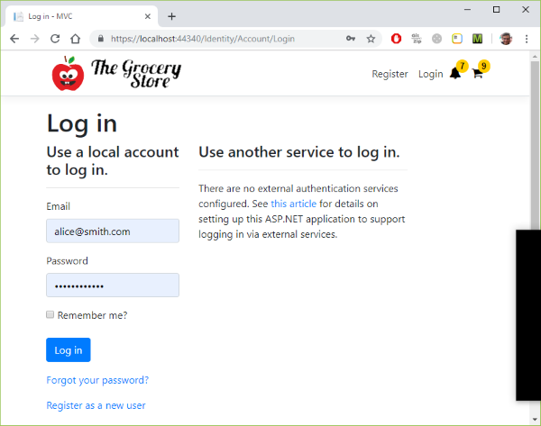

### CAROUSEL - PUT THIS COMMIT FIRST!

Part 03/MVC/wwwroot/css/site.css

ADD

.carousel-control-prev
,.carousel-control-next {
    width: 32px;
}

.carousel-control-prev {
    margin-left: -32px;
}

.carousel-control-next {
    margin-right: -32px;
}

REMOVE

    margin-left: -200px;
.
.
.
    margin-right: -200px;

### Identity added

Microsoft.EntityFrameworkCore.Sqlite

AppIdentityContext, AppIdentityUser

appsettings.json

    "AllowedHosts": "*",
    "ConnectionStrings": {
    "AppIdentityContextConnection": "DataSource=MVC.db"
    }

PM> Add-Migration Identity

PM> Update-Database

Startup.cs

    app.UseStaticFiles();
    app.UseAuthentication();

_Layout.cshtml

    

        <partial name="_LoginPartial" />
        <ul class="nav navbar-nav">

_Layout.cshtml

    @if (User.Identity.IsAuthenticated)
    {
        <ul class="nav navbar-nav">
            <li>
                <vc:notification-counter title="Notifications"...

                <vc:basket-counter title="Basket"...

            </li>
        </ul>
    }

### Identity Core

Part 03/MVC/Controllers/BasketController.cs

REMOVE

using Microsoft.AspNetCore.Mvc;

ADD

using Microsoft.AspNetCore.Authorization;
using Microsoft.AspNetCore.Mvc;

 [Authorize]

Part 03/MVC/Controllers/CheckoutController.cs

REMOVE

using Microsoft.AspNetCore.Mvc;

ADD

using Microsoft.AspNetCore.Authorization;
using Microsoft.AspNetCore.Mvc;

 [Authorize]

Part 03/MVC/Controllers/NotificationsController.cs

REMOVE

using Microsoft.AspNetCore.Mvc;

ADD

using Microsoft.AspNetCore.Authorization;
using Microsoft.AspNetCore.Mvc;

  [Authorize]

Part 03/MVC/Controllers/RegistrationController.cs

ADD 

using Microsoft.AspNetCore.Authorization;
using Microsoft.AspNetCore.Mvc;
using MVC.Areas.Identity.Data;
using MVC.Models.ViewModels;
using MVC.Services;

[Authorize]

https://localhost:44340/Identity/Account/Login?ReturnUrl=%2FBasket

Part 03/MVC/MVC.csproj

<PackageReference Include="IdentityModel" Version="3.10.10" />

CREATED

Part 03/MVC/MVC.db
Part 03/MVC/Migrations/20190503043129_UserProfileData.cs
Part 03/MVC/Migrations/AppIdentityContextModelSnapshot.cs

ADDED

Part 03/MVC/Models/ViewModels/RegistrationViewModel.cs

namespace MVC.Models.ViewModels
{
    public class RegistrationViewModel
    {
        public string UserId { get; set; }
        public string Name { get; set; }
        public string Email { get; set; }
        public string Phone { get; set; }
        public string Address { get; set; }
        public string AdditionalAddress { get; set; }
        public string District { get; set; }
        public string City { get; set; }
        public string State { get; set; }
        public string ZipCode { get; set; }
    }
}

Part 03/MVC/Services/IIdentityParser.cs

using System.Security.Principal;

namespace MVC.Services
{
    public interface IIdentityParser<T>
    {
        T Parse(IPrincipal principal);
    }
}

Part 03/MVC/Services/IdentityParser.cs

using System.Security.Principal;

namespace MVC.Services
{
    public interface IIdentityParser<T>
    {
        T Parse(IPrincipal principal);
    }
}

Part 03/MVC/Services/IdentityParser.cs

using MVC.Areas.Identity.Data;
using System;
using System.Linq;
using System.Security.Claims;
using System.Security.Principal;

namespace MVC.Services
{
    public class IdentityParser : IIdentityParser<AppIdentityUser>
    {
        public AppIdentityUser Parse(IPrincipal principal)
        {
            if (principal is ClaimsPrincipal claims)
            {
                return new AppIdentityUser
                {
                    Name = claims.Claims.FirstOrDefault(x => x.Type == "name")?.Value ?? "",
                    Email = claims.Claims.FirstOrDefault(x => x.Type == "email")?.Value ?? "",
                    Phone = claims.Claims.FirstOrDefault(x => x.Type == "phone")?.Value ?? "",
                    Address = claims.Claims.FirstOrDefault(x => x.Type == "address")?.Value ?? "",
                    AdditionalAddress = claims.Claims.FirstOrDefault(x => x.Type == "address_details")?.Value ?? "",
                    District = claims.Claims.FirstOrDefault(x => x.Type == "district")?.Value ?? "",
                    City = claims.Claims.FirstOrDefault(x => x.Type == "city")?.Value ?? "",
                    State = claims.Claims.FirstOrDefault(x => x.Type == "state")?.Value ?? "",
                    ZipCode = claims.Claims.FirstOrDefault(x => x.Type == "zip_code")?.Value ?? ""
                };
            }
            throw new ArgumentException(message: "The principal must be a ClaimsPrincipal", paramName: nameof(principal));
        }
    }
}

Part 03/MVC/Startup.cs

using IdentityModel;

using Microsoft.AspNetCore.Identity;

using MVC.Areas.Identity.Data;

services.AddTransient<IIdentityParser<AppIdentityUser>, IdentityParser>();

services.Configure<IdentityOptions>(options =>
{
    options.ClaimsIdentity.UserIdClaimType = JwtClaimTypes.Subject;
    options.ClaimsIdentity.UserNameClaimType = JwtClaimTypes.Name;
});

Part 03/MVC/Views/Registration/Index.cshtml

@using MVC.Models.ViewModels
@model RegistrationViewModel
@{

        //<input type="text" class="form-control" />
        <input type="text" class="form-control" value="@Model.Name" />

Part 03/MVC/Areas/Identity/Data/AppIdentityUser.cs

ADD

        public string Name { get; set; }
        public string Phone { get; set; }
        public string Address { get; set; }
        public string AdditionalAddress { get; set; }
        public string District { get; set; }
        public string City { get; set; }
        public string State { get; set; }
        public string ZipCode { get; set; }

Part 03/MVC/Controllers/BaseController.cs

ADD

        protected string GetUserId()
        {
            return @User.FindFirst("sub")?.Value;
        }

### AddMicrosoftAccount

Part 03/MVC/Startup.cs

//using System;
//using System.Collections.Generic;
//using System.Linq;
//using System.Threading.Tasks;
//using IdentityModel;
using IdentityModel;

//using Microsoft.AspNetCore.HttpsPolicy;

            services.AddAuthentication().AddMicrosoftAccount(microsoftOptions =>
            {
                microsoftOptions.ClientId = Configuration["Authentication_Microsoft_ApplicationId"];
                microsoftOptions.ClientSecret = Configuration["Authentication_Microsoft_Password"];
            });

Part 03/MVC/appsettings.json

//  }
  },
  "Authentication_Microsoft_ApplicationId": "365218f7-1110-4d12-ad00-2472000b3219",
  "Authentication_Microsoft_Password": "wutBVKOC4[lgpwLC4147$-("

### Persisting User Data to Session

Part 03/MVC/Controllers/BasketController.cs

//var clientId = GetUserId();

Part 03/MVC/Controllers/CheckoutController.cs

    public class CheckoutController : BaseController
    {
        //public IActionResult Index()
        private readonly IHttpHelper httpHelper;

        public CheckoutController(IHttpHelper httpHelper)
        {
            this.httpHelper = httpHelper;
        }

        [HttpPost]
        [ValidateAntiForgeryToken]
        public async Task<IActionResult> Index(RegistrationViewModel registration)
        {
            httpHelper.SetRegistration(GetUserId(), registration);
            return View();
        }

Part 03/MVC/Controllers/HttpHelper.cs

using Microsoft.AspNetCore.Http;
using MVC.Models.ViewModels;
using Newtonsoft.Json;

namespace MVC.Controllers
{
    public class HttpHelper : IHttpHelper
    {
        private readonly IHttpContextAccessor contextAccessor;

        public HttpHelper(IHttpContextAccessor contextAccessor)
        {
            this.contextAccessor = contextAccessor;
        }

        public void SetRegistration(string clientId, RegistrationViewModel registrationViewModel)
        {
            string json = JsonConvert.SerializeObject(registrationViewModel.GetClone());
            contextAccessor.HttpContext.Session.SetString($"registration_{clientId}", json);
        }

        public RegistrationViewModel GetRegistration(string clientId)
        {
            string json = contextAccessor.HttpContext.Session.GetString($"registration_{clientId}");
            if (string.IsNullOrWhiteSpace(json))
                return new RegistrationViewModel();

            return JsonConvert.DeserializeObject<RegistrationViewModel>(json);
        }
    }
}

Part 03/MVC/Controllers/IHttpHelper.cs

using MVC.Models.ViewModels;

namespace MVC.Controllers
{
    public interface IHttpHelper
    {
        RegistrationViewModel GetRegistration(string clientId);
        void SetRegistration(string clientId, RegistrationViewModel registrationViewModel);
    }
} 

Part 03/MVC/Controllers/RegistrationController.cs

    public class RegistrationController : BaseController
    {
        //private readonly IIdentityParser<AppIdentityUser> appUserParser;
        private readonly IHttpHelper httpHelper;

        //public RegistrationController(IIdentityParser<AppIdentityUser> appUserParser)
        public RegistrationController(IHttpHelper httpHelper)
        {
            //this.appUserParser = appUserParser;
            this.httpHelper = httpHelper;
        }

        public IActionResult Index()
        {
 //           var usuario = appUserParser.Parse(HttpContext.User);
 //           var viewModel = new RegistrationViewModel
 //           {
 //               District = usuario.District,
 //               ZipCode = usuario.ZipCode,
 //               AdditionalAddress = usuario.AdditionalAddress,
 //               Email = usuario.Email,
 //               Address = usuario.Address,
 //               City = usuario.City,
 //               Name = usuario.Name,
 //               Phone = usuario.Phone,
 //               State = usuario.State
 //           };
            var viewModel = httpHelper.GetRegistration(GetUserId());

Part 03/MVC/Models/ViewModels/RegistrationViewModel.cs

        public RegistrationViewModel()
        {

        }

        public RegistrationViewModel(string name, string email, string phone, string address, string additionalAddress, string district, string city, string state, string zipCode)
        {
            Name = name;
            Email = email;
            Phone = phone;
            Address = address;
            AdditionalAddress = additionalAddress;
            District = district;
            City = city;
            State = state;
            ZipCode = zipCode;
        }

        public RegistrationViewModel GetClone()
        {
            return new RegistrationViewModel(this.Name, this.Email, this.Phone, this.Address, this.AdditionalAddress, this.District, this.City, this.State, this.ZipCode);
        }

Part 03/MVC/Startup.cs

            services.AddDistributedMemoryCache();
            services.AddSession();
.
.
.

            services.AddTransient<IHttpHelper, HttpHelper>();
.
.
.
            app.UseSession();

Part 03/MVC/Views/Registration/Index.cshtml

//<form method="post" action="checkout">
<form method="post" asp-controller="checkout" asp-action="index">

//    <input type="text" class="form-control" value="@Model.Name" />
    <input class="form-control" asp-for="@Model.Name" />

    //<label class="control-label">Email</label>
    //<input type="email" class="form-control" />
    <label class="control-label" for="email">Email</label>
    <input type="email" class="form-control" id="email" asp-for="@Model.Email">
    

//<input type="text" class="form-control" />
<input class="form-control" asp-for="@Model.Phone" />

    //<input type="text" class="form-control" />
    <input class="form-control" asp-for="@Model.Address" />

    //<input type="text" class="form-control" />
    <input class="form-control" asp-for="@Model.AdditionalAddress" />

    //<input type="text" class="form-control" />
    <input class="form-control" asp-for="@Model.District" />

    //<input type="text" class="form-control" />
    <input class="form-control" asp-for="@Model.City" />

    //<input type="text" class="form-control" />
    <input class="form-control" asp-for="@Model.State" />

    //<input type="text" class="form-control" />
    <input  class="form-control" asp-for="@Model.ZipCode" />

### Form validation

Part 03/MVC/Controllers/CheckoutController.cs

//    httpHelper.SetRegistration(GetUserId(), registration);
//    return View();
    if (ModelState.IsValid)
    {
        httpHelper.SetRegistration(GetUserId(), registration);
        return View(registration);
    }
    return RedirectToAction("Index", "Registration");

Part 03/MVC/Controllers/HttpHelper.cs

//    return new RegistrationViewModel();
    return new RegistrationViewModel(clientId);

Part 03/MVC/Models/ViewModels/RegistrationViewModel.cs

//    public RegistrationViewModel(string name, string email, string phone, string address, string additionalAddress, string district, string city, string state, string zipCode)
    public RegistrationViewModel(string userId)
    {
        UserId = userId;
    }

    public RegistrationViewModel(string userId, string name, string email, string phone, string address, string additionalAddress, string district, string city, string state, string zipCode)
    {
        UserId = userId;

[Required]
[Required]
[Required]
[Required]...

Part 03/MVC/Views/Checkout/Index.cshtml

//@model string
@model RegistrationViewModel

    
Thank you very much, <b>@Model.Name</b>!

    
Your order has been placed.

//    
Soon you will receive an e-mail at <b>@email</b> including all order details.

    
Soon you will receive an e-mail at <b>@Model.Email</b> including all order details.

Part 03/MVC/Views/Registration/Index.cshtml

<input type="hidden" asp-for="@Model.UserId" />

//                        <label class="control-label">Customer Name</label>
//                        <input class="form-control" asp-for="@Model.Name" />
                        <label class="control-label" for="name">Customer Name</label>
                        <input type="text" class="form-control" id="name" asp-for="@Model.Name" />

//                        <label class="control-label">Phone</label>
//                        <input class="form-control" asp-for="@Model.Phone" />
                        <label class="control-label" for="phone">Phone</label>
                        <input type="text" class="form-control" id="phone" asp-for="@Model.Phone" />
                        
                        

@section Scripts
{
    <partial name="~/Views/Shared/_ValidationScriptsPartial.cshtml"/>
}

### Obtaining email from identity

Part 03/MVC/Controllers/BaseController.cs

        protected string GetUserId()
        {
            //return @User.FindFirst("sub")?.Value;
            return @User.FindFirst(JwtClaimTypes.Subject)?.Value;
        }

        protected string GetUserEmail()
        {
            return @User.FindFirst(JwtClaimTypes.Name)?.Value;
        }

Part 03/MVC/Controllers/HttpHelper.cs

        //public RegistrationViewModel GetRegistration(string clientId)
        public RegistrationViewModel GetRegistration(string clientId, string email)
        {
            string json = contextAccessor.HttpContext.Session.GetString($"registration_{clientId}");
            if (string.IsNullOrWhiteSpace(json))
                //return new RegistrationViewModel(clientId);
                return new RegistrationViewModel(clientId, email);

Part 03/MVC/Controllers/IHttpHelper.cs

        //RegistrationViewModel GetRegistration(string clientId);
        RegistrationViewModel GetRegistration(string clientId, string email);

Part 03/MVC/Controllers/RegistrationController.cs

            //var viewModel = httpHelper.GetRegistration(GetUserId());
            var viewModel = httpHelper.GetRegistration(GetUserId(), GetUserEmail());

Part 03/MVC/Models/ViewModels/RegistrationViewModel.cs

        public RegistrationViewModel(string userId, string email) : this(userId)
        {
            Email = email;
        }

        public RegistrationViewModel(string userId, string name, string email, string phone, string address, string additionalAddress, string district, string city, string state, string zipCode)
            : this(userId, email)
        {
            //UserId = userId;
            Name = name;
            //Email = email;

