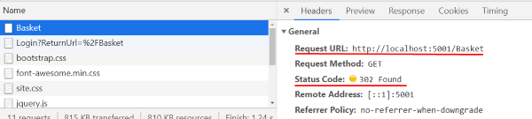
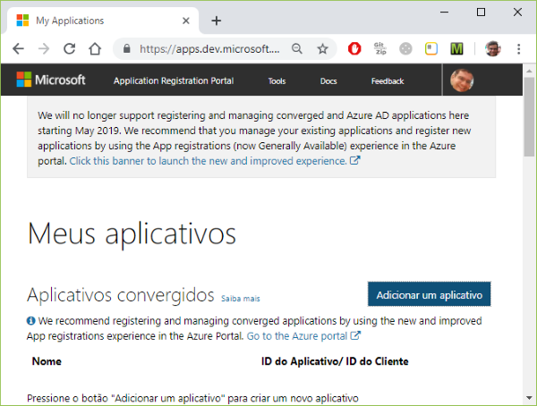
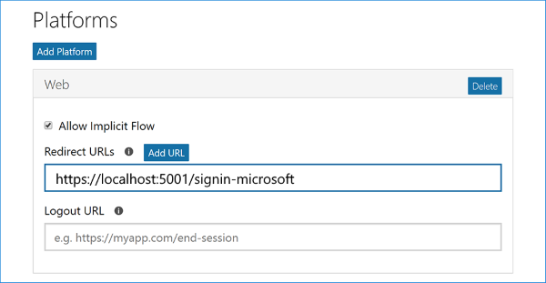
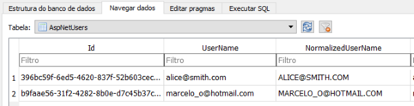
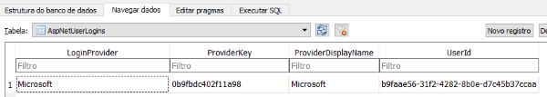

### Introduction


At the end of part 2 of this sequence of articles, we had an e-commerce application with views in which the user could choose products from a catalog, place them in the shopping basket and fill in a registration form with address and other personal data for future shipping procedures. Of course, all of it was made using dummy data.

Our application does not currently require user login or password of any kind. A growing number of e-commerce websites also choose not to require this type of information, requesting only the customer's credit card or other payment methods at the checkout page. On the other hand, many e-commerce websites require a login and password to authenticate the user.

Both models have benefits and drawbacks. An e-commerce website that does not require authentication is more convenient for customers as it reduces friction that could hurt conversions, in user experience parlance. On the other hand, authentication enables you to identify users and possibly better analyze their behavior over time, as well as allowing you to provide users with certain benefits, such as displaying an order history of a customer that has previously purchased on the website. In this article, we will follow the second approach.

In this third installment of the article series, we will use a login system and ensure that our application is accessed only by authenticated users. It allows you to protect the sensitive points of the application from anonymous users. With authentication, we ensure the user enters the system through a secure identification service. That also enables the application to track user access, identify usage patterns, automatically fill out registration forms, view customer order history, and other conveniences, enhancing user experience.

If all you need is a user table with login and password columns and a user profile for your application, then ASP.NET Core Identity is the best option for you.

In this chapter, we will learn how to install ASP.NET Core Identity in our e-commerce solution and take advantage of the security, login/logout, authentication, and user profile features provided by this framework.

By default, the database engine used by Identity is SQL Server. However, we will be using SQLite, which is a simpler and more compact database engine than SQL Server. Before installing Identity, we will prepare the project to use this new database 
engine.

Right-click the MVC project name, choose the Add NuGet Package submenu, and the package installation page opens, enter the package name: Microsoft.EntityFrameworkCore.SQLite


Now click the "Install" button and wait for the package to install.

Okay, now the project is ready to receive the ASP.NET Core Identity scaffolding.

### Installing ASP.NET Core Identity

#### Applying the ASP.NET Core Identity Scaffold


Installing a new ASP.NET Core with Identity from the beginning is different from installing it in an existing project. Since our project does not have Identity, we will install a package of files and assemblies containing the functionalities we need. This process is similar to building walls in a construction site using prefabricated modules. This process is known as scaffolding.

If we had to manually create login/logout, authentication and other features in our application, that would require a lot of effort. We are talking about the development of views, business logic, model entities, data access, security, etc., in addition to many hours of unit testing, functional testing, integrated testing and so on.

Fortunately, our application can benefit from authentication and authorization features without much effort. Authentication and authorization are ubiquitous in web applications. Because of this, Microsoft provides a package that can be transparently installed in ASP.NET Core projects that lack such features. It's called ASP.NET Core Identity.

To apply ASP.NET Core Identity in our solution, we right-click the project, click Add Scaffolded Item and then choose the Add option. That will open a new Add Scaffold dialog window.


Here, we will choose **Installed > Identity > Identity**. 


The ASP.NET Core Identity Scaffold will open a new dialog window containing a series of configuration parameters. There, you can define the layout of the pages, what source code you will include, the data and user context classes, and also which type of database (SQL Server or SQLite) Identity will use.


Let's select these options:

- **Layout**: The _Layout.cshtml file that already exists in our project. It will define a basic markup to be shared by the Identity pages and the rest of our application.
- **Identity pages**: Login, Logout, Register, ExternalLogin. The scaffolding process will copy those pages to our application, where you can edit them. Note that you still can navigate to the other Identity pages that you left unmarked, but you cannot modify or 
customize them since they will not be present in the project.
- **Context class**: AppIdentityContext.
- **User class**: AppIdentityUser. Represents a user in the identity system

After confirming these parameters, the scaffolding will modify our project. The most notable change is the new file structure under the **Areas / Identity** folder of our project.


Observe the new structure under Areas folder:

- The **AppIdentityContext** class: this is the class used for the Entity Framework database context for ASP.NET Core Identity.
- The **AppIdentityUser** class: represents a user in the identity system.
- The **pages below Pages / Account**: Those are pages containing the markup code for Identity pages. They are Razor Pages, that is, a kind of MVC structure type where the view is in the file and the actions of the controller and the template reside in a single file. As we have said, these pages can be modified and customized in our application, but the other Identity pages can be accessed, but not changed, since their files are not present in the project.
- **Partial Views**: _ValidationScriptPartial, _ViewImports, _ViewStart
- **IdentityHostingStartup** class: The ASP.NET Core WebHost executes this class as soon as the application runs. The IdentityHostingStartup class configures database and other services that Identity needs to work.

#### Creating and Applying ASP.NET Core Identity Model Migration

It is not enough to install the ASP.NET Core Identity package in our project; we still have to generate the database schema, which includes tables and initial data required by for ASP.NET 
Identity Core.

When we made the scaffolding of ASP.NET Identity Core, a new Identity data model was automatically added to our project, as we can see in the IdentityHostingStartup.cs file class:

```csharp
public void Configure(IWebHostBuilder builder)
{
    builder.ConfigureServices((context, services) => {
        services.AddDbContext<AppIdentityContext>(options =>
            options.UseSqlite(
                context.Configuration.GetConnectionString("AppIdentityContextConnection")));

        services.AddDefaultIdentity<AppIdentityUser>()
            .AddEntityFrameworkStores<AppIdentityContext>();
    });
}
```

Notice how the above Entity Framework configuration  (AddDbContext method) is using the AppIdentityContext class, a name we chose in the scaffolding process.

The same process also added a new AppIdentityContextConnection connection string to the 
appsettings.json configuration file. ASP.NET Core Identity will use this connection string to access the SQLite database:

```json
.
.
.
"AllowedHosts": "*",
"ConnectionStrings": {
    "AppIdentityContextConnection": "DataSource=MVC.db"
}
```

But note that the scaffolding process alone did not create the Identity SQLite database by itself. This can be achieved by creating a new Entity Framework Migration.

To add a new migration, open the **Tools > Package Manager Console** menu, and type in the console.

```
PM> Add-Migration Identity 
```

The above command added the classes containing the migration statements, but it did not create the database itself:


In order to create the SQLite database, you must apply the migration by executing the Update-Database command:

```
PM> Update-Database -verbose
```

This command creates the MVC.db database file defined in the connection string included in the appsettings.json configuration file:


Now let's take a look at this file by double-clicking on it. This will open the DB Browser for SQLite application we installed at the beginning of this article:


That's it! Now our application already has all the necessary components to perform authentication and authorization. From now on, we will start using these components to integrate ASP.NET Core Identity features in our application.

### Configuring ASP.NET Core Identity

#### Adding Identity Components to the Back-End


The Identity components are already present in our project. However, we need to add further configuration that will integrate these components with the rest of the application.

In software architecture, that is referred to as **middleware**.

ASP.NET Core provides a standard approach to integrate a middleware into the normal execution of the application. This mechanism resembles a water pipeline. Each new service further extends the plumbing system, taking the water at one end, and 
passing it to the next segment.


Similarly, ASP.NET Core will pass requests along a chain of middlewares. Upon receiving a request, each middleware decides either to process it or to pass the request to the next middleware in the chain. If the user is anonymous and the resource requires an authorization, then Identity will redirect the user to the login page.

The scaffolding process created the IdentityHostingStartup class, which already configured some Identity services.

```csharp
public void Configure(IWebHostBuilder builder)
{
    ...
        services.AddDefaultIdentity<AppIdentityUser>()
            .AddEntityFrameworkStores<AppIdentityContext>();
    ...
}
```

The AddDefaultIdentity() method adds a set of common identity services to the application, including a default UI, token providers, and configures authentication to use identity cookies.

Identity is enabled by calling the UseAuthentication extension method. This method adds authentication middleware to the request pipeline:

```csharp
    ...
    app.UseStaticFiles();
    app.UseAuthentication();
    ...
```

The UseAuthentication() method adds the AuthenticationMiddleware to the specified ApplicationBuilder, which enables authentication capabilities.

However, the above code configures just the back end behavior. For the front end, you can integrate ASP.NET Core Identity views with the application user interface by including a partial view in the layout markup that will allow users to log in or register. Let's take a look at it in the next section.

#### Adding Identity Components to the Front-End


The ASP.NET Core Identity scaffolding process includes the LoginPartial file in
the Views\Shared folder. This file contains the partial view that displays either the 
authenticated user name or hyperlinks for login and registration.


```
@using Microsoft.AspNetCore.Identity
@using MVC.Areas.Identity.Data
@inject SignInManager<AppIdentityUser> SignInManager
@inject UserManager<AppIdentityUser> UserManager

<ul class="navbar-nav">
@if (SignInManager.IsSignedIn(User))
{
    <li class="nav-item">
        <a id="manage" class="nav-link text-dark" asp-area="Identity" asp-page="/Account/Manage/Index" title="Manage">Hello @UserManager.GetUserName(User)!</a>
    </li>
    <li class="nav-item">
        <form id="logoutForm" class="form-inline" asp-area="Identity" asp-page="/Account/Logout" asp-route-returnUrl="@Url.Action("Index", "Home", new { area = "" })">
            <button id="logout" type="submit" class="nav-link btn btn-link text-dark">Logout</button>
        </form>
    </li>
}
else
{
    <li class="nav-item">
        <a class="nav-link text-dark" id="register" asp-area="Identity" asp-page="/Account/Register">Register</a>
    </li>
    <li class="nav-item">
        <a class="nav-link text-dark" id="login" asp-area="Identity" asp-page="/Account/Login">Login</a>
    </li>
}
</ul>
```

You can add this component to any of the application views, with the line below:

```
<partial name="_LoginPartial" />
```

However, adding this line more than one time would cause undesirable code duplication. 
We can avoid this redundancy by including the line above in the standard layout view of 
the application (_Layout.cshtml file) since this will cause the component to be visible 
through all of our e-commerce views. We need to include it more specifically in the 
application's navigation bar, inside the <div> element that contains the "navbar-collapse" 
class:

_Layout.cshtml

```
    <div class="navbar-collapse collapse justify-content-end">
        <partial name="_LoginPartial" />
        <ul class="nav navbar-nav">
```

By running the application, we can now see the log and login links at the upper right corner 
of the product search page:


Now we will click to add any product to navigate to the shopping cart page. Notice how the login 
and register links are also present here:


#### Razor Pages

When you install ASP.NET Core Identity scaffolding, the new Identity components included in your
project does not follow the MVC architecture. Instead, Identity components are based on Razor Pages.

But what's the difference between MVC and Razor Pages?

We can see by the image below how a typical MVC project keeps the components of a single page in a set of files scattered in many files and folders:


So, in MVC there’s not a single “web page” file. And it’s a little awkward to explain it to someone who’s new to the technology.

What if you took an MVC application, then you called your View as a Page (e.g. in Index.cshtml file), and you centralized not only the Model data but also the server-side code related to that page (that used to reside on your Controller) inside a class dedicated to that page (inside an Index.cshtml.cs file) - that you now called a Page Model?

If you have already worked in native mobile apps, then you have probably seen something similar to this in the Model-View-ViewModel (MVVM) pattern.


Despite being different from MVC, Razor Pages still relies on ASP.NET Core MVC Framework. Once you create a new project with Razor Pages template, Visual Studio configures the application via Startup.cs file to enable the ASP.NET Core MVC Framework, as we have just seen.

The template not only configures the new web application for MVC use, but also creates the Page folder and a set of Razor pages and page models for the example application:


#### Anatomy of a Razor Page

At first sight, a Razor Page looks pretty much like an ordinary ASP.NET MVC View file. But a Razor Page requires a new directive. Every Razor Page must start with the @page directive, which tells ASP.NET Core to treat it as Razor page. The folowing image shows a little more detail about a typical razor page.  


@page - Identify the file as a Razor Page. Without it, the page is simply unreacheable by ASP.NET Core.
@model - much like in an MVC application, defines the class from which originates the binding data, as well as the Get/Post methods requested by the page.
@using - the regular directive for defining namespaces.
@inject - configures which interface(s) instance(s) should be injected into the page model class.
@{ } - a piece of C# code inside Razor brackets, which in this case is used to define the page title.
<div…> - the regular HTML code that comes along with the Razor-enabled C# Code.

#### Creating a New User

Since we created a new database without users,  our customers need to fill in the Identity's Register page. 


_Layout.cshtml

    @if (User.Identity.IsAuthenticated)
    {
        <ul class="nav navbar-nav">
            <li>
                <vc:notification-counter title="Notifications"...

                <vc:basket-counter title="Basket"...

            </li>
        </ul>
    }


#### Authorizing ASP.NET Core Resources


Now that we have Identity working, we will begin to protect some areas of our MVC project from anonymous access, that is, unauthenticated access. This will ensure that only users who have entered a valid login and password can access protected system resources.
But what resources should be protected against anonymous access?

|Controller               |Should be protected?|
|-------------------------|--------------------|
| CatalogController       |         No         |
| BasketController        |         Yes        |
| CheckoutController      |         Yes        |
| NotificationsController |         Yes        |
| RegistrationController  |         Yes        |

Note that both the Carousel and SearchProducts will be unprotected. Because? We want to allow users to browse the site's product freely, without forcing them to log in with the password. The other actions are all protected, as they involve the handling of orders, which can only be done by customers.
But how are we going to protect these resources? We must mark one of these actions in the RequestController with an authorization attribute:


```csharp
[Authorize]
public class BasketController : BaseController
{
    public IActionResult Index()
    ...
```

```csharp
[Authorize]
public class BasketController : BaseController
...
```

```csharp
[Authorize]
public class CheckoutController : BaseController
...
```

```csharp
[Authorize]
public class NotificationsController : BaseController
...
```

```csharp
[Authorize]
public class RegistrationController : BaseController
...
```

Let's take a test now: What happens when an anonymous user tries to access one of these features marked with [Authorize]?
ASP.NET Core Identity will receive each of the requisitions made to the application. If the user is already authenticated, Identity passes the processing to the next component of the pipeline. If the user is anonymous and the resource being accessed requires authorization then Identity will redirect the user to the login page.

Running the application as an anonymous user, we go to the product search page, which we can access without any problem, since this action is unprotected (that is without the [Authorize] attribute):


So we closed the topic on ASP.NET Core Identity Configuration. From now on, we will begin to get the user information that can finally be used in our application.

https://localhost:44340/Identity/Account/Login?ReturnUrl=%2FBasket


Note that this url has 2 parts:
The url where the user has to authenticate: http: // localhost: 5001 / Identity / Account / Login
The original url, to which the user will return after authentication: ReturnUrl =% 2Payed% 2Fetch% 2F180
We can look at this redirection process more closely by opening the Developer Tools (Chrome Key F12) and opening the Headers tab, where we have seen that the call to the Action / Cart action is redirected via HTTP code 302, which is a code of redirection:



### Managing User Data


#### Preparing the User Registration Form

Part 03/MVC/Models/ViewModels/RegistrationViewModel.cs

```csharp
public class RegistrationViewModel
{
    public string UserId { get; set; }
    public string Name { get; set; }
    public string Email { get; set; }
    public string Phone { get; set; }
    public string Address { get; set; }
    public string AdditionalAddress { get; set; }
    public string District { get; set; }
    public string City { get; set; }
    public string State { get; set; }
    public string ZipCode { get; set; }
}
```

Part 03/MVC/Views/Registration/Index.cshtml

```html
@using MVC.Models.ViewModels
@model RegistrationViewModel
@{
    ViewData["Title"] = "Registration";
}
<h3>Registration</h3>

<form method="post" asp-controller="checkout" asp-action="index">
    <input type="hidden" asp-for="@Model.UserId" />
    <div class="card">
        <div class="card-body">
            <div class="row">
                <div class="col-sm-4">
                    <div class="form-group">
                        <label class="control-label" for="name">Customer Name</label>
                        <input type="text" class="form-control" id="name" asp-for="@Model.Name" />
                        <span asp-validation-for="@Model.Name" class="text-danger"></span>
                    </div>
                    <div class="form-group">
                        <label class="control-label" for="email">Email</label>
                        <input type="email" class="form-control" id="email" asp-for="@Model.Email">
                        <span asp-validation-for="@Model.Email" class="text-danger"></span>
                    </div>
                    <div class="form-group">
                        <label class="control-label" for="phone">Phone</label>
                        <input type="text" class="form-control" id="phone" asp-for="@Model.Phone" />
                        <span asp-validation-for="@Model.Phone" class="text-danger"></span>
                    </div>
                </div>
                <div class="col-sm-4">
                    <div class="form-group">
                        <label class="control-label" for="address">Address</label>
                        <input type="text" class="form-control" id="address" asp-for="@Model.Address" />
                        <span asp-validation-for="@Model.Address" class="text-danger"></span>
                    </div>
                    <div class="form-group">
                        <label class="control-label" for="additionaladdress">Additional Address</label>
                        <input type="text" class="form-control" id="additionaladdress" asp-for="@Model.AdditionalAddress" />
                        <span asp-validation-for="@Model.AdditionalAddress" class="text-danger"></span>
                    </div>
                    <div class="form-group">
                        <label class="control-label" for="district">District</label>
                        <input type="text" class="form-control" id="district" asp-for="@Model.District" />
                        <span asp-validation-for="@Model.District" class="text-danger"></span>
                    </div>
                </div>
                <div class="col-sm-4">
                    <div class="form-group">
                        <label class="control-label" for="city">City</label>
                        <input type="text" class="form-control" id="city" asp-for="@Model.City" />
                        <span asp-validation-for="@Model.City" class="text-danger"></span>
                    </div>
                    <div class="form-group">
                        <label class="control-label" for="state">State</label>
                        <input type="text" class="form-control" id="state" asp-for="@Model.State" />
                        <span asp-validation-for="@Model.State" class="text-danger"></span>
                    </div>
                    <div class="form-group">
                        <label class="control-label" for="zipcode">Zip Code</label>
                        <input type="text" class="form-control" id="zipcode" asp-for="@Model.ZipCode" />
                        <span asp-validation-for="@Model.ZipCode" class="text-danger"></span>
                    </div>

                    <div class="form-group">
                        <a class="btn btn-success" href="/">
                            Keep buying
                        </a>
                    </div>
                    <div class="form-group">
                        <button type="submit"
                                class="btn btn-success button-notification">
                            Check out
                        </button>
                    </div>
                </div>
            </div>
        </div>
    </div>
</form>
```

Part 03/MVC/Areas/Identity/Data/AppIdentityUser.cs

```csharp
public class AppIdentityUser : IdentityUser
{
    public string Name { get; set; }
    public string Phone { get; set; }
    public string Address { get; set; }
    public string AdditionalAddress { get; set; }
    public string District { get; set; }
    public string City { get; set; }
    public string State { get; set; }
    public string ZipCode { get; set; }
}
```

#### Retrieving User Data From Identity Database


Part 03/MVC/Controllers/BasketController.cs

//var clientId = GetUserId();

Part 03/MVC/Controllers/CheckoutController.cs

    [Authorize]
    public class CheckoutController : BaseController
    {
        private readonly UserManager<AppIdentityUser> userManager;

        public CheckoutController(UserManager<AppIdentityUser> userManager)
        {
            this.userManager = userManager;
        }

        [HttpPost]
        [ValidateAntiForgeryToken]
        public async Task<IActionResult> Index(RegistrationViewModel registration)
        {
            if (ModelState.IsValid)
            {
                var usuario = await userManager.GetUserAsync(this.User);

                usuario.Email = registration.Email;
                usuario.Phone = registration.Phone;
                usuario.Name = registration.Name;
                usuario.Address = registration.Address;
                usuario.AdditionalAddress = registration.AdditionalAddress;
                usuario.District = registration.District;
                usuario.City = registration.City;
                usuario.State = registration.State;
                usuario.ZipCode = registration.ZipCode;

                await userManager.UpdateAsync(usuario);
                return View(registration);
            }
            return RedirectToAction("Index", "Registration");
        }
    }

Part 03/MVC/Controllers/RegistrationController.cs

[Authorize]
public class RegistrationController : BaseController
{
    private readonly UserManager<AppIdentityUser> userManager;

    public RegistrationController(UserManager<AppIdentityUser> userManager)
    {
        this.userManager = userManager;
    }

    public async Task<IActionResult> Index()
    {
        var user = await userManager.GetUserAsync(this.User);
        var viewModel = new RegistrationViewModel(
            user.Id, user.Name, user.Email, user.Phone,
            user.Address, user.AdditionalAddress, user.District,
            user.City, user.State, user.ZipCode
        );
        return View(viewModel);
    }
}

Part 03/MVC/Models/ViewModels/RegistrationViewModel.cs

```csharp
    public RegistrationViewModel()
    {

    }

    public RegistrationViewModel(string name, string email, string phone, string address, string additionalAddress, string district, string city, string state, string zipCode)
    {
        Name = name;
        Email = email;
        Phone = phone;
        Address = address;
        AdditionalAddress = additionalAddress;
        District = district;
        City = city;
        State = state;
        ZipCode = zipCode;
    }


    public RegistrationViewModel GetClone()
    {
        return new RegistrationViewModel(this.Name, this.Email, this.Phone, this.Address, this.AdditionalAddress, this.District, this.City, this.State, this.ZipCode);
    }
```


Part 03/MVC/Views/Registration/Index.cshtml

```html
//<form method="post" action="checkout">
<form method="post" asp-controller="checkout" asp-action="index">

//    <input type="text" class="form-control" value="@Model.Name" />
    <input class="form-control" asp-for="@Model.Name" />

    //<label class="control-label">Email</label>
    //<input type="email" class="form-control" />
    <label class="control-label" for="email">Email</label>
    <input type="email" class="form-control" id="email" asp-for="@Model.Email">
    <span asp-validation-for="@Model.Email" class="text-danger"></span>
```


```html
//<input type="text" class="form-control" />
<input class="form-control" asp-for="@Model.Phone" />

    //<input type="text" class="form-control" />
    <input class="form-control" asp-for="@Model.Address" />

    //<input type="text" class="form-control" />
    <input class="form-control" asp-for="@Model.AdditionalAddress" />

    //<input type="text" class="form-control" />
    <input class="form-control" asp-for="@Model.District" />

    //<input type="text" class="form-control" />
    <input class="form-control" asp-for="@Model.City" />

    //<input type="text" class="form-control" />
    <input class="form-control" asp-for="@Model.State" />

    //<input type="text" class="form-control" />
    <input  class="form-control" asp-for="@Model.ZipCode" />
```

#### Persisting User Data to Identity Database

Part 03/MVC/Controllers/CheckoutController.cs

    if (ModelState.IsValid)
    {
        var usuario = await userManager.GetUserAsync(this.User);

        usuario.Email = registration.Email;
        usuario.Phone = registration.Phone;
        usuario.Name = registration.Name;
        usuario.Address = registration.Address;
        usuario.AdditionalAddress = registration.AdditionalAddress;
        usuario.District = registration.District;
        usuario.City = registration.City;
        usuario.State = registration.State;
        usuario.ZipCode = registration.ZipCode;

        await userManager.UpdateAsync(usuario);
        return View(registration);
    }
    return RedirectToAction("Index", "Registration");


Part 03/MVC/Models/ViewModels/RegistrationViewModel.cs

//    public RegistrationViewModel(string name, string email, string phone, string address, string additionalAddress, string district, string city, string state, string zipCode)
    public RegistrationViewModel(string userId)
    {
        UserId = userId;
    }

    public RegistrationViewModel(string userId, string name, string email, string phone, string address, string additionalAddress, string district, string city, string state, string zipCode)
    {
        UserId = userId;


[Required]
[Required]
[Required]
[Required]...

Part 03/MVC/Views/Checkout/Index.cshtml

```html
//@model string
@model RegistrationViewModel

    <p>Thank you very much, <b>@Model.Name</b>!</p>
    <p>Your order has been placed.</p>
//    <p>Soon you will receive an e-mail at <b>@email</b> including all order details.</p>
    <p>Soon you will receive an e-mail at <b>@Model.Email</b> including all order details.</p>

```

Part 03/MVC/Views/Registration/Index.cshtml

```html
<input type="hidden" asp-for="@Model.UserId" />

//                        <label class="control-label">Customer Name</label>
//                        <input class="form-control" asp-for="@Model.Name" />
                        <label class="control-label" for="name">Customer Name</label>
                        <input type="text" class="form-control" id="name" asp-for="@Model.Name" />

//                        <label class="control-label">Phone</label>
//                        <input class="form-control" asp-for="@Model.Phone" />
                        <label class="control-label" for="phone">Phone</label>
                        <input type="text" class="form-control" id="phone" asp-for="@Model.Phone" />
                        <span asp-validation-for="@Model.Phone" class="text-danger"></span>
                        <span asp-validation-for="@Model.Name" class="text-danger"></span>

```


```html
@section Scripts
{
    <partial name="~/Views/Shared/_ValidationScriptsPartial.cshtml"/>
}
```


### Logging In With Microsoft Account, Google, Facebook, etc.

#### Why allow external account login?

Registering a new user and password in a web application is an often tedious process, which in an e-commerce application can be not only unmotivating to the client, but also detrimental to the business, as any additional steps may deter potential buyers. may prefer another e-commerce website that is friendlier and less bureaucratic. Undoubtedly, the worst of all is the loss of sales as the end result.

An external login process, which allows us to integrate the identity process with existing accounts on external services such as Microsoft, Google and Facebook, and without the need to create new passwords, can provide a more convenient registration process for our clients.

However, it is critical that this external login process is only an alternative, not a requirement for entry into our application. Otherwise, we will be requiring you to have an account already registered with one of these external services.

Fortunately, ASP.NET Core Identity provides a mechanism to allow users to enter their existing credentials into services such as Microsoft, Google, Facebook, Twitter, etc.

#### Configuring External Logon with Microsoft Account

Keep in mind that external logon services are not aware of your application, and vice versa. Both parties need a configuration that defines which applications / services will be involved in the authentication process.

Let's create the necessary configuration so that our users can use their Microsoft accounts (@ hotmail.com, @ outlook.com, etc.) as a means of login for our application.

First, the Microsoft authentication service needs to know our application. We need to enter the address of the service called Microsoft Application Registration Portal https://apps.dev.microsoft.com and create the settings for our application.

First, you (the developer) need to log in with your Microsoft account to access the portal:


In this developer portal you can read the list of applications you have. If you do not already have a Microsoft account, you can create one. After you sign in, you will be redirected to the My Apps page:



Here, we will register a new application. Touch add an application in the upper right corner and enter the name of the application.

Let's give it a meaningful name, such as GroceryStore.


Click Create Application to continue to the registration page. Provide a name and note the value of the application Id, which you can use as ClientId later.


Here you will touch on Add platform in the platforms section and select the Web platform.


Under Web Platform, enter your development URL with / signin-microsoft added to the redirect field URLs (for example: https: // localhost: 44320 / signin-microsoft). The Microsoft authentication scheme that we will configure later will automatically handle the requests in / signin-microsoft route to implement the OAuth flow:



Note that on this page we will click Add URL to ensure that the URL has been added.


Fill in any other application settings if necessary and touch save at the bottom of the page to save changes to the application configuration.


Now look at the Application Id that appears on the registration page. Click to generate a new password in the "application secrets" section. This will display a box in which you can copy the application password:


Where will we store this password? In a real-world commercial application, we would have to use some form of secure storage, such as Environment Variables or the Secret Manager tool (https://docs.microsoft.com/aspnet/core/security/app-secrets ? view = aspnetcore-2.2 & tabs = windows).

However, to make life easier for you, let's simply use the appsettings.json configuration file to store the application password registered on the Microsoft Developer Portal. Here, we created two new configuration keys:

Authentication_Microsoft_Application: The web application ID created at Microsoft
Authentication_Microsoft_Password: the password of the web application created in Microsoft

```
  "ExternalLogin": {
    "Microsoft": {
      "ClientId": "nononononononononononnnononoon",
      "ClientSecret": "nononononononononononnnononoon"
    },
    "Google": {
      "ClientId": "nononononononononononnnononoon",
      "ClientSecret": "nononononononononononnnononoon"
    }
  }
```

Now let's add the following excerpt to the CofigureServices method of the Startup class to enable authentication through Microsoft account:

```csharp
services.AddAuthentication()
    .AddMicrosoftAccount(options =>
    {
        options.ClientId = Configuration["ExternalLogin:Microsoft:ClientId"];
        options.ClientSecret = Configuration["ExternalLogin:Microsoft:ClientSecret"];
    })
    .AddGoogle(options =>
    {
        options.ClientId = Configuration["ExternalLogin:Google:ClientId"];
        options.ClientSecret = Configuration["ExternalLogin:Google:ClientSecret"];
    });
```

Running our e-commerce application again, we can see on the login page a right panel, where you can find a new button that allows you to sign in with the Microsoft service.


After logging in to the Microsoft page, our user is redirected to an "account association page" provided by ASP.NET Core Identity. Here, we will click on "Register" to complete the association between the Microsoft account and the account of our store:


As we can see below, the client is now registered with Microsoft's own email, and no further login information is required in our application!


Note that accounts created directly by Identity can coexist side by side with user accounts created in external mechanisms such as Google, Microsoft, Facebook, etc. as we can see in the user table (AspNetUsers) of the SQLite database MVC.db:


Eventually we can investigate which user accounts were created outside our system. Just open the AspNetUserLogins table from the MVC.db database:



Note that the table above has the UserId column, where we can find the id of the user who just logged in to the Microsoft service.

#### Configuring External Logon with Microsoft Account

Although we do not show authentication through other external services like Google, Twitter and Facebook, the process is very similar. On the side of our application, we can simply modify the code in the ConfigureServices method in the Startup class to include new external login services, as follows:

```csharp
services.AddAuthentication()
    .AddMicrosoftAccount(microsoftOptions => { ... })
    .AddGoogle(googleOptions => { ... })
    .AddTwitter(twitterOptions => { ... })
    .AddFacebook(facebookOptions => { ... });
```

### Conclusion

We have reached the end of our new "ASP.NET Core Part 3" course. In this course, we understood the user authentication needs of the application we had at the end of the last course (ASP.NET Core Part 2). We then decided to use ASP.NET Core Identity as an authentication solution for our e-commerce web application.

We have learned how to use the ASP.NET Core Identity scaffolding process to authorize the MVC application, so that it can enjoy the benefits of authenticating users, protecting features and sensitive pages such as Cart, Registration, and Checkout.

We have learned how to customize the Identity package by translating the code from the Identity Razor pages that were included in the application, as well as using custom classes for error messages.

We understand how the user layout flow works, and we have learned how to configure the MVC web application to meet the requirements of that stream. As soon as the login and logout process was understood, we began to modify
our MVC application to use both id and username as well
the other cadastral information of each logged in user, which in the
context of our MVC application represents the client that is performing
the purchase.

Finally, we learned how to perform an external login process, which allows us to integrate the identity process with existing accounts in external services such as Microsoft, Google and Facebook, thus providing a more convenient registration process for our customers.


